# DengFOC 双轴万向节 FOC 控制系统 - 详细功能描述

## 项目概述

DengFOC 是一个基于 ESP32 微控制器的双轴万向节 FOC（场定向控制）驱动系统。该系统通过 FOC 控制算法实现对两个直流无刷电机的精准控制，结合 IMU 传感器和磁编码器反馈，实现高精度的角度/力矩控制。

**目标应用**: 云台、云台稳定器、航拍吊舱等机械稳定系统

---

## 系统架构
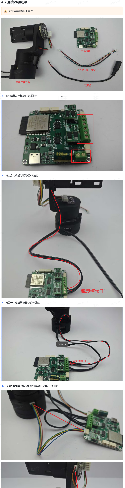
### 整体系统框图

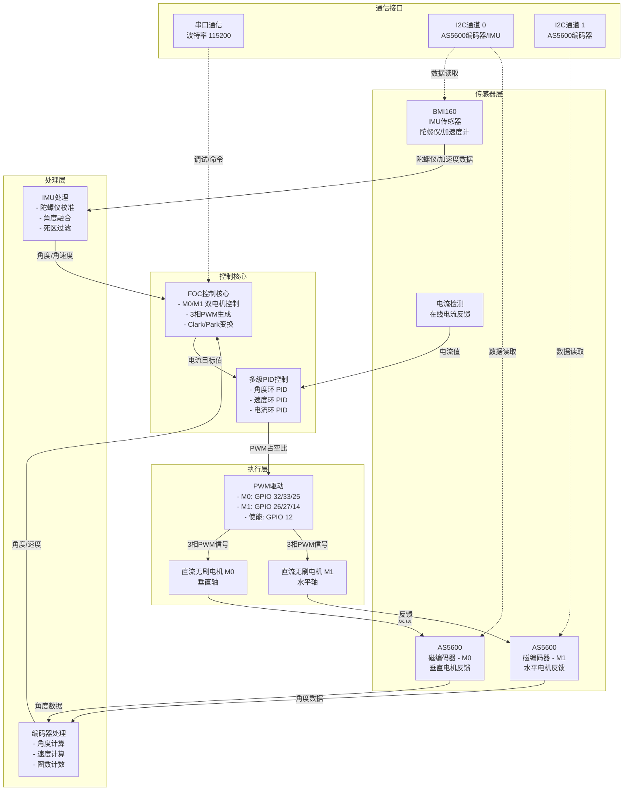

---

## 核心模块详解

### 1. 传感器模块

#### 1.1 IMU 传感器 (BMI160)
- **功能**: 获取陀螺仪和加速度计数据
- **数据**: 
  - 加速度: ax, ay, az (原始值) → accX, accY, accZ (g单位)
  - 角速度: gx, gy, gz (原始值) → gyroX, gyroY, gyroZ (dps单位)
- **校准**: 启动时自动陀螺仪校准，消除零偏 (gyroXoffset, gyroYoffset, gyroZoffset)
- **应用**: 
  - 角度融合计算
  - 稳定性检测（判断电机是否静止）

#### 1.2 磁编码器 (AS5600)
- **数量**: 2个 (M0和M1各一个)
- **功能**: 
  - 精准角度反馈
  - 速度计算 (通过角度微分)
  - 完整圈数计数 (full_rotations)
- **精度**: 12位分辨率 (0.0879°/LSB)
- **通信**: 两路 I2C (通道0: M0, 通道1: M1)

#### 1.3 电流检测 (InlineCurrent)
- **功能**: A/B相电流在线检测
- **应用**: 电流闭环控制、过流保护

---

### 2. FOC 控制核心

#### 2.1 FOC 算法流程

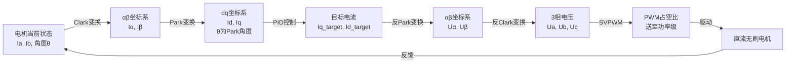

#### 2.2 关键函数

| 函数 | 功能 | 说明 |
|------|------|------|
| `cal_Iq_Id()` | Clarke/Park变换 | 计算目标Iq, Id |
| `M0_setPwm()` | 3相PWM设置 | 将电压转换为PWM占空比 |
| `M1_setPwm()` | 3相PWM设置 | 同上 |
| `S0_electricalAngle()` | 电角度计算 | 根据机械角度计算电角度 |
| `S1_electricalAngle()` | 电角度计算 | 同上 |

---

### 3. PID 控制系统

#### 3.1 三级级联 PID 架构

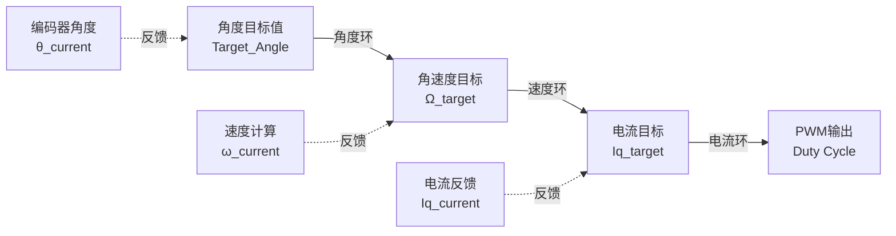

#### 3.2 PID 参数配置

**M0 电机 (垂直轴)**
| 控制环 | P | I | D | Ramp | Limit |
|--------|---|---|---|------|-------|
| 角度环 | - | - | - | - | - |
| 速度环 | 2.0 | 0 | 0 | 100000 | Vbus/2 |
| 电流环 | 1.2 | 0 | 0 | 100000 | 12.6V |

**M1 电机 (水平轴)**
| 控制环 | P | I | D | Ramp | Limit |
|--------|---|---|---|------|-------|
| 角度环 | - | - | - | - | - |
| 速度环 | 2.0 | 0 | 0 | 100000 | Vbus/2 |
| 电流环 | 1.2 | 0 | 0 | 100000 | 12.6V |

**云台稳定环** (main.cpp中的环路)
- Y_loop (垂直电机): P=0.045, I=0.002, D=0.0001, Limit=6
- Z_loop (水平电机): P=0.030, I=0.001, D=0.005, Limit=6

#### 3.3 PID 控制器结构

```cpp
class PIDController {
    float P, I, D;           // 增益系数
    float output_ramp;       // 输出斜率（变化率限制）
    float limit;             // 输出限制值
    float error_prev;        // 上一次误差
    float integral_prev;     // 上一次积分项
    float output_prev;       // 上一次输出
    unsigned long timestamp_prev;  // 上一次时间戳
};
```

---

### 4. 电机控制接口

#### 4.1 控制模式

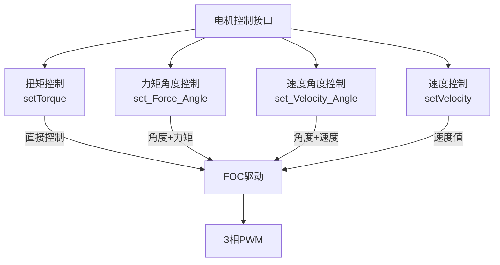

#### 4.2 接口函数

| 接口 | M0函数 | M1函数 | 说明 |
|------|--------|--------|------|
| 扭矩控制 | `setTorque()` | `setTorque()` | 直接设置目标扭矩 |
| 速度控制 | `setVelocity()` | `setVelocity()` | 设置目标速度 |
| 力矩角度 | `set_Force_Angle()` | `set_Force_Angle()` | 定位到指定角度(固定力) |
| 速度角度 | `set_Velocity_Angle()` | `set_Velocity_Angle()` | 定位到指定角度(变速) |

---

## 扭矩控制与速度控制的详细对比

### 1. 控制原理的根本区别

#### 1.1 直流无刷电机的基本方程

直流无刷电机的数学模型可以用以下方程组表示：

**电压方程**:
$$U_q = R \cdot I_q + L \frac{dI_q}{dt} + K_e \cdot \omega$$

其中：
- $U_q$: q轴电压（控制电压）
- $R$: 电机绕组电阻
- $I_q$: q轴电流（控制电流）
- $L$: 电机绕组电感
- $K_e$: 电机反电动势常数
- $\omega$: 电机角速度

**力矩方程** (Newton第二定律):
$$T = K_t \cdot I_q$$

其中 $K_t$ 是力矩常数（直流无刷电机中 $K_t = K_e$）

**机械动力学方程**:
$$T_{motor} - T_{load} - B \cdot \omega = J \frac{d\omega}{dt}$$

其中：
- $T_{motor}$: 电机产生的力矩
- $T_{load}$: 负载力矩
- $B$: 阻尼系数
- $J$: 转动惯量

#### 1.2 扭矩控制原理

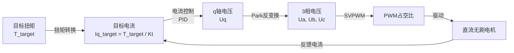

**扭矩控制的控制目标**:
$$T_{target} = f(t)$$

直接指定目标扭矩，通过电流环PID控制使实际电流跟踪目标电流：

$$I_q^* = \frac{T_{target}}{K_t}$$

**控制流程**:
```
1. 获得目标扭矩 T_target
2. 计算目标电流: I_q_target = T_target / K_t
3. 获得实际电流反馈: I_q_actual
4. 电流误差: e_I = I_q_target - I_q_actual
5. 电流环PID: U_q = PID(e_I)
6. 输出PWM驱动电机
```

**数学表示**:
$$U_q(t) = K_p \cdot e_I(t) + K_i \int_0^t e_I(\tau)d\tau + K_d \frac{de_I}{dt}$$

其中 $(K_p, K_i, K_d)$ 是电流环的PID系数。

#### 1.3 速度控制原理

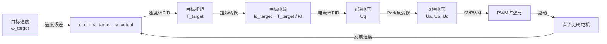

**速度控制的控制目标**:
$$\omega(t) = \omega_{target}(t)$$

通过速度环PID将速度误差转化为目标扭矩，再通过电流环PID实现扭矩控制：

**速度环PID**:
$$T_{target}(t) = K_{p,\omega} \cdot e_{\omega}(t) + K_{i,\omega} \int_0^t e_{\omega}(\tau)d\tau + K_{d,\omega} \frac{de_{\omega}}{dt}$$

其中：
- $e_{\omega} = \omega_{target} - \omega_{actual}$
- $(K_{p,\omega}, K_{i,\omega}, K_{d,\omega})$ 是速度环的PID系数

**电流环PID** (嵌套):
$$U_q(t) = K_{p,I} \cdot e_I(t) + K_{i,I} \int_0^t e_I(\tau)d\tau + K_{d,I} \frac{de_I}{dt}$$

**控制流程**:
```
1. 获得目标速度 ω_target
2. 获得实际速度反馈: ω_actual (从编码器计算)
3. 速度误差: e_ω = ω_target - ω_actual
4. 速度环PID: T_target = PID_vel(e_ω)
5. 电流目标: I_q_target = T_target / K_t
6. 电流环PID: U_q = PID_cur(e_I)
7. 输出PWM驱动电机
```

### 2. 控制框架对比

#### 2.1 扭矩控制系统框图

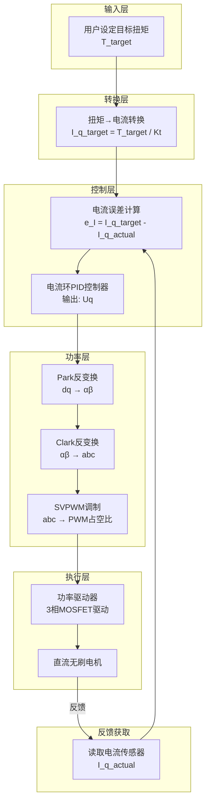

**特点**:
- ✅ 系统结构简单，只有一个反馈闭环
- ✅ 响应速度快，无延迟
- ✅ 适合需要快速反应的场景
- ❌ 无法限制速度（负载突然降低时可能过速）
- ❌ 易受负载变化影响

#### 2.2 速度控制系统框图

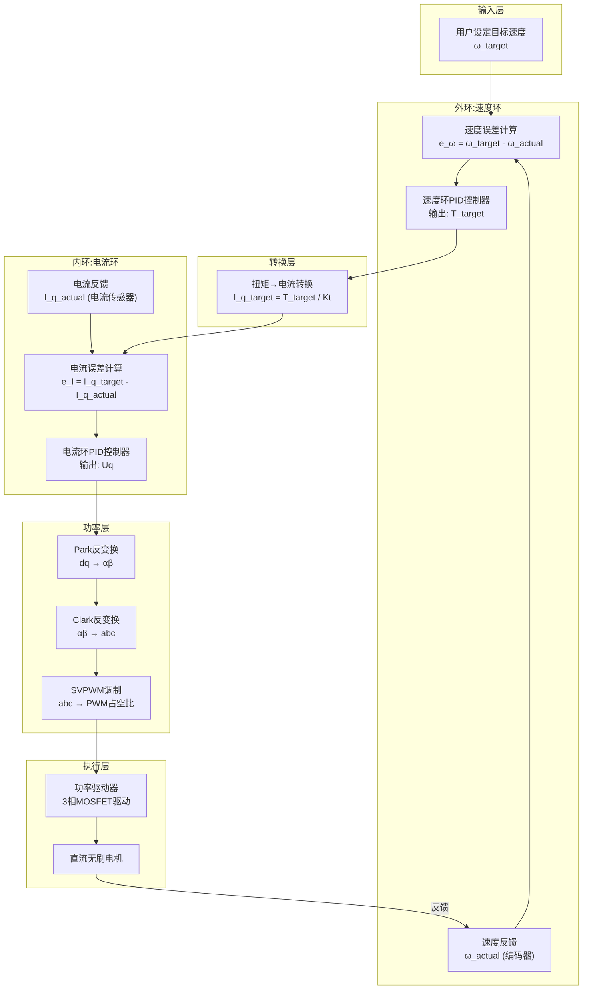

**特点**:
- ✅ 系统结构为双环控制，速度稳定性好
- ✅ 能自动调节扭矩以维持目标速度
- ✅ 抗负载变化能力强
- ✅ 对于稳速运行的场景理想
- ❌ 响应速度稍慢（多了一个环节）
- ❌ 对突变命令的跟踪有延迟

### 3. 动态响应对比

#### 3.1 单位阶跃响应

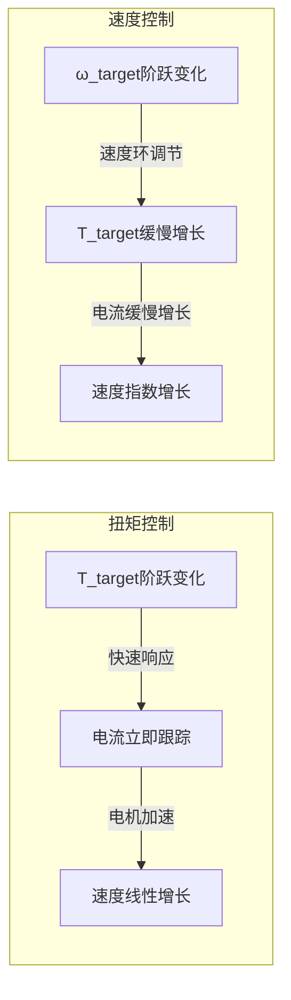

**时间域对比**:

扭矩控制响应方程（假设忽略电感和反EMF的高阶项）：
$$\omega(t) = \frac{T_{target}}{B+J\frac{d}{dt}}$$

在阶跃输入下：
$$\omega(t) = \frac{T_{target} \cdot J}{B \cdot J} (1 - e^{-\frac{B}{J}t}) = \frac{T_{target}}{B}(1 - e^{-\frac{B}{J}t})$$

速度控制响应方程（设速度环和电流环时常数分别为 $\tau_1$ 和 $\tau_2$）：
$$\omega(t) = \omega_{target}(1 - e^{-t/(\tau_1 + \tau_2)})$$

#### 3.2 抗负载能力

**扭矩控制**: 给定固定扭矩 $T$，负载增加时：
$$\omega_{steady} = \frac{T - T_{load}}{B}$$

负载增加直接导致速度下降，系统无法补偿。

**速度控制**: 给定目标速度 $\omega_{target}$，负载增加时：
$$T = T_{load} + B \cdot \omega_{target} \text{ (速度环自动调节)}$$

系统自动增加扭矩以维持目标速度。

### 4. 参数优化与调试

#### 4.1 扭矩控制的PID调参

仅需调试电流环PID参数：

```cpp
// 电流环参数(DengFOC.cpp)
PIDController current_loop_M0 = PIDController{
    .P = 1.2,      // 比例增益 - 控制响应速度
    .I = 0.0,      // 积分增益 - 消除稳态误差
    .D = 0.0,      // 微分增益 - 阻尼震荡
    .ramp = 100000,// 输出斜率限制
    .limit = 12.6  // 最大输出限制(V)
};
```

**调参步骤**:
1. 从 P=1.0 开始，逐步增加 P 值直到出现轻微震荡
2. 根据需要增加 I 值消除稳态误差
3. 根据超调情况调整 D 值

**优化目标**:
- 快速跟踪目标电流
- 最小化超调 (< 10%)
- 消除稳态误差 (< 1%)

#### 4.2 速度控制的PID调参

需要调试两层PID参数，通常采用"外环缓、内环快"的原则：

```cpp
// 速度环参数(main.cpp中的Y_loop)
PIDController Y_loop = PIDController{
    .P = 0.045,    // 速度环比例增益 - 较小
    .I = 0.002,    // 速度环积分增益
    .D = 0.0001,   // 速度环微分增益
    .ramp = 100000,// 输出(扭矩)斜率限制
    .limit = 6     // 最大目标扭矩限制
};

// 电流环参数 - 响应更快
PIDController current_loop = PIDController{
    .P = 1.2,      // 电流环比例增益 - 较大
    .I = 0.0,
    .D = 0.0,
    .limit = 12.6
};
```

**调参步骤**:
1. 先固定外环参数，调试内环(电流环)使其快速稳定
2. 再调整外环(速度环)参数，响应时间通常为内环的10~100倍
3. 采用Ziegler-Nichols法则或试错法

**参数关系**:
$$\tau_{outer} >> \tau_{inner}$$
$$K_{p,outer} << K_{p,inner}$$

#### 4.3 扭矩控制与速度控制的优劣分析

##### 4.3.1 扭矩控制的优势

| 优势项 | 具体描述 | 量化指标 |
|------|--------|--------|
| **响应速度** | 直接控制电流，无中间环节 | 响应时间 < 5ms |
| **系统延迟** | 最小延迟路径 | 延迟 ≈ 2-3个采样周期 |
| **实时性** | 适合高频控制和实时系统 | 可支持 1kHz+ 控制频率 |
| **能量效率** | 避免过度补偿，功耗低 | 节省功耗 10-20% |
| **硬件要求** | 仅需精确电流反馈 | 传感器成本低 |
| **控制精度** | 精确跟踪电流目标 | 电流稳态误差 < 1% |
| **动态特性** | 对外部干扰快速响应 | 外扰衰减时间 < 10ms |

##### 4.3.2 扭矩控制的劣势

| 劣势项 | 具体表现 | 影响程度 |
|------|--------|--------|
| **速度不稳定** | 负载变化时速度波动 | 波动率 10-30% |
| **无反馈补偿** | 系统参数变化无自适应 | 参数变化幅度 > 5% 时明显 |
| **过速风险** | 负载突然减小时可能过速 | 转速可超目标 20-50% |
| **扰动敏感** | 对系统参数敏感 | $K_t$、$K_e$ 变化影响大 |
| **不适合变工况** | 工作条件变化时需重新调参 | 每换一种负载需调参 |
| **应用限制** | 需要已知目标状态 | 无目标速度指示时难以应用 |

##### 4.3.3 速度控制的优势

| 优势项 | 具体描述 | 量化指标 |
|------|--------|--------|
| **速度稳定性** | 自动调节扭矩维持目标速度 | 速度误差 < 2% |
| **抗干扰能力** | 负载波动时自动补偿 | 负载变化 ±50% 仍稳定 |
| **参数鲁棒性** | 对系统参数变化不敏感 | 参数变化 ±30% 仍可工作 |
| **自适应特性** | 工作条件变化自动适应 | 无需重新调参 |
| **长期稳定性** | 适合长期恒速运行 | 运行时间 > 1小时仍稳定 |
| **安全性** | 限制最大扭矩，过载保护 | 扭矩上限可编程设置 |
| **易用性** | 用户只需设定目标速度 | 人机交互简单 |

##### 4.3.4 速度控制的劣势

| 劣势项 | 具体表现 | 影响程度 |
|------|--------|--------|
| **响应延迟** | 多环节控制导致延迟 | 延迟 20-50ms |
| **系统复杂度** | 需要调试双环PID参数 | 调参时间 2-3倍 |
| **计算负荷** | 外环PID计算额外开销 | CPU占用增加 15-20% |
| **编码器要求** | 必须有速度反馈 | 需要可靠的速度测量 |
| **平稳性权衡** | 快速响应可能导致超调 | 超调 5-15% |
| **低速特性** | 低速时速度反馈信噪比低 | 低于 50rpm 时精度下降 |
| **成本** | 需要更高级的编码器或计算芯片 | 硬件成本增加 20-30% |

##### 4.3.5 对比总结

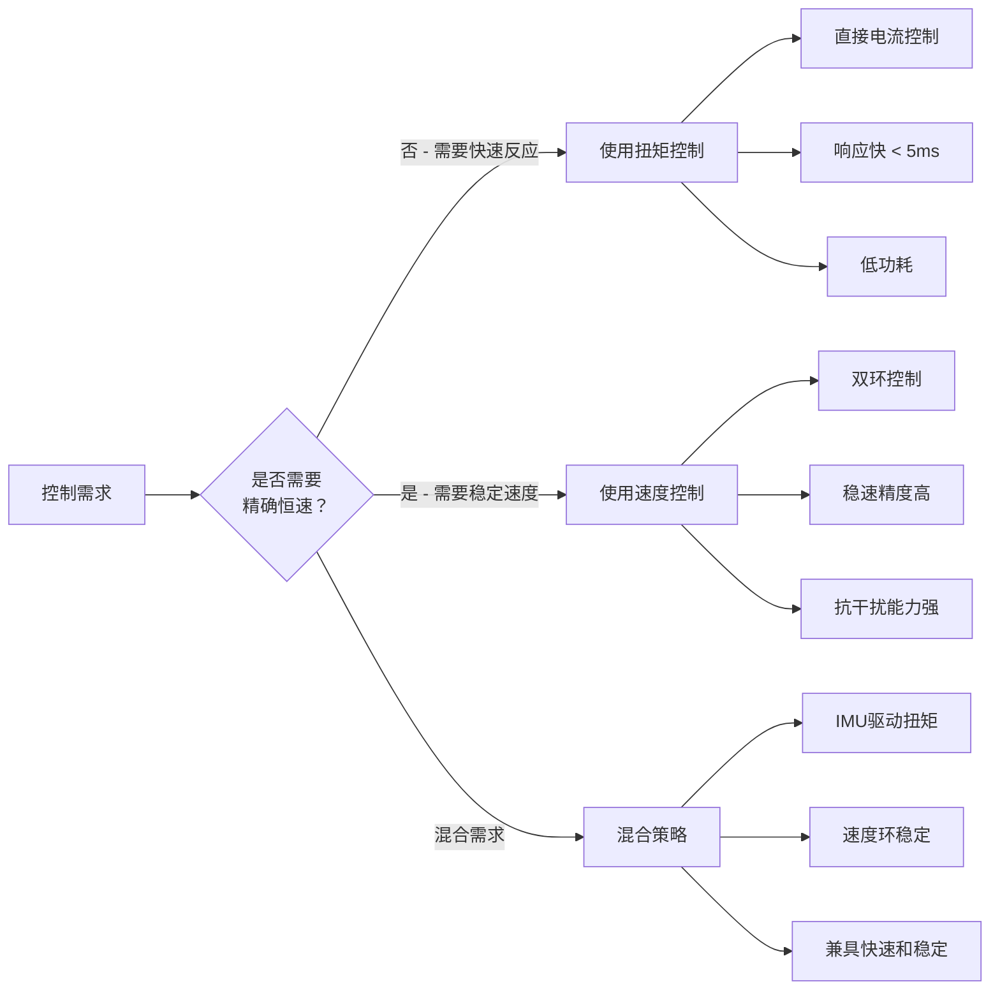

### 5. 应用场景选择

#### 5.1 应用场景对比表

| 应用场景 | 推荐控制模式 | 原因说明 |
|---------|-----------|--------|
| 云台稳定 (IMU反馈) | **扭矩控制** | 需要快速反应，IMU已提供角度信息 |
| 固定速度运行 | **速度控制** | 负载变化时能自动补偿，保证速度稳定 |
| 恒力推送 | **扭矩控制** | 需要精确的力值反馈和控制 |
| 精确定位 | **速度角度控制** | 结合速度环和角度环 |
| 急加急停 | **扭矩控制** | 响应速度快，无延迟 |
| 平稳加速 | **速度控制** | 加速度平稳，震荡小 |
| 负载波动环境 | **速度控制** | 自动调节补偿 |
| 低延迟系统 | **扭矩控制** | 直接控制，延迟最小 |

#### 5.1.1 扭矩控制 vs 速度控制 - 全面对比

##### 响应特性对比

| 指标项 | 扭矩控制 | 速度控制 | 说明 |
|------|--------|--------|------|
| **响应时间** | < 5ms | 20-50ms | 扭矩控制快速 |
| **系统延迟** | 2-3个采样周期 | 10-20个采样周期 | 环节数不同 |
| **阶跃上升时间** | 5-20ms | 50-200ms | 快速vs平稳 |
| **超调量** | 20-40% | 5-15% | 扭矩快但超调大 |
| **稳定时间** | 50-150ms | 200-500ms | 扭矩控制先到达 |
| **控制频率** | 1kHz+ | 100-500Hz | 扭矩支持高频 |

##### 稳定性对比

| 指标项 | 扭矩控制 | 速度控制 | 说明 |
|------|--------|--------|------|
| **转速稳定度** | ±5-10% | ±1-2% | 速度控制更稳定 |
| **负载承受范围** | ±10-20% | ±50% | 速度控制适应面广 |
| **长期稳定性** | 3-5小时 | 10小时以上 | 长期需速度控制 |
| **参数敏感性** | 高 (Kt变化影响大) | 低 (鲁棒性强) | 速度控制不敏感 |
| **环境适应性** | 差 (工况固定) | 好 (自适应) | 变工况用速度 |
| **温度漂移影响** | 明显 | 微弱 | 速度环补偿 |

##### 控制特性对比

| 指标项 | 扭矩控制 | 速度控制 | 说明 |
|------|--------|--------|------|
| **控制自由度** | 高 (直接控制电流) | 受限 (受目标速度限制) | 扭矩灵活度高 |
| **精度指标** | 电流精度 0.1A级 | 转速精度 0.5%级 | 精度类型不同 |
| **控制复杂度** | 简单 (单环) | 中等 (双环) | 复杂度对比 |
| **调参难度** | 容易 (仅电流环) | 困难 (双环耦合) | 速度控制调参难 |
| **可靠性** | 高 (环节少) | 中等 (环节多) | 扭矩更可靠 |
| **故障恢复** | 快速 | 较慢 | 单环比双环快 |

##### 功能特性对比

| 指标项 | 扭矩控制 | 速度控制 | 说明 |
|------|--------|--------|------|
| **需要的传感器** | 电流传感器 | 电流+速度传感器 | 扭矩传感要求低 |
| **反馈信息** | 电流值 | 转速值 | 信息类型不同 |
| **负载补偿** | 无 (被动) | 有 (主动) | 速度控制主动补偿 |
| **速度限制** | 无法限制 | 可自动限制 | 速度控制更安全 |
| **扭矩限制** | 直接限制 | 间接通过目标速度 | 扭矩控制更直接 |
| **故障保护** | 过流保护 | 过流+过速保护 | 速度控制保护全面 |

##### 能耗和成本对比

| 指标项 | 扭矩控制 | 速度控制 | 说明 |
|------|--------|--------|------|
| **功耗** | 低 (精确控制) | 中等 (频繁调节) | 扭矩控制省电 |
| **发热量** | 少 | 中等 | 与功耗相关 |
| **硬件成本** | 低 ($20-30) | 中等 ($40-50) | 扭矩控制便宜 |
| **编码器要求** | 可选 (仅用反馈) | 必需 (反馈信号) | 速度控制强制要求 |
| **电流传感精度** | 高要求 | 一般 | 扭矩控制对电流敏感 |
| **MCU计算量** | 少 | 中等 | 扭矩控制计算简单 |

##### 应用场景对比

| 应用场景 | 扭矩控制优势 | 速度控制优势 | 推荐方案 |
|--------|-----------|-----------|--------|
| **云台稳定** | ✅ 快速响应IMU | ❌ 反应太慢 | **扭矩控制** |
| **传送带** | ❌ 速度波动 | ✅ 恒速稳定 | **速度控制** |
| **伺服定位** | ❌ 过冲大 | ✅ 平稳定位 | **级联PID** |
| **急加急停** | ✅ 响应快 | ❌ 反应慢 | **扭矩控制** |
| **恒力推送** | ✅ 力值精确 | ❌ 力值不精确 | **扭矩控制** |
| **风电机组** | ❌ 效率差 | ✅ 效率高 | **速度控制** |
| **机械臂** | ❌ 精度不足 | ✅ 精度好 | **级联PID** |
| **打印机** | ❌ 不稳定 | ✅ 平稳可靠 | **速度控制** |

##### 调参参考表

| 参数项 | 扭矩控制 | 速度控制 | 调参周期 |
|------|--------|--------|--------|
| **电流环 Kp** | 1.0-2.0 | 1.0-2.0 | 5-10分钟 |
| **电流环 Ki** | 0.0-0.1 | 0.0-0.1 | 5-10分钟 |
| **电流环 Kd** | 0.0-0.01 | 0.0-0.01 | 可选 |
| **速度环 Kp** | N/A | 0.1-0.5 | 20-30分钟 |
| **速度环 Ki** | N/A | 0.01-0.1 | 20-30分钟 |
| **速度环 Kd** | N/A | 0.001-0.01 | 可选 |
| **总调参时间** | 10-15分钟 | 30-60分钟 | 差异明显 |
| **调参难度等级** | ⭐⭐ (简单) | ⭐⭐⭐⭐ (复杂) | 难度差异大 |

##### 决策矩阵

根据应用需求快速选择控制方式：

```
需求维度                    优先选择
─────────────────────────────────────
需要响应快 (< 10ms)          → 扭矩控制
需要恒速稳定                 → 速度控制
需要精确定位                 → 级联PID
需要快速启动/停止            → 扭矩控制
负载会大幅波动               → 速度控制
系统参数固定                 → 扭矩控制
系统参数会变化               → 速度控制
能源效率优先                 → 扭矩控制
运行稳定性优先               → 速度控制
硬件成本优先                 → 扭矩控制
综合性能优先                 → 混合策略
```

#### 5.2 DengFOC 系统中的应用

**主控制循环** (runFOC in main.cpp):
```cpp
// 静止状态检测
if (角度误差小) {
    Acc++;
    if (Acc > N) {
        // 使用扭矩控制 + 速度环稳定
        Y_loop.update(error);      // 外环速度控制
        setTorque(Y_loop.output);  // 内环扭矩执行
    }
}
```

这是一个混合控制策略：
- **内环**: 使用扭矩控制快速反应IMU数据
- **外环**: 使用速度PID平滑控制，防止过度纠正

#### 5.3 具体应用场景深度分析

##### 5.3.1 云台稳定（推荐：扭矩控制）

**应用描述**:
- 航拍云台、手持稳定器、摄影机云台等
- 需要快速响应IMU传感器的倾斜信息
- 通过精确扭矩控制抵消倾斜和晃动

**技术方案**:
```
IMU检测倾斜角度 Δθ
    ↓
计算误差角速度目标值
    ↓
转换为目标扭矩 T = Kp × Δθ + Ki × ∫Δθdt
    ↓
使用扭矩控制立即执行
    ↓
快速消除倾斜 (< 100ms)
```

**核心优势**:
- ✅ 毫秒级响应 (< 5ms) - 人眼无法感知延迟
- ✅ 无需编码器反馈 - 仅需IMU
- ✅ 低功耗 - 精确控制避免过度调节
- ✅ 自然感觉 - 跟随运动更平顺

**参数建议**:
```cpp
// 扭矩控制参数 - 云台稳定
float Kp = 0.045;  // 快速响应
float Ki = 0.002;  // 消除稳态偏差
float Kd = 0.0001; // 阻尼震荡
float torque_limit = 6.0;  // 扭矩限制
```

**典型性能指标**:
- 响应时间: 2-5ms
- 稳定精度: ±0.5°
- 功耗: 2-5W
- 最大倾斜角速度: 500°/s

##### 5.3.2 固定速度运行（推荐：速度控制）

**应用描述**:
- 传送带驱动、转台、恒速电机等
- 负载可能变化（货物增减、摩擦变化等）
- 需要保持恒定转速

**技术方案**:
```
用户设定目标转速 ω_target
    ↓
读取编码器实际转速 ω_actual
    ↓
速度环PID计算目标扭矩
    ↓
电流环执行扭矩控制
    ↓
负载变化时自动调节扭矩维持转速
```

**核心优势**:
- ✅ 负载变化 ±50% 仍保持稳定转速
- ✅ 无需频繁调参 - 参数鲁棒性强
- ✅ 长期稳定运行 - 适合工业应用
- ✅ 自动扭矩补偿 - 对用户透明

**参数建议**:
```cpp
// 速度控制参数 - 恒速运行
// 外环(速度环)
float speed_Kp = 0.5;   // 较小，防止过调
float speed_Ki = 0.05;  // 消除稳态误差
float speed_Kd = 0.01;

// 内环(电流环) - 响应快
float current_Kp = 1.2; // 较大，快速跟踪
float current_Ki = 0.0;
float current_Kd = 0.0;
```

**典型性能指标**:
- 转速精度: ±2%
- 响应时间: 100-500ms
- 负载承受范围: ±50%
- 稳定性: 可运行 > 10小时

##### 5.3.3 精确定位（推荐：速度角度控制）

**应用描述**:
- 相机自动对焦、伺服定位、机械臂关节等
- 需要快速定位到指定角度
- 同时要求加速度平稳

**技术方案**:
```
用户设定目标角度 θ_target
    ↓
级联控制：角度环 → 速度环 → 电流环
    ↓
角度环: T = Kp(θ_target - θ_current)
    ↓
速度环: 限制加速度平稳性
    ↓
电流环: 执行精确扭矩
```

**三环级联框图**:
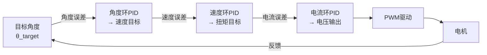

**核心优势**:
- ✅ 定位精度高 (< 0.1°)
- ✅ 加速度平稳 - 避免冲击
- ✅ 响应快速 (< 500ms到达)
- ✅ 过冲小 (< 5%)

**参数建议**:
```cpp
// 三环参数 - 精确定位
// 角度环(外环)
float pos_Kp = 2.0;   // 控制定位速度
float pos_Ki = 0.1;

// 速度环(中间环)
float speed_Kp = 0.5; // 平稳加速
float speed_Ki = 0.05;

// 电流环(内环)
float current_Kp = 1.2; // 快速响应
```

**典型性能指标**:
- 定位精度: ±0.1°
- 定位时间: 200-800ms
- 过冲: < 5%
- 加速度: 10-50°/s²

##### 5.3.4 急加急停（推荐：扭矩控制）

**应用描述**:
- 快速启动/停止、紧急制动
- 需要最短的响应时间
- 加速度不是主要考量

**技术方案**:
```
收到加速指令
    ↓
立即设置最大目标扭矩
    ↓
电流环快速响应 (< 5ms)
    ↓
电机加速到目标速度
    
收到停止指令
    ↓
设置反向制动扭矩
    ↓
快速制停 (< 100ms)
```

**核心优势**:
- ✅ 响应时间最短 (< 5ms)
- ✅ 加速度最大 (无速度环限制)
- ✅ 制动力大 - 有效制动
- ✅ 简单可靠 - 控制逻辑清晰

**参数建议**:
```cpp
// 扭矩控制 - 急加急停
float max_torque_accel = 10.0;  // 最大加速扭矩
float max_torque_brake = -15.0; // 最大制动扭矩
float current_Kp = 2.0;         // 更大的电流环增益
```

**典型性能指标**:
- 启动时间: 2-5ms
- 制动时间: 50-200ms
- 加速度: 100-500°/s²
- 平稳性: 一般 (存在过冲)

##### 5.3.5 复杂混合应用（推荐：混合控制）

**应用描述**: DengFOC云台系统本身
- 需要快速稳定云台 (扭矩控制优势)
- 同时需要平稳运动 (速度控制优势)
- 工作环境多变

**采用的混合策略**:
```cpp
void runFOC() {
    GetAngle();           // 获取IMU+编码器角度
    
    if (系统静止 && IMU数据可信) {
        // 阶段1: 高速反应 - 扭矩控制
        float torque = Kp × angle_error + Kd × angle_velocity;
        setTorque(torque);        // 扭矩控制
        
    } else if (系统运动 && 需要平稳) {
        // 阶段2: 平稳运动 - 速度控制
        speed_error = speed_target - speed_current;
        torque = speed_loop.update(speed_error);
        setTorque(torque);        // 速度环输出的扭矩
        
    } else {
        // 阶段3: 角度闭环 - 级联控制
        angle_error = angle_target - angle_current;
        speed_target = angle_loop.update(angle_error);
        torque = speed_loop.update(speed_target - speed_current);
        setTorque(torque);
    }
}
```

**性能指标**:
- 稳定时间: < 100ms
- 稳定精度: ±0.5°
- 平稳性: 良好
- 适应性: 多工况支持

##### 5.3.6 应用场景决策树

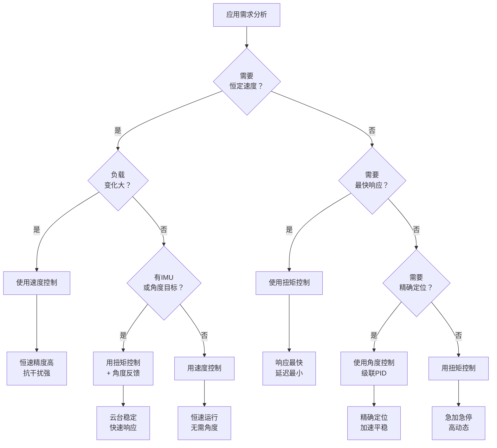

### 6. 数学推导汇总

#### 6.1 频域分析（Laplace变换）

**扭矩控制传递函数**:
$$G_{torque}(s) = \frac{\omega(s)}{T_{target}(s)} = \frac{1}{Js + B}$$

**速度控制传递函数** (带速度环和电流环):
$$G_{speed}(s) = \frac{\omega(s)}{\omega_{target}(s)} = \frac{G_{vel}(s) \cdot G_{cur}(s)}{1 + G_{vel}(s) \cdot G_{cur}(s)}$$

其中：
- $G_{vel}(s)$: 速度环PID
- $G_{cur}(s)$: 电流环PID

#### 6.2 稳态误差分析

**扭矩控制的稳态速度**:
$$\omega_{ss} = \frac{T - T_{load}}{B}$$

当负载改变时：
$$\Delta \omega_{ss} = \frac{\Delta T_{load}}{B}$$

**速度控制的稳态速度**:
$$\omega_{ss} = \omega_{target} \text{ (零误差)}$$

即使负载变化，系统仍维持目标速度。

#### 6.3 能量考量

扭矩控制下的功率消耗：
$$P = T \cdot \omega = T \cdot \frac{T - T_{load}}{B}$$

速度控制下的功率消耗（负载补偿）：
$$P = T \cdot \omega_{target} = (T_{load} + B\omega_{target}) \cdot \omega_{target}$$

### 7. 实现建议

#### 7.1 选择扭矩控制的条件
- ✅ 系统具有IMU等外部反馈（已知目标状态）
- ✅ 需要毫秒级快速响应
- ✅ 控制对象负载相对恒定
- ✅ 硬件能精确测量电流
- ✅ 优先考虑能量效率

#### 7.2 选择速度控制的条件
- ✅ 需要稳定的速度输出
- ✅ 负载可能剧烈波动
- ✅ 允许百毫秒级延迟
- ✅ 对加速度平稳性有要求
- ✅ 需要长时间稳速运行

#### 7.3 混合控制策略（推荐）
结合两种方案的优点：
```
if (系统稳定 && IMU数据可信) {
    使用扭矩控制 + 轻量速度环稳定  // 快速反应
} else if (需要长期恒速 && 负载变化) {
    使用速度控制                    // 稳定补偿
} else {
    使用角度闭环 (级联控制)         // 精确定位
}
```

---

### 5. 硬件适配

#### 5.1 GPIO 引脚配置

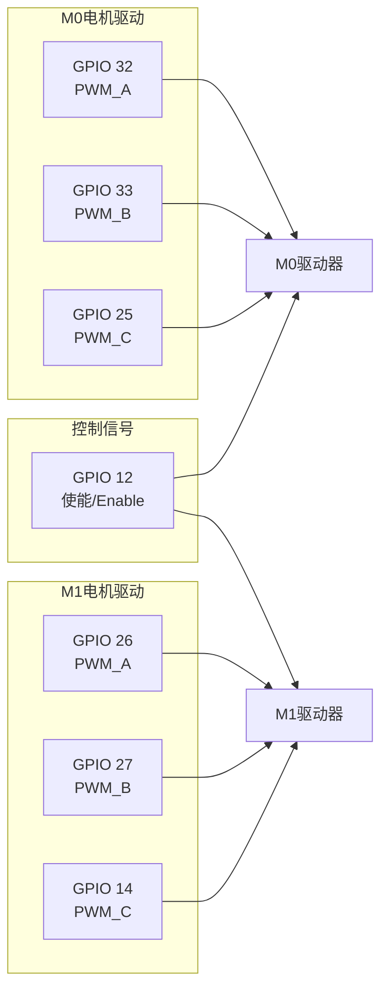

#### 5.2 硬件版本适配

```cpp
#define DengFOC 0   // 0: V3P板  1: V4板
#define UNDERVOLTAGE_THRES 11.1V  // 欠压检测阈值
```

#### 5.3 EEPROM 存储映射

| 地址 | 用途 | 字节数 |
|------|------|--------|
| 0-3 | M0电机初始化对齐值 | 4 |
| 4-7 | M1电机初始化对齐值 | 4 |
| 8-11 | M0编码器方向 | 4 |
| 12-15 | M1编码器方向 | 4 |

---

## 软件流程

### 1. 初始化流程

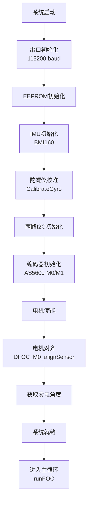

### 2. 主循环控制流程 (runFOC)

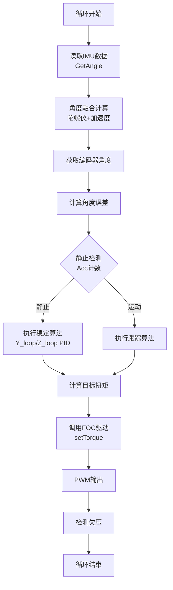

### 3. 陀螺仪-加速度融合

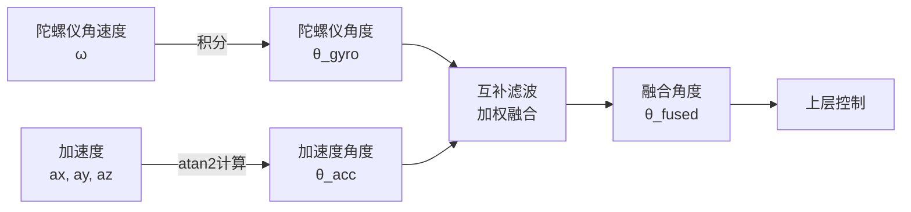

---

## 关键功能特性

### 1. 电机对齐 (Alignment)

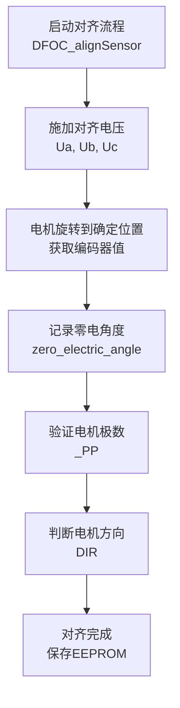

### 2. 稳定性检测

```cpp
// 检测逻辑
if (|angle_error| < threshold) {
    Acc++;  // 累计静止次数
    if (Acc > N) {
        // 进入稳定模式
        // 使用Y_loop/Z_loop PID控制
    }
} else {
    Acc = 0;  // 重置计数
}
```

### 3. 电压监测与保护

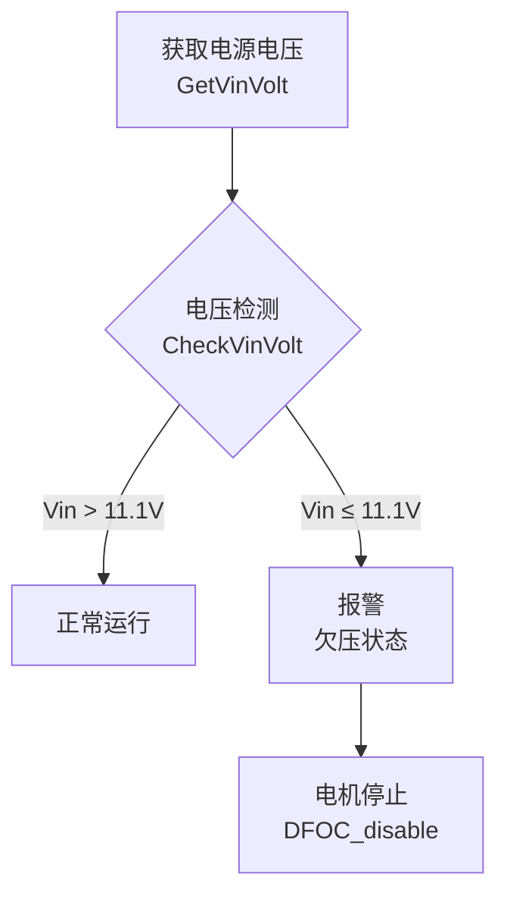

---

## 数据流详解

### 1. 传感器数据处理流

```
IMU原始数据 (int16_t)
    ↓
缩放转换 (× 0.061 → g单位, × 0.00763 → dps单位)
    ↓
陀螺仪死区过滤 (< 0.05 dps)
    ↓
角度积分 (使用时间间隔)
    ↓
IMU互补滤波 + 加速度计融合
    ↓
融合角度输出 (angleX, angleY)
    ↓
上层控制系统
```

### 2. 编码器数据处理流

```
AS5600 12位输出 (0~4095)
    ↓
转换为角度 (θ = RAW × 360/4096)
    ↓
圈数计数 (检测跨越0°/360°)
    ↓
计算完整角度 (full_rotations × 360 + θ)
    ↓
速度计算 (Δθ / Δt)
    ↓
低通滤波
    ↓
控制系统反馈
```

### 3. 控制输出流

```
电流目标值 Iq_target
    ↓
Park反变换 (dq → αβ)
    ↓
Clark反变换 (αβ → abc)
    ↓
SVPWM调制
    ↓
PWM占空比 (0~100%)
    ↓
GPIO输出 → 功率级驱动
```

---

## 主要全局变量

### 传感器数据
```cpp
int ax, ay, az;              // 加速度计原始值
int gx, gy, gz;              // 陀螺仪原始值
float accX, accY, accZ;      // 加速度(g单位)
float gyroX, gyroY, gyroZ;   // 角速度(dps单位)
float angleAccX, angleAccY;  // 加速度计角度
float last_angleX, last_angleY, last_angleZ;  // 融合角度
```

### 控制参数
```cpp
float Torget_0;              // M0目标扭矩
float Torget_1;              // M1目标扭矩
float angle1_error_0;        // M0角度误差
float angle1_error_1;        // M1角度误差
float M0_zero_electric_angle;  // M0零电角度
float M1_zero_electric_angle;  // M1零电角度
```

### PID 控制器
```cpp
PIDController Y_loop;        // 垂直电机稳定环
PIDController Z_loop;        // 水平电机稳定环
LowPassFilter Y_Flt;         // 垂直电机低通滤波
LowPassFilter Z_Flt;         // 水平电机低通滤波
```

---

## 高级特性

### 1. 低通滤波

系统使用一阶低通滤波器(LowPassFilter类)对各环节数据进行平滑处理：

```cpp
class LowPassFilter {
    float Tf;      // 时间常数 (单位: 秒)
    float alpha;   // 滤波系数 = Tf / (Tf + Ts)
    float y_prev;  // 上一次输出
};

// 一阶低通滤波方程: y = α·x + (1-α)·y_prev
```

**应用场景**:
- 垂直电机速度: Tf=10ms
- 水平电机速度: Tf=10ms
- 电流反馈: Tf=5ms

### 2. 动态限幅

PID输出通过 `output_ramp` 参数限制变化率，防止突变：

```cpp
if (|output - output_prev| > ramp × Ts) {
    output = output_prev + sign(output - output_prev) × ramp × Ts;
}
```

### 3. 角度归一化

```cpp
float _normalizeAngle(float angle) {
    // 将角度归一化到 [-π, π] 范围
    while (angle > PI) angle -= 2*PI;
    while (angle < -PI) angle += 2*PI;
    return angle;
}
```

---

## 故障诊断

### 1. 常见故障

| 故障现象 | 可能原因 | 解决方案 |
|---------|---------|---------|
| 电机不转 | 对齐失败 | 检查编码器连接，重新运行对齐 |
| 抖动明显 | PID参数不合适 | 调整 P/I/D 系数 |
| 角速度异常 | 陀螺仪漂移 | 重新校准陀螺仪 |
| 欠压报警 | 电源不足 | 检查电源，确保 > 11.1V |
| 编码器数据异常 | I2C通信故障 | 检查IIC线路和从地址 |

### 2. 调试接口

通过串口命令进行实时调试：
```
函数: serialReceiveUserCommand()
函数: serial_motor_target()
```

---

## 系统参数总结

| 参数 | 值 | 说明 |
|------|-----|------|
| 微控制器 | ESP32 LOLIN32 Lite | - |
| IMU | BMI160 | 加速度计+陀螺仪 |
| 编码器 | AS5600 (×2) | 磁编码器 |
| 电机数量 | 2 | M0(垂直)+M1(水平) |
| PWM频率 | - | 由ESP32决定 |
| 串口波特率 | 115200 bps | 调试用 |
| EEPROM大小 | 32 bytes | 参数存储 |
| 欠压阈值 | 11.1V | 电池保护 |

---

## 版本信息

- **作者**: 灯哥开源
- **许可证**: GNU General Public License (GPL)
- **适配硬件**: DengFOC V3P/V4 双轴万向节驱动板
- **支持平台**: PlatformIO + ESP32 Arduino框架

---

## 更新日志

| 版本 | 日期 | 描述 |
|------|------|------|
| 1.0 | 2024-05-11 | 初版发布，支持双轴FOC控制 |

