# 车企对电机控制器开发流程

本文系统整理车企（OEM）对电机控制器（MCU/PEU/Inverter）的典型开发流程。内容覆盖项目立项、系统设计、软硬件开发、FOC 控制算法、Bootloader、UDS 诊断刷写、CANoe/CAPL 测试、PPAP 量产准备与售后闭环。

车规电机控制器开发通常以 V 模型为主线，以 APQP/PPAP 管理质量成熟度，同时结合 ASPICE、ISO 26262 功能安全、ISO 21434 信息安全、ISO 14229 UDS 诊断、ISO 15765-2 传输层以及各 OEM 内部规范。

## 1. 全生命周期总览

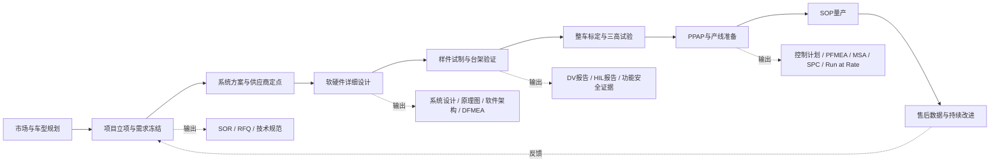

### 1.1 关键阶段

| 阶段 | 主要目标 | 典型输入 | 典型输出 |
| --- | --- | --- | --- |
| 概念与立项 | 明确整车目标、边界条件和项目商业可行性 | 车型平台规划、动力性能、续航、成本目标、法规要求 | 项目章程、整车技术规范、初版系统需求 |
| 供应商定点 | 确认技术方案、成本、周期和质量能力 | SOR、RFQ、接口规范、目标成本 | 技术方案、报价、风险清单、定点信 |
| 设计开发 | 完成系统、硬件、软件、结构、热设计 | 系统需求、功能安全目标、平台约束 | 系统架构、原理图、PCB、软件设计、测试计划 |
| 样件验证 | 证明设计满足需求 | DV样件、软件版本、测试规范 | DV/PV报告、问题闭环、标定数据 |
| 生产准备 | 证明过程稳定且具备量产能力 | PPAP样件、工艺文件、EOL规范 | PPAP包、Run at Rate报告、量产批准 |
| 量产售后 | 稳定供货并闭环市场问题 | SOP版本、售后数据、质量数据 | 8D报告、OTA升级、ECR/ECN、经验库 |

### 1.2 里程碑

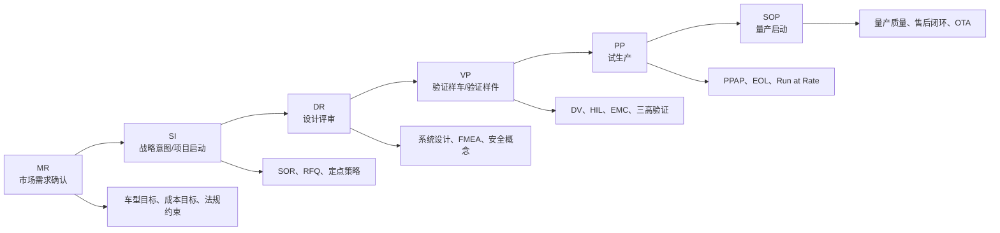

## 2. V 模型与 APQP 对应关系

电机控制器开发不是单纯的代码或硬件开发，而是需求、架构、实现、验证、生产和售后共同约束的系统工程。V 模型保证需求到验证的可追溯性，APQP 保证从设计到量产的质量成熟度。

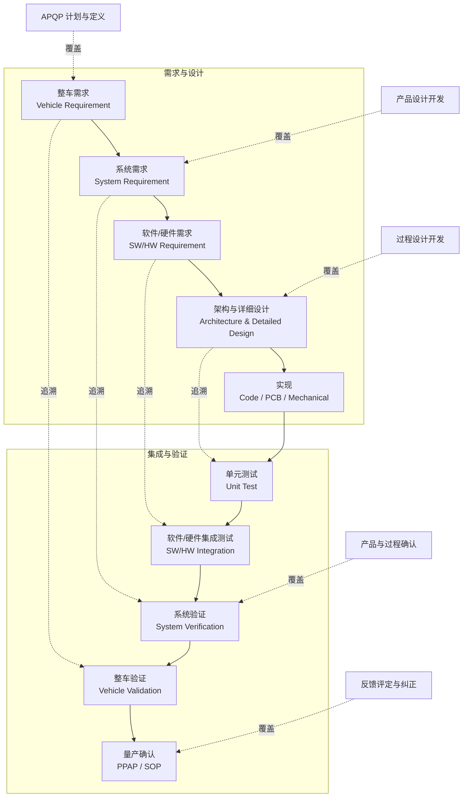

## 3. 项目立项与需求定义

### 3.1 OEM 需求输入

整车厂通常从车型平台目标出发，向供应商下发整车级、动力总成级和零部件级需求：

- 动力性：峰值功率、持续功率、峰值转矩、持续转矩、最高转速。
- 经济性：效率 MAP、能耗目标、回馈制动效率。
- 电气平台：400 V / 800 V，电压范围，母线纹波，预充策略。
- 热管理：冷却方式、水道压降、入口温度、降额策略。
- NVH：转矩脉动、电磁噪声、开关频率、PWM策略。
- 通信诊断：CAN / CAN-FD / LIN / FlexRay / Ethernet、UDS、DTC、OTA。
- 安全与法规：ASIL 等级、EMC、绝缘、IP 等级、环保与可回收要求。
- 质量与成本：目标价格、供应链约束、量产节拍、质保里程。

### 3.2 电机控制器核心需求

| 需求域 | 典型内容 |
| --- | --- |
| 功率与电流 | 峰值/持续功率，峰值/持续相电流，过载时间，短路耐受能力 |
| 高压接口 | 母线电压范围，预充控制，主动放电，被动放电，绝缘监测 |
| 低压接口 | KL30/KL15，唤醒休眠，低压掉电保持，电源诊断 |
| 控制性能 | 转矩响应，转矩精度，速度控制精度，弱磁能力，回馈制动 |
| 保护功能 | 过流、过压、欠压、过温、相线开短路、旋变故障、驱动故障 |
| 通信诊断 | 周期报文、事件报文、UDS服务、DTC、快照、扩展数据 |
| 功能安全 | HARA、ASIL分解、安全目标、FSR、TSR、Safety Case |
| 信息安全 | 安全启动、安全刷写、签名校验、密钥保护、防回滚 |
| 生产测试 | EOL测试项、刷写流程、标定写入、追溯码、老化测试 |

## 4. 系统架构

电机控制器是强电、弱电、控制算法、通信诊断、热设计和结构设计高度耦合的 ECU。系统方案应在早期明确边界，否则后期会在 EMC、热、效率、功能安全或生产测试上反复返工。

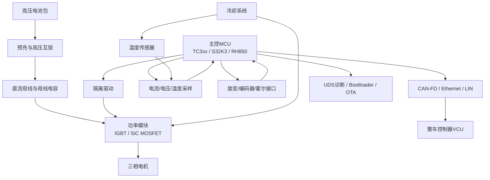

### 4.1 系统设计关注点

- 拓扑选择：两电平/三电平，IGBT/SiC，单电机/双电机集成。
- 采样方案：双电阻、三电阻、母线电流采样，采样窗口与 PWM 同步。
- 位置方案：旋变、编码器、霍尔、无位置传感器。
- 驱动保护：DESAT、Miller Clamp、负压关断、短路保护、栅极电阻策略。
- 热设计：功率模块热阻、水冷板、热仿真、温度降额曲线。
- EMC：母线电容、共模路径、屏蔽、接地、Y 电容、滤波器布局。
- 安全机制：关断路径、转矩监控、采样冗余、看门狗、时钟监控、存储校验。

## 5. 软件架构

车规电机控制器软件通常采用 AUTOSAR Classic 分层架构，但高速电机控制环由于实时性极强，常通过 CDD 或专用高速任务绕过部分 RTE 开销。

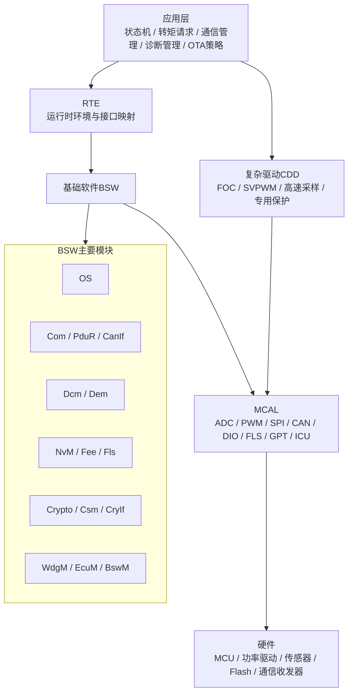

### 5.1 软件模块划分

| 层级 | 模块 | 说明 |
| --- | --- | --- |
| 应用层 | 状态机、转矩仲裁、诊断策略、OTA策略 | 管理 ECU 行为、故障响应、整车交互 |
| 控制算法 | FOC、电流环、速度环、MTPA、弱磁、SVPWM | 决定控制性能、效率和 NVH |
| 复杂驱动 | PWM/ADC同步、旋变解码、驱动芯片SPI、快速保护 | 对实时性和硬件耦合要求高 |
| BSW | OS、COM、DCM、DEM、NvM、EcuM、BswM | 提供标准化服务 |
| MCAL | ADC、PWM、SPI、CAN、DIO、FLS、GPT、ICU | 屏蔽 MCU 差异 |
| Bootloader | 安全刷写、启动管理、回滚保护 | 支持生产刷写、售后升级、OTA |

### 5.2 任务调度

| 任务 | 周期 | 典型内容 |
| --- | --- | --- |
| PWM 中断任务 | 50-100 us | ADC采样读取、Clarke/Park、电流环、SVPWM、快速保护 |
| 快速周期任务 | 1 ms | 速度计算、转矩限制、温度滤波、故障监控 |
| 通信任务 | 5-10 ms | CAN报文收发、信号超时、VCU交互 |
| 慢速任务 | 100 ms | NVM管理、诊断状态、热管理、统计信息 |
| 后台任务 | 空闲 | 自检、数据记录、低优先级维护 |

## 6. FOC 控制算法工程化

FOC（Field Oriented Control）是电机控制器核心算法。量产工程中需要同时考虑采样同步、执行时序、标定接口、定点化、故障监控、功能安全和可测试性。

### 6.1 FOC 信号链

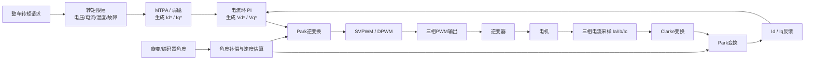

### 6.2 FOC 分层控制框图

为了避免一张大图横向过宽，FOC 控制框图按层级拆分为“控制层级总览、指令与外环、电流内环与调制、反馈链路”四张图。这样在 Markdown 预览或文档导出时更容易阅读。

#### 6.2.1 控制层级总览

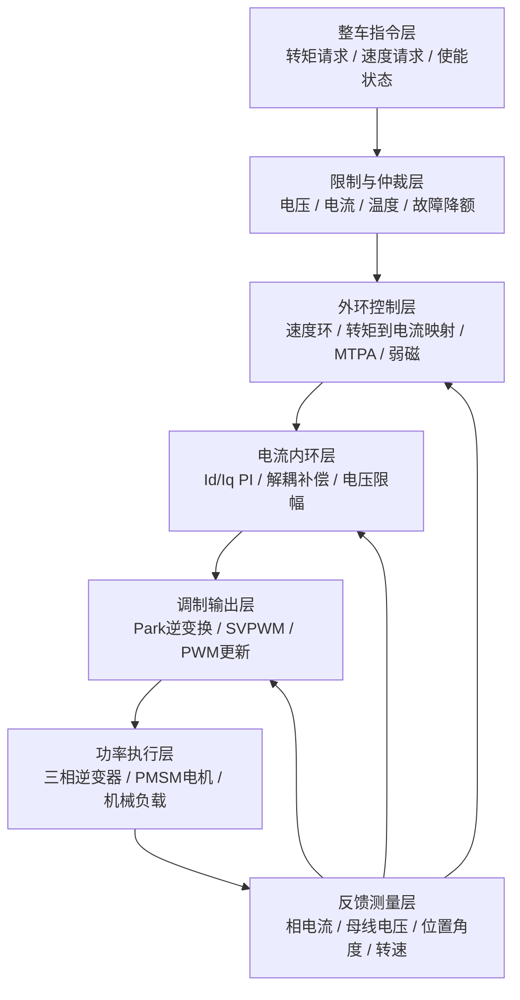

#### 6.2.2 指令、限制与外环

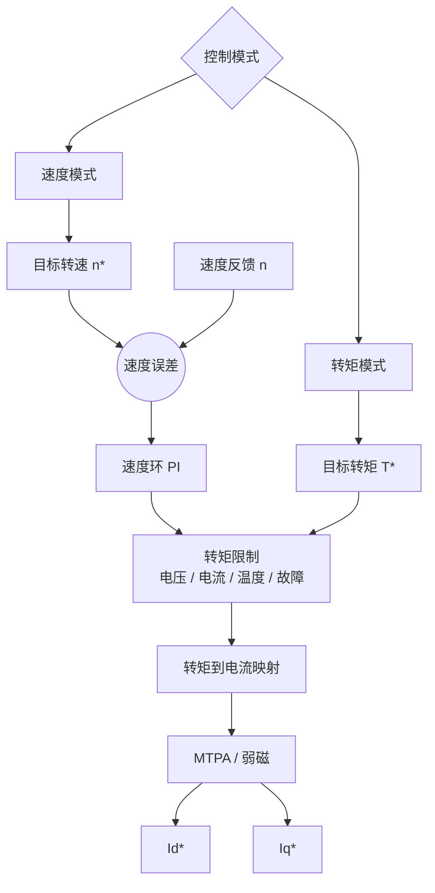

#### 6.2.3 电流内环与调制输出

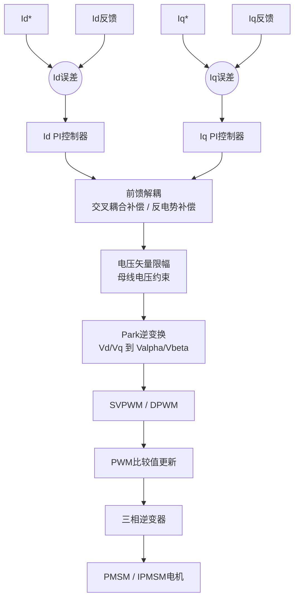

#### 6.2.4 电流、位置与速度反馈

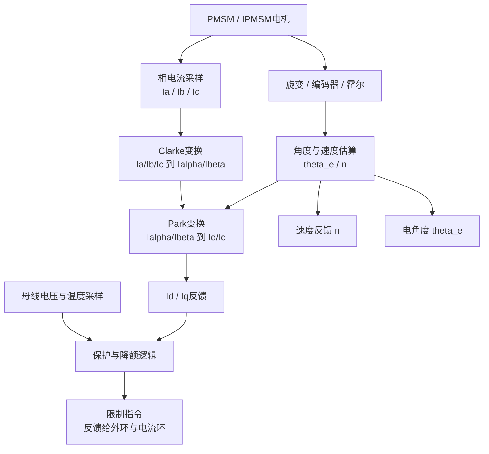

### 6.3 PWM 与 ADC 同步

三相电流采样应避开开关噪声，通常在 PWM 中点或稳定窗口触发 ADC 转换。高速工况、低调制度和过调制场景下，还需要考虑采样窗口不足与电流重构。

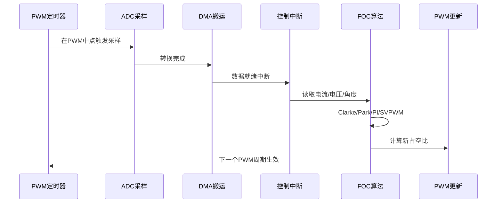

### 6.4 关键算法模块

| 模块 | 作用 | 工程注意事项 |
| --- | --- | --- |
| Clarke/Park | 三相静止坐标到旋转坐标转换 | 角度同步、缩放一致性、定点溢出 |
| 电流环 PI | 快速调节 Id/Iq | 抗积分饱和、前馈解耦、母线电压限幅 |
| MTPA | 单位电流最大转矩 | MAP表标定、温度修正、磁饱和补偿 |
| 弱磁控制 | 高速区提升转速范围 | 电压闭环、稳定性、过调制边界 |
| SVPWM/DPWM | 生成三相占空比 | 死区补偿、最小脉宽、采样窗口 |
| 位置估算 | 获取电角度与速度 | 旋变零位、极对数、角度延迟补偿 |
| 保护算法 | 快速关断与降额 | 硬件保护优先，软件保护分级响应 |

## 7. Bootloader 与刷写设计

Bootloader 是生产刷写、售后升级和 OTA 的基础。车规项目通常采用 PBL + SBL + APP 的分层启动方案，量产项目还会加入安全启动、签名校验、A/B 分区、防回滚与失败恢复。

### 7.1 启动架构

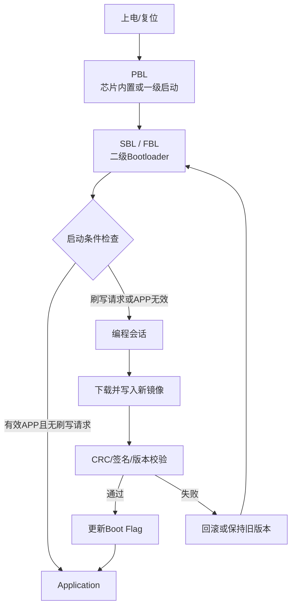

### 7.2 Flash 分区

| 分区 | 作用 |
| --- | --- |
| Bootloader | 启动、刷写、校验、回滚，不随普通 APP 升级频繁变更 |
| Application A/B | 支持双区升级，降低刷写失败变砖风险 |
| Calibration | 标定数据、变体参数、EOL写入数据 |
| NVM/DTC | 故障码、冻结帧、学习值、统计信息 |
| Boot Flag | 镜像状态、启动尝试次数、回滚标志、防回滚版本 |
| HSM/Key | 密钥、证书、计数器，通常受硬件安全模块保护 |

### 7.3 UDS 刷写主流程

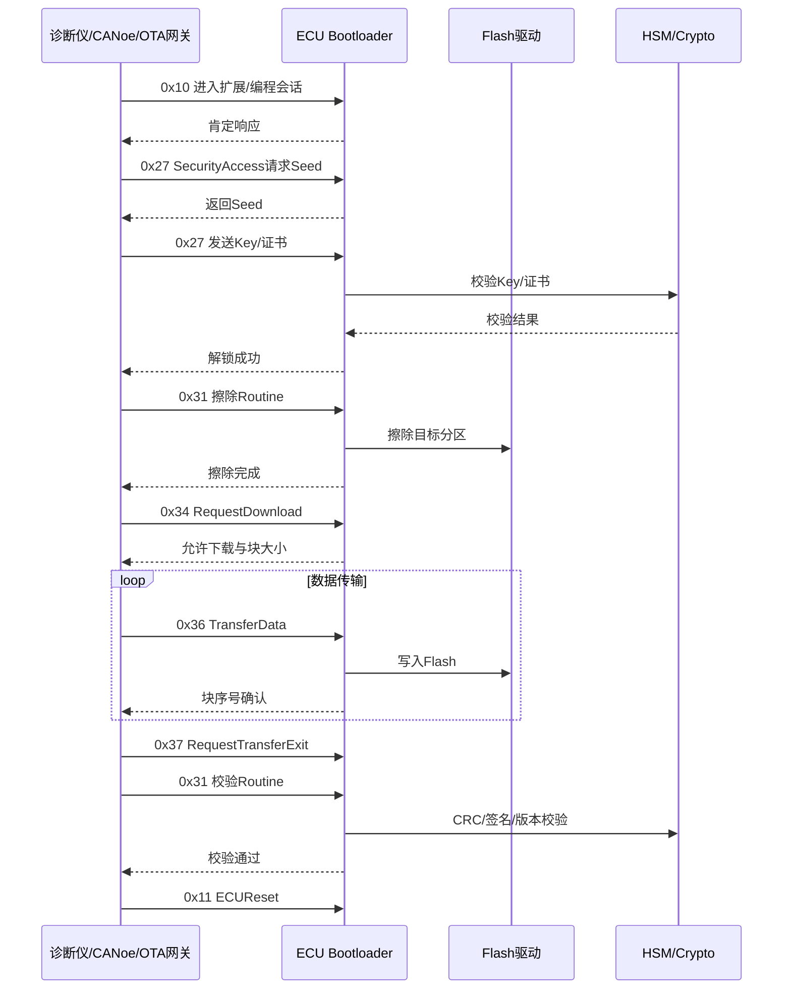

### 7.4 Bootloader 关键设计点

- 刷写前置条件：电压稳定、车速为零、挡位安全、热状态允许、通信链路稳定。
- 传输层参数：BS、STmin、P2/P2*、CAN-FD DLC、掉帧重试策略。
- Flash 驱动：擦写函数尽量放 RAM 执行，避免读写冲突；擦写过程需要事务保护。
- 安全机制：Seed-Key 或证书认证、签名校验、安全启动、防回滚、防暴力尝试。
- 失败恢复：A/B 分区、启动尝试计数、镜像状态机、回滚到上一稳定版本。

## 8. UDS 诊断与 CANoe/CAPL 测试

诊断测试要覆盖服务正例、反例、会话权限、NRC、边界值、超时、压力、掉电、总线错误和刷写异常。CANoe/CAPL 可用于手工调试、自动化回归、压力测试和 HIL 联动。

### 8.1 测试体系

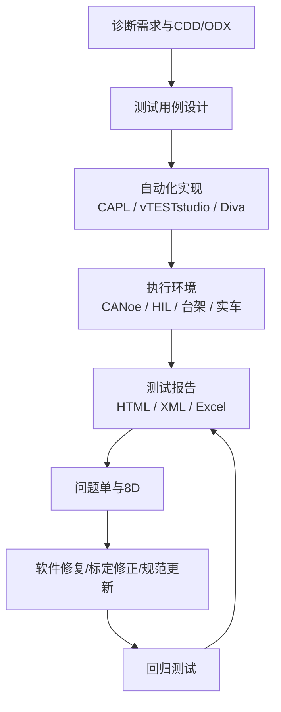

### 8.2 UDS 测试矩阵

| 测试类别 | 覆盖内容 |
| --- | --- |
| 会话管理 | 默认会话、扩展会话、编程会话、会话超时、会话切换 |
| 安全访问 | Seed-Key、错误Key、延时锁定、尝试次数、掉电恢复 |
| DID读写 | 支持DID、未支持DID、长度错误、权限错误、边界值 |
| Routine | 擦除、校验、依赖条件、执行中状态、结果查询 |
| DTC | 设置、清除、状态位、冻结帧、扩展数据、老化策略 |
| 刷写 | 完整刷写、断点异常、块序号错误、CRC错误、签名错误 |
| 传输层 | 单帧、多帧、流控、STmin、BS、超时、丢帧、乱序 |
| 压力测试 | 高频请求、长时间稳定性、总线负载、模糊测试 |
| 故障注入 | BUSOFF、电源中断、通信中断、Flash写失败、低压 |

### 8.3 CANoe 工程组织

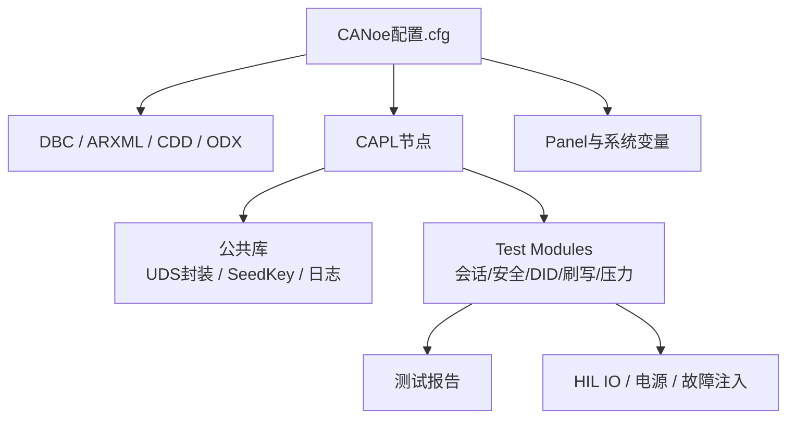

### 8.4 自动化建议

- 公共库优先封装 UDS 请求、响应检查、NRC 检查、超时处理和日志输出。
- 测试用例按服务、会话、权限、正例、反例、压力和异常恢复分类。
- 对刷写流程建立独立回归集，至少覆盖完整刷写、断电恢复、签名失败和防回滚。
- 对长期测试记录 P2/P2* 响应时间、失败率、总线负载、ECU复位次数和DTC变化。
- CI/CD 中可将 CANoe 命令行执行、报告归档和问题单关联串起来。

## 9. 功能安全与信息安全

### 9.1 功能安全开发链路

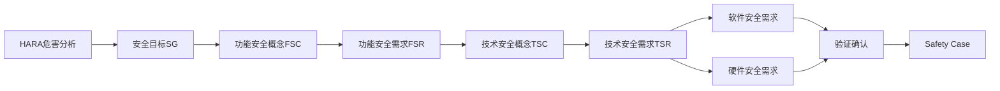

### 9.2 电机控制器典型安全机制

| 风险 | 可能后果 | 典型安全机制 |
| --- | --- | --- |
| 非预期转矩 | 车辆异常加速/减速 | 转矩监控、双通道校验、VCU请求合理性检查 |
| 过流/短路 | 功率器件损坏 | 硬件DESAT、比较器快速关断、软件过流诊断 |
| 位置传感器错误 | 控制失稳、转矩异常 | 旋变诊断、角度合理性、速度斜率监控 |
| 采样链路异常 | 控制偏差 | ADC范围检查、三相电流和校验、冗余采样 |
| 软件跑飞 | 控制失控 | 看门狗、时钟监控、MPU、程序流监控 |
| 存储损坏 | 错误标定或错误启动 | CRC、双备份、NVM块状态、启动校验 |

### 9.3 信息安全要求

- 安全启动：Bootloader 对 APP 做签名校验，防止未授权软件运行。
- 安全刷写：下载镜像需认证、加密或签名校验，防止恶意刷写。
- 密钥保护：密钥不应明文存储在 APP 中，优先使用 HSM 或安全存储。
- 防回滚：通过安全计数器或版本策略禁止刷回有漏洞的旧版本。
- 日志审计：关键安全事件需要记录，便于售后追溯和问题分析。

## 10. 样件验证与量产准备

### 10.1 DV/PV 验证

| 测试类别 | 主要内容 |
| --- | --- |
| 性能测试 | 效率MAP、转矩精度、动态响应、弱磁能力、回馈能力 |
| 环境测试 | 高低温、温湿度循环、冷热冲击、盐雾、防水防尘 |
| 机械测试 | 振动、冲击、跌落、连接器保持力 |
| EMC测试 | RE、CE、BCI、ESD、瞬态脉冲、抗扰度 |
| 可靠性测试 | 功率循环、热循环、老化、寿命、HALT/HASS |
| 功能安全测试 | 故障注入、诊断覆盖率、SPFM/LFM、降级策略 |
| 整车验证 | 台架联调、整车标定、三高试验、道路耐久 |

### 10.2 PPAP 与产线准备

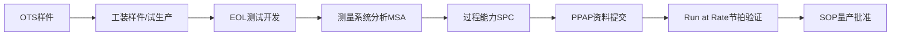

PPAP 常见资料包括设计记录、工程变更、DFMEA、PFMEA、控制计划、过程流程图、尺寸报告、材料报告、性能报告、MSA、SPC、外观批准、样件提交保证书等。电机控制器还需要关注 EOL 测试覆盖率、追溯码、刷写版本、标定版本和高压安规测试。

### 10.3 EOL 典型测试项

| 类别 | 测试项 |
| --- | --- |
| 基础电气 | 低压电源、电流消耗、唤醒休眠、IO输入输出 |
| 高压安全 | 绝缘、耐压、主动放电、预充控制、高压互锁 |
| 通信诊断 | CAN/CAN-FD通信、DID读写、DTC清除、软件版本读取 |
| 功率驱动 | PWM输出、驱动芯片状态、短路保护、相序检查 |
| 传感器 | 电流偏置、母线电压、温度、旋变/编码器接口 |
| 刷写标定 | Bootloader刷写、APP校验、标定写入、追溯码写入 |

## 11. 问题闭环与持续改进

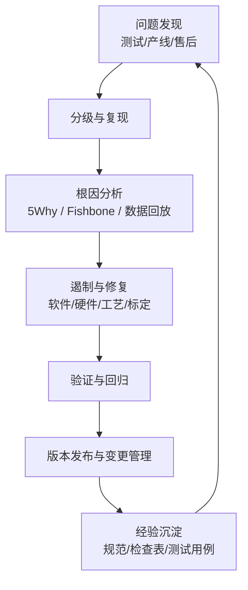

### 11.1 常见问题与排查方向

| 问题 | 常见原因 | 排查建议 |
| --- | --- | --- |
| 转矩抖动 | 电流采样噪声、角度误差、PI参数不当、死区补偿不足 | 看相电流、角度、Iq波动、PWM占空比和机械共振点 |
| 高速失控或限速 | 弱磁参数、母线电压利用率、角度延迟补偿不足 | 检查Vd/Vq限幅、调制度、角度补偿和过调制策略 |
| 驱动报故障 | DESAT误触发、栅极参数、布局寄生、电源纹波 | 结合示波器看Vge、Vce、母线纹波和故障脚 |
| EMC不过 | 共模路径、开关速度、滤波不足、接地不良 | 调整栅阻、屏蔽、Y电容、母线布局和滤波器 |
| 刷写失败 | TP参数、Flash擦写超时、签名错误、掉电恢复缺陷 | 抓CANoe Trace，检查NRC、块序号、P2/P2*和Boot Flag |
| EOL误判 | 工装接触、测试时序、标定未写入、版本不一致 | 加强夹具诊断、版本校验、重试策略和追溯 |

## 12. 推荐交付物清单

| 阶段 | 交付物 |
| --- | --- |
| 立项 | 项目计划、需求清单、接口清单、风险清单、供应商定点资料 |
| 系统设计 | 系统架构、功能清单、接口控制文档、功能安全概念、信息安全概念 |
| 硬件设计 | 原理图、PCB、BOM、热仿真、EMC设计说明、硬件测试报告 |
| 软件设计 | 软件架构、模块设计、接口设计、调度设计、诊断设计、刷写设计 |
| 算法开发 | FOC模型、标定表、控制参数、仿真报告、HIL测试报告 |
| 验证确认 | DVP&R、测试用例、DV/PV报告、问题闭环记录、三高报告 |
| 量产准备 | PFMEA、控制计划、EOL规范、PPAP包、Run at Rate报告 |
| 售后维护 | 8D报告、OTA包、版本发布说明、经验库、变更记录 |

## 13. 实施建议

1. 需求阶段建立可追溯矩阵，将整车需求、系统需求、软硬件需求和测试用例关联起来。
2. 系统架构阶段提前锁定采样方案、驱动保护、热设计和 EMC 策略，避免后期硬件返版。
3. 软件开发阶段把高速控制环、诊断通信、Bootloader 和安全机制分层管理，接口稳定后再并行开发。
4. FOC 算法应从 MIL/SIL/HIL 到台架逐级验证，并保留标定参数、测试工况和问题记录。
5. 刷写和诊断测试要尽早自动化，避免到 SOP 前集中暴露会话权限、NRC、超时和掉电恢复问题。
6. PPAP 前重点检查 EOL 覆盖率、追溯链路、版本一致性和产线节拍。
7. SOP 后通过售后 DTC、OTA 结果、产线 PPM 和 8D 闭环持续更新设计规范和测试用例库。

## 14. 总结

电机控制器开发的核心不是单点技术，而是系统工程闭环：需求要清楚，架构要稳定，算法要可标定，软件要可测试，Bootloader 要可恢复，诊断要可追溯，产线要可量产，售后要能闭环。对车企项目而言，V 模型提供技术验证主线，APQP/PPAP 提供质量成熟度主线，功能安全和信息安全提供约束边界，自动化测试和问题闭环决定最终交付质量。
