# 车企对电机控制器开发流程

本文系统整理车企（OEM）对电机控制器（MCU/PEU/Inverter）的典型开发流程。内容覆盖项目立项、系统设计、软硬件开发、FOC 控制算法、Bootloader、UDS 诊断刷写、CANoe/CAPL 测试、PPAP 量产准备与售后闭环。

车规电机控制器开发通常以 V 模型为主线，以 APQP/PPAP 管理质量成熟度，同时结合 ASPICE、ISO 26262 功能安全、ISO 21434 信息安全、ISO 14229 UDS 诊断、ISO 15765-2 传输层以及各 OEM 内部规范。

## 1. 全生命周期总览

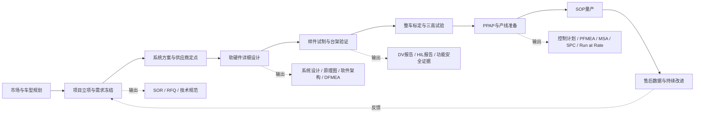

### 1.1 关键阶段

| 阶段 | 主要目标 | 典型输入 | 典型输出 |
| --- | --- | --- | --- |
| 概念与立项 | 明确整车目标、边界条件和项目商业可行性 | 车型平台规划、动力性能、续航、成本目标、法规要求 | 项目章程、整车技术规范、初版系统需求 |
| 供应商定点 | 确认技术方案、成本、周期和质量能力 | SOR、RFQ、接口规范、目标成本 | 技术方案、报价、风险清单、定点信 |
| 设计开发 | 完成系统、硬件、软件、结构、热设计 | 系统需求、功能安全目标、平台约束 | 系统架构、原理图、PCB、软件设计、测试计划 |
| 样件验证 | 证明设计满足需求 | DV样件、软件版本、测试规范 | DV/PV报告、问题闭环、标定数据 |
| 生产准备 | 证明过程稳定且具备量产能力 | PPAP样件、工艺文件、EOL规范 | PPAP包、Run at Rate报告、量产批准 |
| 量产售后 | 稳定供货并闭环市场问题 | SOP版本、售后数据、质量数据 | 8D报告、OTA升级、ECR/ECN、经验库 |

### 1.2 里程碑

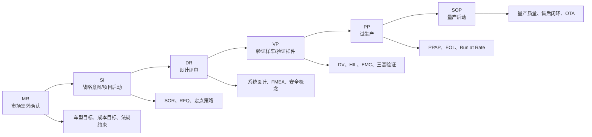

## 2. V 模型与 APQP 对应关系

电机控制器开发不是单纯的代码或硬件开发，而是需求、架构、实现、验证、生产和售后共同约束的系统工程。V 模型保证需求到验证的可追溯性，APQP 保证从设计到量产的质量成熟度。

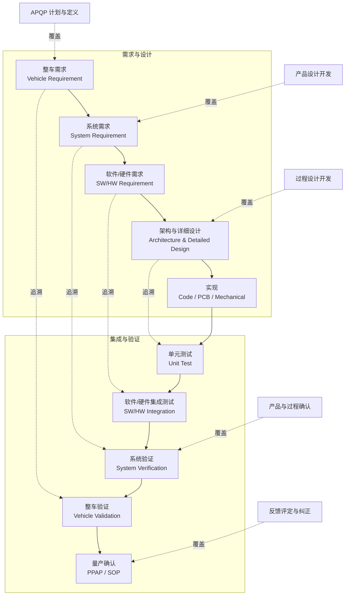

## 3. 项目立项与需求定义

### 3.1 OEM 需求输入

整车厂通常从车型平台目标出发，向供应商下发整车级、动力总成级和零部件级需求：

- 动力性：峰值功率、持续功率、峰值转矩、持续转矩、最高转速。
- 经济性：效率 MAP、能耗目标、回馈制动效率。
- 电气平台：400 V / 800 V，电压范围，母线纹波，预充策略。
- 热管理：冷却方式、水道压降、入口温度、降额策略。
- NVH：转矩脉动、电磁噪声、开关频率、PWM策略。
- 通信诊断：CAN / CAN-FD / LIN / FlexRay / Ethernet、UDS、DTC、OTA。
- 安全与法规：ASIL 等级、EMC、绝缘、IP 等级、环保与可回收要求。
- 质量与成本：目标价格、供应链约束、量产节拍、质保里程。

### 3.2 电机控制器核心需求

| 需求域 | 典型内容 |
| --- | --- |
| 功率与电流 | 峰值/持续功率，峰值/持续相电流，过载时间，短路耐受能力 |
| 高压接口 | 母线电压范围，预充控制，主动放电，被动放电，绝缘监测 |
| 低压接口 | KL30/KL15，唤醒休眠，低压掉电保持，电源诊断 |
| 控制性能 | 转矩响应，转矩精度，速度控制精度，弱磁能力，回馈制动 |
| 保护功能 | 过流、过压、欠压、过温、相线开短路、旋变故障、驱动故障 |
| 通信诊断 | 周期报文、事件报文、UDS服务、DTC、快照、扩展数据 |
| 功能安全 | HARA、ASIL分解、安全目标、FSR、TSR、Safety Case |
| 信息安全 | 安全启动、安全刷写、签名校验、密钥保护、防回滚 |
| 生产测试 | EOL测试项、刷写流程、标定写入、追溯码、老化测试 |

## 4. 系统架构

电机控制器是强电、弱电、控制算法、通信诊断、热设计和结构设计高度耦合的 ECU。系统方案应在早期明确边界，否则后期会在 EMC、热、效率、功能安全或生产测试上反复返工。

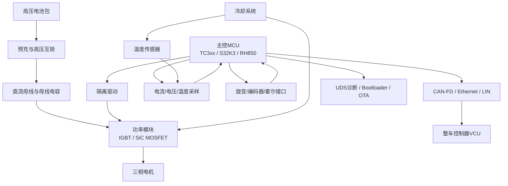

### 4.1 系统设计关注点

- 拓扑选择：两电平/三电平，IGBT/SiC，单电机/双电机集成。
- 采样方案：双电阻、三电阻、母线电流采样，采样窗口与 PWM 同步。
- 位置方案：旋变、编码器、霍尔、无位置传感器。
- 驱动保护：DESAT、Miller Clamp、负压关断、短路保护、栅极电阻策略。
- 热设计：功率模块热阻、水冷板、热仿真、温度降额曲线。
- EMC：母线电容、共模路径、屏蔽、接地、Y 电容、滤波器布局。
- 安全机制：关断路径、转矩监控、采样冗余、看门狗、时钟监控、存储校验。

### 4.2 电机本体：内转子与外转子区别

内转子和外转子的核心区别是转子相对定子的位置不同：内转子电机的转子在定子内侧，外转子电机的转子在定子外侧。该结构差异会影响转矩密度、转动惯量、响应速度、散热路径和最高转速，也会进一步影响电机控制器的电流环带宽、速度环参数、弱磁能力和热保护策略。

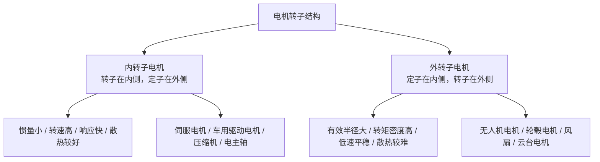

| 项目 | 内转子电机 | 外转子电机 |
| --- | --- | --- |
| 结构 | 转子在里面，定子在外面 | 定子在里面，转子像外壳一样包在外面 |
| 旋转部分 | 中心轴或内部转子旋转 | 外壳或外圈转子旋转 |
| 转动惯量 | 较小 | 较大 |
| 动态响应 | 响应快，适合快速加减速 | 响应相对慢，但转矩输出更平稳 |
| 散热 | 定子在外侧，散热路径较好 | 定子在内侧，散热相对困难 |
| 转矩密度 | 同尺寸下转矩相对小一些 | 有效半径更大，同尺寸下转矩更大 |
| 最高转速 | 更容易做高转速 | 不太适合特别高转速 |
| 典型应用 | 伺服电机、车用驱动电机、压缩机、电主轴 | 无人机电机、轮毂电机、风扇、云台电机 |

简单理解：内转子电机更像常见的高速电机，中心轴在转，适合高转速和快速动态响应；外转子电机更像一个会转的外壳，由于有效力臂更大，更适合低速大转矩和直驱场景。

## 5. 软件架构

车规电机控制器软件通常采用 AUTOSAR Classic 分层架构，但高速电机控制环由于实时性极强，常通过 CDD 或专用高速任务绕过部分 RTE 开销。

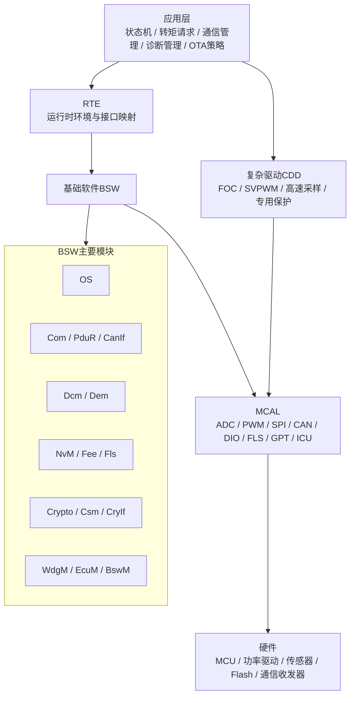

### 5.1 软件模块划分

| 层级 | 模块 | 说明 |
| --- | --- | --- |
| 应用层 | 状态机、转矩仲裁、诊断策略、OTA策略 | 管理 ECU 行为、故障响应、整车交互 |
| 控制算法 | FOC、电流环、速度环、MTPA、弱磁、SVPWM | 决定控制性能、效率和 NVH |
| 复杂驱动 | PWM/ADC同步、旋变解码、驱动芯片SPI、快速保护 | 对实时性和硬件耦合要求高 |
| BSW | OS、COM、DCM、DEM、NvM、EcuM、BswM | 提供标准化服务 |
| MCAL | ADC、PWM、SPI、CAN、DIO、FLS、GPT、ICU | 屏蔽 MCU 差异 |
| Bootloader | 安全刷写、启动管理、回滚保护 | 支持生产刷写、售后升级、OTA |

### 5.2 任务调度

| 任务 | 周期 | 典型内容 |
| --- | --- | --- |
| PWM 中断任务 | 50-100 us | ADC采样读取、Clarke/Park、电流环、SVPWM、快速保护 |
| 快速周期任务 | 1 ms | 速度计算、转矩限制、温度滤波、故障监控 |
| 通信任务 | 5-10 ms | CAN报文收发、信号超时、VCU交互 |
| 慢速任务 | 100 ms | NVM管理、诊断状态、热管理、统计信息 |
| 后台任务 | 空闲 | 自检、数据记录、低优先级维护 |

## 6. FOC 控制算法工程化

FOC（Field Oriented Control）是电机控制器核心算法。量产工程中需要同时考虑采样同步、执行时序、标定接口、定点化、故障监控、功能安全和可测试性。

### 6.1 FOC 信号链

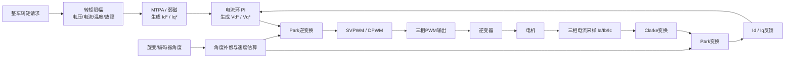

### 6.2 FOC 分层控制框图

为了避免一张大图横向过宽，FOC 控制框图按层级拆分为“控制层级总览、指令与外环、电流内环与调制、反馈链路”四张图。这样在 Markdown 预览或文档导出时更容易阅读。

#### 6.2.1 控制层级总览

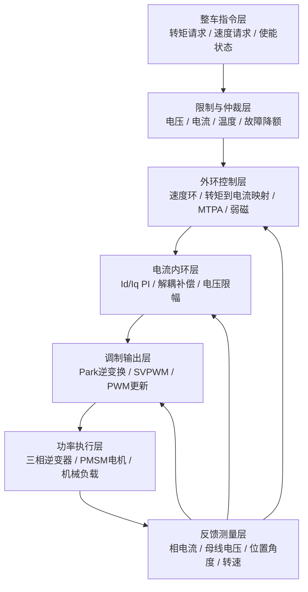

#### 6.2.2 指令、限制与外环

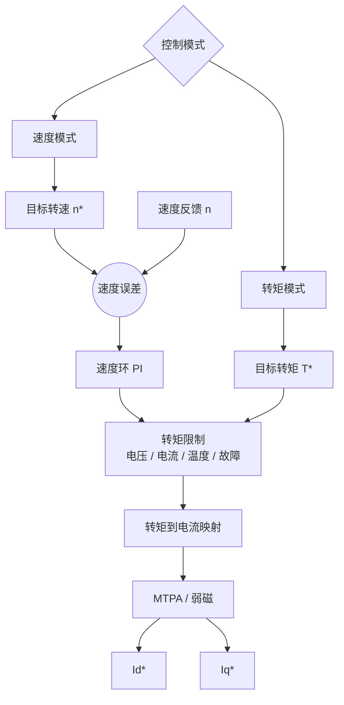

#### 6.2.3 电流内环与调制输出

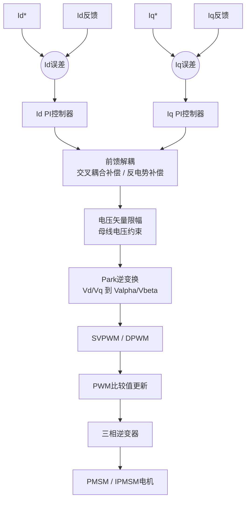

#### 6.2.4 电流、位置与速度反馈

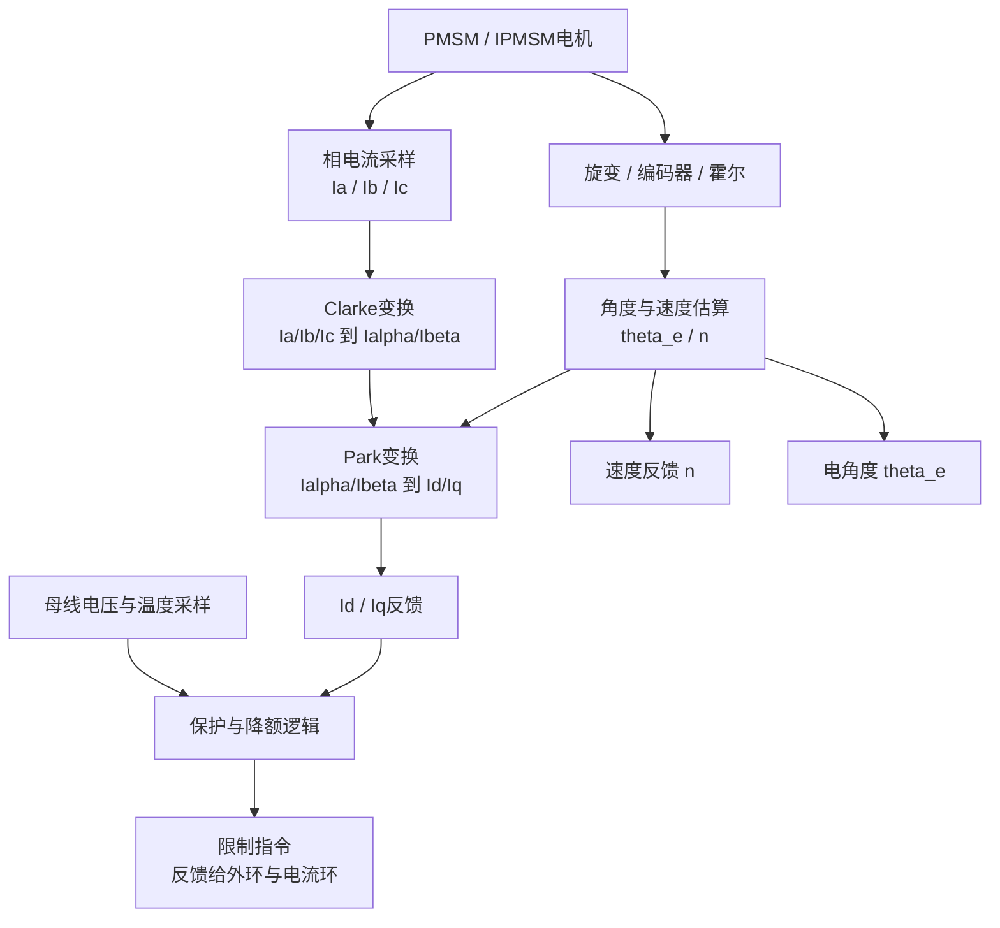

### 6.3 PWM 与 ADC 同步

三相电流采样应避开开关噪声，通常在 PWM 中点或稳定窗口触发 ADC 转换。高速工况、低调制度和过调制场景下，还需要考虑采样窗口不足与电流重构。

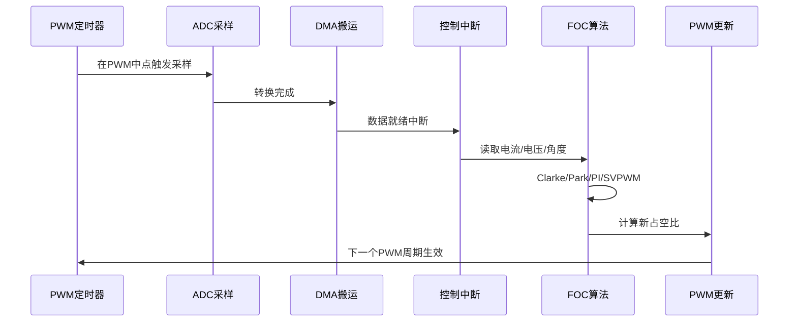

### 6.4 关键算法模块

| 模块 | 作用 | 工程注意事项 |
| --- | --- | --- |
| Clarke/Park | 三相静止坐标到旋转坐标转换 | 角度同步、缩放一致性、定点溢出 |
| 电流环 PI | 快速调节 Id/Iq | 抗积分饱和、前馈解耦、母线电压限幅 |
| MTPA | 单位电流最大转矩 | MAP表标定、温度修正、磁饱和补偿 |
| 弱磁控制 | 高速区提升转速范围 | 电压闭环、稳定性、过调制边界 |
| SVPWM/DPWM | 生成三相占空比 | 死区补偿、最小脉宽、采样窗口 |
| 位置估算 | 获取电角度与速度 | 旋变零位、极对数、角度延迟补偿 |
| 保护算法 | 快速关断与降额 | 硬件保护优先，软件保护分级响应 |

### 6.5 以 S32K3 为例的电机控制器详细实现方案

本节以 NXP S32K3 系列 MCU 为例，给出一套 PMSM/IPMSM 电机控制器的工程实现方案。具体料号可按项目复杂度选择，例如 S32K344、S32K358 等；实际外设数量、引脚复用、Flash/RAM、核数和安全能力以目标料号数据手册与参考手册为准。

#### 6.5.1 项目假设与目标

| 项目 | 目标配置 |
| --- | --- |
| 控制对象 | 三相 PMSM / IPMSM，支持内转子或外转子 |
| 控制算法 | FOC，支持 MTPA、弱磁、回馈制动、转矩限幅 |
| PWM 频率 | 10-20 kHz，按功率器件、效率、NVH 和采样窗口确定 |
| 控制周期 | 电流环与 PWM 同步，典型 50-100 us |
| 通信接口 | CAN-FD 与 VCU 通信，UDS 诊断和 Bootloader 刷写 |
| 位置反馈 | 旋变、编码器、霍尔或无位置算法，量产优先选高可靠方案 |
| 功能安全 | 面向 ASIL C/D 项目预留监控、诊断、降级和安全关断机制 |
| 软件平台 | S32 Design Studio + S32K3 RTD/MCAL，必要时集成 AUTOSAR |

#### 6.5.2 S32K3 外设分配

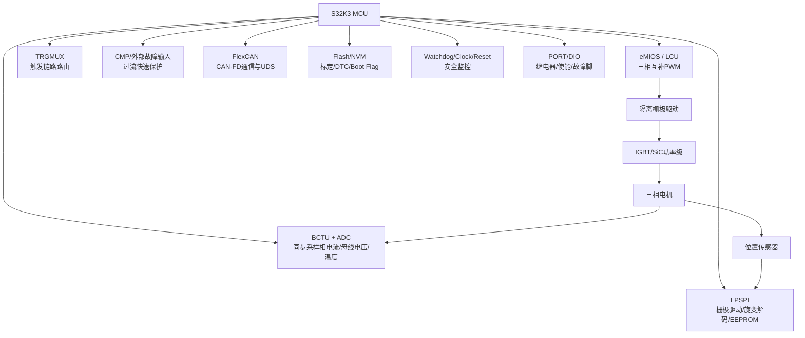

| 功能 | S32K3 资源建议 | 实现要点 |
| --- | --- | --- |
| 三相 PWM | eMIOS / LCU / Pwm 驱动 | 生成 U/V/W 三相互补 PWM，配置死区、极性、同步更新和紧急关断 |
| ADC 同步采样 | BCTU + ADC / Adc 驱动 | 由 PWM 中点触发 ADC，采样 Ia/Ib/Ic、Vdc、温度、低压电源 |
| 触发路由 | TRGMUX / Mcl 配置 | 将 eMIOS 事件路由到 BCTU/ADC，保证采样时刻稳定 |
| 过流保护 | CMP 或外部 Driver Fault | 硬件快速关断优先，软件记录故障原因并进入安全态 |
| 栅极驱动 | LPSPI / Spi 驱动 | 配置驱动芯片、读取 DESAT/UVLO/OT 等诊断状态 |
| 位置反馈 | eMIOS/ICU、LPSPI、ADC | 编码器/霍尔可走 ICU，旋变可走外部 RDC 芯片或专用解码方案 |
| CAN-FD | FlexCAN / Can 驱动 | 周期信号、事件信号、UDS、Bootloader 刷写 |
| NVM | Fls/Fee/NvM 或自研 Flash 服务 | 保存标定参数、DTC、冻结帧、Boot Flag、版本信息 |
| 安全监控 | SWT/WDG、FCCU、MPU、Clock Monitor | 看门狗、时钟监控、内存保护、故障收敛到安全状态 |

#### 6.5.3 软件分层实现

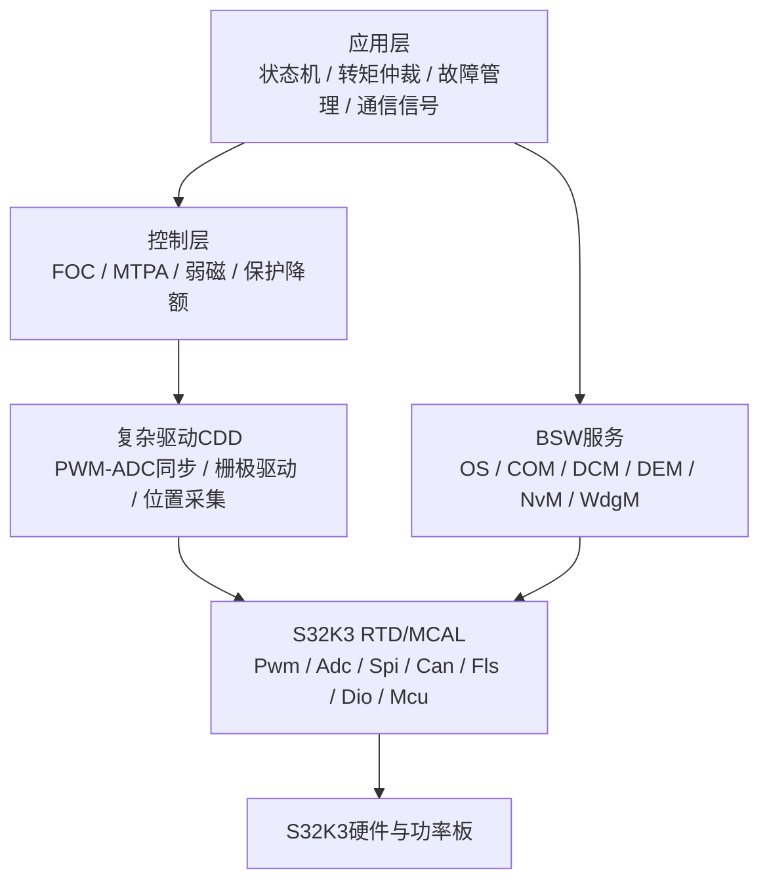

推荐的软件目录如下：

```text
MotorCtrl_S32K3/
  App/
    App_StateMachine.c
    App_TorqueManager.c
    App_FaultManager.c
    App_CanSignal.c
  Control/
    Foc_CurrentLoop.c
    Foc_Transform.c
    Foc_Svpwm.c
    Foc_Mtpa.c
    Foc_FieldWeakening.c
    Foc_Protection.c
  Cdd/
    Cdd_PwmAdcSync.c
    Cdd_GateDriver.c
    Cdd_PositionSensor.c
    Cdd_FastFault.c
  Bsw/
    Diag/
    NvM/
    BootIf/
  Config/
    S32K3_Mcal/
    Pins/
    Clock/
    Linker/
  Calib/
    MotorParam.c
    ControlParam.c
    A2L/
  Test/
    Hil/
    Canoe/
```

#### 6.5.4 PWM、ADC 与 FOC 中断链路

S32K3 上电机控制的关键是建立稳定的硬件触发链：PWM 定时器在中心对齐模式下运行，eMIOS 产生中点触发事件，经 TRGMUX/BCTU 触发 ADC 队列，ADC 转换完成后进入 FOC 中断，最后在安全窗口内更新下一周期 PWM 占空比。

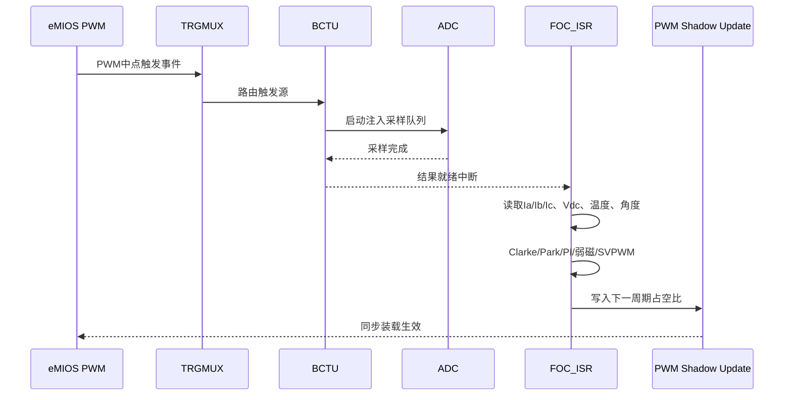

电流环中断建议只做确定性强、耗时可控的事情：

1. 读取 ADC 结果与位置角度。
2. 做采样偏置校正、比例换算和有效性检查。
3. 执行 Clarke/Park、电流 PI、解耦补偿、电压限幅、SVPWM。
4. 更新 PWM Shadow 寄存器。
5. 执行快速保护检查，例如过流、过压、驱动故障、角度异常。

不建议在电流环中断内执行 CAN 通信、Flash 写入、复杂诊断、长日志输出或动态内存操作。

#### 6.5.5 控制状态机

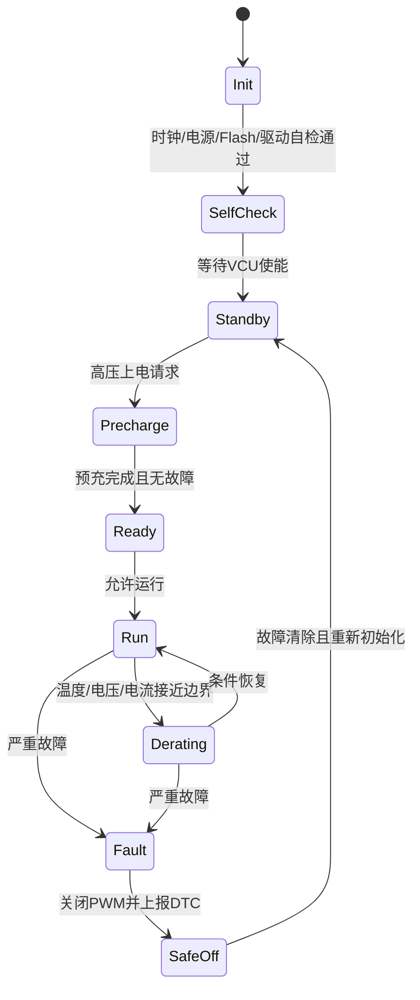

| 状态 | 主要动作 |
| --- | --- |
| Init | 初始化时钟、Port、Dio、Adc、Pwm、Spi、Can、Flash、Watchdog |
| SelfCheck | 检查供电、温度、传感器、驱动芯片、NVM CRC、APP版本 |
| Standby | 等待 VCU 使能，保持 PWM 关闭，周期上报状态 |
| Precharge | 配合整车完成高压预充，监控母线电压上升斜率 |
| Ready | 完成转子位置初始化、偏置校正、参数加载 |
| Run | 执行 FOC，响应转矩请求，实时监控故障 |
| Derating | 温度、电压或电流接近边界时限制 Id/Iq 或转矩 |
| Fault/SafeOff | 关闭 PWM，关断驱动，锁存故障，上报 DTC |

#### 6.5.6 FOC 数据流与关键接口

| 接口 | 输入 | 输出 | 调用周期 |
| --- | --- | --- | --- |
| `Cdd_PwmAdcSync_GetSample()` | ADC原始值 | `Ia/Ib/Ic/Vdc/Temp` 工程量 | PWM中断 |
| `Cdd_PositionSensor_GetAngle()` | 旋变/编码器原始值 | 电角度 `theta_e`、速度 `n` | PWM中断或1ms |
| `Foc_CurrentLoop_Run()` | `IdRef/IqRef`、反馈电流、角度、Vdc | `DutyU/V/W` | PWM中断 |
| `Foc_TorqueManager_Run()` | VCU转矩请求、限制条件 | `IdRef/IqRef` | 1ms |
| `Foc_Protection_RunFast()` | 电流、电压、驱动故障 | 快速故障标志 | PWM中断 |
| `App_FaultManager_Run()` | 快速/慢速故障标志 | DTC、降级、安全态 | 1-10ms |

电流环核心伪代码：

```c
void FOC_CurrentLoopIsr(void)
{
    MotorSample sample = Cdd_PwmAdcSync_GetSample();
    RotorState rotor = Cdd_PositionSensor_GetAngle();

    if (!Foc_Protection_RunFast(&sample, &rotor)) {
        Cdd_Pwm_DisableOutput();
        App_FaultManager_LatchFastFault();
        return;
    }

    AlphaBeta i_ab = Foc_Clarke(sample.ia, sample.ib, sample.ic);
    DqCurrent i_dq = Foc_Park(i_ab, rotor.theta_e);

    DqVoltage v_dq = Foc_CurrentPi_Run(g_id_ref, g_iq_ref, i_dq, sample.vdc);
    v_dq = Foc_DecoupleAndLimit(v_dq, i_dq, rotor.speed, sample.vdc);

    AlphaBeta v_ab = Foc_InvPark(v_dq, rotor.theta_e);
    PwmDuty duty = Foc_Svpwm_Run(v_ab, sample.vdc);

    Cdd_Pwm_UpdateDuty(duty);
}
```

#### 6.5.7 标定参数与 NVM 设计

| 参数类别 | 典型参数 |
| --- | --- |
| 电机参数 | 极对数、Rs、Ld、Lq、磁链、最大电流、最大转速 |
| 控制参数 | Id/Iq PI、速度环 PI、弱磁 PI、MTPA 表、限幅曲线 |
| 保护参数 | 过流阈值、过压/欠压阈值、过温阈值、降额曲线 |
| 传感器参数 | 电流采样增益/偏置、母线电压系数、温度查表、旋变零位 |
| 通信参数 | CAN ID、周期、DID、DTC、软件版本、硬件版本 |
| 生产参数 | 序列号、EOL结果、标定版本、Boot Flag、追溯码 |

建议将参数分为 ROM 默认值、Flash 标定区、RAM 运行值三层。上电时先校验 Flash 标定区 CRC，失败则回退到 ROM 默认值并置诊断故障。量产 EOL 写入参数后，应读取回校验并记录标定版本。

#### 6.5.8 诊断、刷写与通信

S32K3 电机控制器建议至少实现以下诊断与刷写能力：

| 功能 | 实现建议 |
| --- | --- |
| 周期通信 | 通过 FlexCAN/CAN-FD 上报转速、转矩、电流、电压、温度、故障状态 |
| UDS 基础服务 | `0x10` 会话、`0x11` 复位、`0x14` 清故障、`0x19` 读DTC、`0x22/0x2E` DID读写 |
| 安全访问 | `0x27` Seed-Key 或证书认证，量产项目建议接入 HSE/安全服务 |
| 例程控制 | `0x31` 支持擦除、CRC校验、旋变零位学习、EOL自检 |
| 下载刷写 | `0x34/0x36/0x37` 支持 APP 和标定区升级 |
| DTC 管理 | 过流、过压、过温、旋变故障、驱动故障、通信超时、NVM错误 |

Bootloader 可沿用第 7 章方案：SBL/FBL 负责刷写、校验和跳转，APP 负责运行控制。若项目有 OTA 需求，应预留 A/B 分区、镜像签名、防回滚版本和断电恢复策略。

#### 6.5.9 功能安全实现要点

| 安全目标 | S32K3 实现建议 |
| --- | --- |
| 防止非预期转矩 | VCU请求合理性检查、转矩限幅、Id/Iq监控、转矩估算交叉校验 |
| 快速关闭功率级 | 硬件过流输入直接关断 PWM，同时软件锁存故障 |
| 采样链路可信 | ADC范围检查、三相电流和校验、偏置漂移诊断、传感器断线诊断 |
| 位置反馈可信 | 角度跳变检查、速度斜率检查、旋变幅值诊断、备用策略 |
| 软件运行可信 | Watchdog、程序流监控、任务超时监控、栈溢出检查 |
| 存储数据可信 | Flash CRC、标定区双备份、NVM块状态、启动区校验 |
| 通信可信 | CAN计数器/CRC、信号超时、UDS权限控制、安全刷写 |

功能安全项目中，应把上述机制映射到 FSR/TSR，并形成可验证的安全需求、测试用例和 Safety Case 证据。快速关断类故障必须优先走硬件路径，软件路径用于记录、上报和恢复管理。

#### 6.5.10 Bring-up 与验证步骤

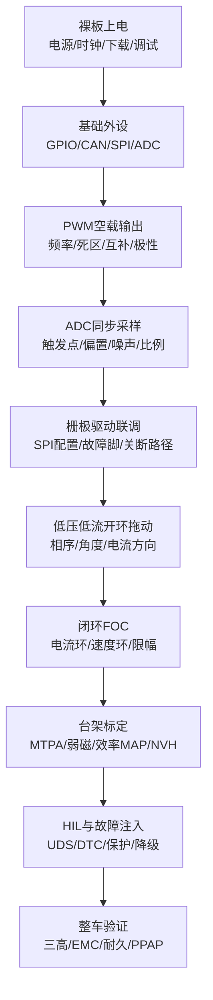

| 阶段 | 核心检查项 |
| --- | --- |
| 裸板上电 | 5V/3.3V电源、复位、晶振/PLL、J-Link/PEMicro下载 |
| 基础外设 | CAN收发、SPI读写驱动芯片、ADC读电压温度、DIO控制 |
| PWM空载 | 互补输出、死区、中心对齐、同步更新、紧急关断 |
| 采样校准 | 零电流偏置、采样比例、采样点噪声、DMA/中断时序 |
| 开环拖动 | 相序、角度方向、电流方向、旋变零位或编码器零位 |
| 电流闭环 | Id/Iq阶跃、PI稳定性、电压限幅、过调制边界 |
| 速度/转矩闭环 | 转矩响应、速度稳定性、负载突变、回馈制动 |
| 标定优化 | MTPA表、弱磁曲线、温度降额、效率MAP |
| 安全测试 | 过流、过压、欠压、过温、传感器断线、BUSOFF、掉电恢复 |

#### 6.5.11 关键风险与规避

| 风险 | 影响 | 规避措施 |
| --- | --- | --- |
| PWM 与 ADC 触发不同步 | 电流噪声大、转矩脉动 | 用硬件触发链固定采样点，示波器验证触发相位 |
| 中断执行超时 | PWM更新错过周期，控制不稳定 | 电流环代码定时测量，禁止慢操作进入 ISR |
| 相序或角度方向错误 | 电机抖动、反转、过流 | 低压限流开环验证相序，再闭环 |
| 过流保护只依赖软件 | 短路时来不及关断 | 驱动芯片/CMP硬件快速关断，软件只做锁存和上报 |
| 标定区损坏 | 参数异常导致控制风险 | CRC、双备份、默认参数回退、DTC记录 |
| 诊断刷写影响控制 | 运行中 Flash 操作阻塞 | 刷写只在安全会话和安全条件下允许，运行态禁止擦写关键区 |
| 外转子惯量较大 | 速度环超调、响应慢 | 降低速度环带宽，增加加速度限制和转矩斜率限制 |

### 6.6 无位置算法详细描述

无位置算法（Sensorless Control）是在不依赖旋变、编码器、霍尔等机械位置传感器的情况下，通过电压、电流、电机模型或高频注入信号估算转子电角度 `theta_e` 和转速 `omega_e`，再供 FOC 的 Park/InvPark 变换使用。它可以降低成本、减少线束和连接器故障点，但对低速启动、参数鲁棒性、采样精度和软件稳定性要求更高。

#### 6.6.1 适用场景与限制

| 场景 | 是否适合无位置 | 说明 |
| --- | --- | --- |
| 风扇、泵、压缩机 | 适合 | 启动负载相对可控，允许开环启动和逐步闭环 |
| 无人机、云台小电机 | 可用 | 常用外转子电机，低速大转矩，需注意启动抖动 |
| 车用主驱电机 | 谨慎 | 功能安全要求高，低速大转矩和零速保持通常仍偏向位置传感器 |
| 起步即大负载 | 难度高 | 零速反电势为零，纯反电势法无法直接估算角度 |
| 高可靠安全项目 | 需冗余设计 | 可作为传感器备份或降级策略，但需充分验证 |

无位置算法的核心矛盾是：中高速时反电势明显，估算相对可靠；低速和零速时反电势很小，估算信噪比差，需要开环启动、高频注入或其他辅助策略。

#### 6.6.2 总体控制架构

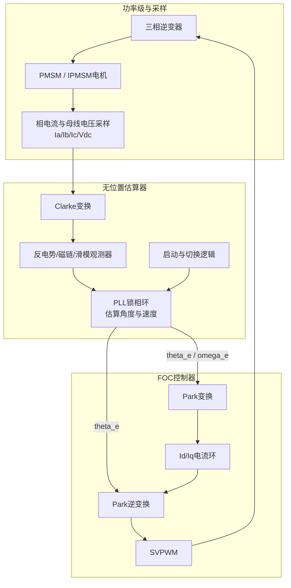

#### 6.6.3 常见无位置算法分类

| 算法 | 适用速度区间 | 优点 | 难点 |
| --- | --- | --- | --- |
| 开环 V/f 或 I/f 启动 | 零速到低速 | 实现简单，可把电机拖到可观测速度 | 负载突变时易失步，启动电流和加速度需标定 |
| 反电势法 | 中高速 | 直观、计算量小 | 低速反电势弱，对电阻、电感和采样误差敏感 |
| 滑模观测器 SMO | 中高速 | 鲁棒性较好，工程应用多 | 抖振、滤波相位延迟、参数整定复杂 |
| MRAS 模型参考自适应 | 中高速 | 可结合参数辨识 | 模型依赖强，整定和稳定性验证复杂 |
| 扩展卡尔曼滤波 EKF | 宽速度区 | 理论完整，可融合多源信息 | 计算量大，协方差和噪声模型难整定 |
| 高频注入 HFI | 零速和低速，适合凸极 IPMSM | 可在低速估算角度 | 噪声、振动、额外损耗，SPMSM效果有限 |

量产工程中常见组合是：`开环启动 + SMO/PLL 中高速闭环`，如果需要低速大转矩或零速能力，则增加 `HFI + SMO/PLL` 的切换策略。

#### 6.6.4 中高速反电势/滑模观测器方案

PMSM 在 `alpha/beta` 静止坐标系下，可以用定子电压、电流、电阻、电感估算反电势。估算器的目标不是直接追求每个中间变量完全准确，而是获得稳定、相位正确的 `theta_e`。

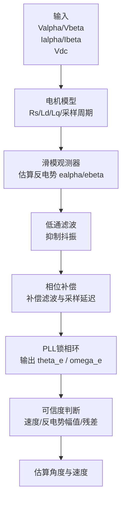

工程实现步骤：

1. 由 FOC 输出的 `Valpha/Vbeta` 和采样得到的 `Ialpha/Ibeta` 进入观测器。
2. 观测器根据电机模型估算反电势 `ealpha/ebeta`。
3. 对反电势做滤波，抑制滑模抖振和采样噪声。
4. 做相位补偿，修正低通滤波、采样延迟和 PWM 更新延迟造成的角度滞后。
5. PLL 根据反电势矢量估算角度与速度。
6. 可信度逻辑判断当前估算是否可用于闭环。

关键标定参数：

| 参数 | 作用 | 标定建议 |
| --- | --- | --- |
| `Rs` | 定子电阻 | 温度变化明显，需温度补偿或在线修正 |
| `Ld/Lq` | 电感参数 | IPMSM 中 Ld/Lq 不同，影响观测精度和弱磁 |
| `Ke/Flux` | 反电势常数/磁链 | 影响速度估算和电压前馈 |
| `Kslide` | 滑模增益 | 过小跟踪慢，过大抖振和噪声增加 |
| `LPF_Fc` | 反电势滤波截止频率 | 过低相位滞后，过高噪声大 |
| `PLL_Kp/Ki` | 锁相环参数 | 影响角度跟踪速度和噪声 |
| `ThetaComp` | 角度补偿 | 与速度、滤波和控制周期相关 |

#### 6.6.5 低速与零速启动策略

无位置控制最难的是零速和低速。常见方案是先通过开环方式建立旋转磁场，把电机拖到反电势足够大的速度，再切换到闭环估算角度。

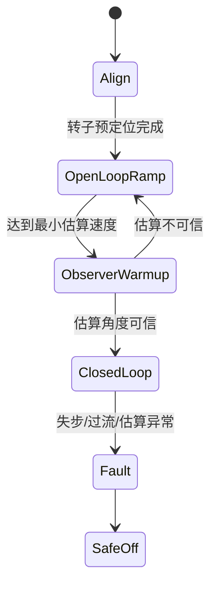

| 阶段 | 目标 | 关键点 |
| --- | --- | --- |
| 转子预定位 Align | 给定固定电角度，使转子靠向已知方向 | 电流不能过大，时间不能过长，避免发热和冲击 |
| 开环加速 OpenLoopRamp | 按斜坡提升电角速度 | 控制 `Iq`、加速度和最大开环时间，防止失步 |
| 观测器预热 ObserverWarmup | 同时运行无位置估算器但暂不闭环 | 检查估算角与开环角差值、反电势幅值、速度连续性 |
| 闭环切换 ClosedLoop | 从开环角平滑切到估算角 | 角度差过大禁止切换，切换时限幅转矩和速度环输出 |

切换条件建议同时满足：

- 电角速度高于最小闭环速度，例如达到额定速度的 5%-10%。
- 反电势幅值高于噪声门限。
- 估算速度方向与开环方向一致。
- 开环角与估算角差值小于允许阈值。
- 电流没有持续饱和，母线电压和驱动状态正常。

#### 6.6.6 高频注入低速算法

对于凸极性明显的 IPMSM，可在低速或零速时向 d/q 轴或 alpha/beta 轴注入高频电压，通过电流响应差异提取转子位置信息。该方法不依赖反电势，适合低速大转矩场景，但会引入额外噪声、振动和损耗。

```mermaid
flowchart TB
    HFV[高频电压注入]
    Motor[IPMSM凸极响应]
    HFI[高频电流采样]
    Demod[解调与滤波]
    PosErr[位置误差提取]
    PLL[低速PLL/跟踪器]
    Theta[低速估算角度]

    HFV --> Motor
    Motor --> HFI
    HFI --> Demod
    Demod --> PosErr
    PosErr --> PLL
    PLL --> Theta
```

高频注入工程注意事项：

- 更适合 IPMSM，表贴式 SPMSM 的凸极性弱，效果通常较差。
- 注入频率需避开机械共振、采样频率和 PWM 频率的敏感组合。
- 注入幅值过小信噪比差，过大会带来噪声、振动和额外铜耗。
- 低速 HFI 与中高速 SMO/PLL 之间需要平滑切换。
- 对 NVH 要求高的项目，应评估注入声噪是否可接受。

#### 6.6.7 速度区间与算法切换

```mermaid
flowchart LR
    Zero[零速] --> Low[低速区]
    Low --> Mid[中速区]
    Mid --> High[高速区]

    Zero --> A[预定位 / HFI]
    Low --> B[HFI 或 开环I/f]
    Mid --> C[SMO/反电势 + PLL]
    High --> D[SMO/PLL + 弱磁补偿]

    B -->|估算可信| C
    C -->|速度降低| B
    C -->|进入弱磁| D
```

| 速度区间 | 推荐策略 | 重点风险 |
| --- | --- | --- |
| 零速 | 预定位或 HFI | 不能依赖反电势，注意冲击和发热 |
| 低速 | HFI 或开环 I/f | 信噪比低，负载突变易失步 |
| 中速 | SMO/反电势 + PLL | 参数误差、滤波相位、采样噪声 |
| 高速 | SMO/PLL + 弱磁 | 角度滞后、电压饱和、弱磁稳定性 |

#### 6.6.8 S32K3 上的软件实现建议

在 S32K3 上实现无位置算法时，估算器应放在电流环同周期或半周期任务中执行，输入与 FOC 使用同一套同步采样数据，避免采样时间不一致导致角度噪声。

```mermaid
flowchart TB
    ISR[PWM/ADC同步中断]
    Sample[读取同步采样<br/>Ia/Ib/Ic/Vdc]
    Clarke[Clarke变换]
    Est[Sensorless_EstimatorRun]
    Select[角度源选择<br/>开环/HFI/SMO/传感器备份]
    FOC[FOC_CurrentLoopRun]
    PWM[PWM更新]
    Slow[1ms慢速任务<br/>状态机/切换/诊断/标定]

    ISR --> Sample
    Sample --> Clarke
    Clarke --> Est
    Est --> Select
    Select --> FOC
    FOC --> PWM
    Slow --> Select
    Slow --> Est
```

推荐模块划分：

```text
Control/
  Sensorless/
    Sl_OpenLoopStart.c
    Sl_BackEmfObserver.c
    Sl_Smo.c
    Sl_Pll.c
    Sl_Hfi.c
    Sl_AngleSwitch.c
    Sl_Diagnostics.c
```

关键接口示例：

```c
typedef struct
{
    float i_alpha;
    float i_beta;
    float v_alpha;
    float v_beta;
    float vdc;
    float dt;
} Sl_InputType;

typedef struct
{
    float theta_e;
    float omega_e;
    float bemf_alpha;
    float bemf_beta;
    float confidence;
    bool  valid;
} Sl_OutputType;

void Sl_EstimatorInit(const MotorParamType *motor);
void Sl_EstimatorRun(const Sl_InputType *in, Sl_OutputType *out);
void Sl_AngleSwitchRun(const Sl_OutputType *est, AngleSourceType *src);
```

电流环集成伪代码：

```c
void FOC_CurrentLoopIsr(void)
{
    MotorSample sample = Cdd_PwmAdcSync_GetSample();

    AlphaBeta i_ab = Foc_Clarke(sample.ia, sample.ib, sample.ic);
    AlphaBeta v_ab_last = Foc_GetLastVoltageAlphaBeta();

    Sl_InputType sl_in = {
        .i_alpha = i_ab.alpha,
        .i_beta  = i_ab.beta,
        .v_alpha = v_ab_last.alpha,
        .v_beta  = v_ab_last.beta,
        .vdc     = sample.vdc,
        .dt      = FOC_ISR_PERIOD_SEC
    };

    Sl_OutputType sl_out;
    Sl_EstimatorRun(&sl_in, &sl_out);

    float theta_e = Sl_SelectAngle(sl_out, g_open_loop_angle, g_angle_source);
    Foc_CurrentLoopRun(sample, theta_e);
}
```

#### 6.6.9 诊断与保护

无位置算法必须给出“估算可信度”，不能无条件把估算角度送进 FOC。建议至少实现以下诊断：

| 诊断项 | 判据 | 动作 |
| --- | --- | --- |
| 反电势过低 | `bemf_amp` 低于速度相关门限 | 禁止闭环切换或退回开环 |
| 角度跳变 | `theta_e` 单周期变化超过阈值 | 限制转矩，严重时关 PWM |
| 速度不连续 | 估算速度斜率异常 | 置估算器故障，进入降级 |
| 方向不一致 | 估算方向与指令方向冲突 | 禁止加速，重新启动或报故障 |
| 电流饱和 | `Id/Iq` 长时间达到限幅 | 判断可能失步，降额或停机 |
| 残差过大 | 观测电流/电压模型残差超限 | 降低可信度，触发 DTC |
| 切换失败 | 开环到闭环多次失败 | 锁定启动故障，等待重新使能 |

功能安全项目中，无位置算法通常不应作为唯一安全证据。若用于主驱或高风险执行器，应结合电流、电压、速度变化、转矩估算、VCU 指令合理性等多通道监控。

#### 6.6.10 标定与验证流程

```mermaid
flowchart TB
    A[电机参数测量<br/>Rs/Ld/Lq/Ke/极对数] --> B[采样校准<br/>电流偏置/比例/Vdc]
    B --> C[开环启动标定<br/>定位电流/加速度/切换速度]
    C --> D[观测器标定<br/>SMO增益/滤波/PLL]
    D --> E[切换标定<br/>角度差/反电势门限/可信度]
    E --> F[负载验证<br/>空载/半载/满载/突加突卸]
    F --> G[环境验证<br/>低温/高温/低压/高压]
    G --> H[故障注入<br/>采样噪声/缺相/堵转/过流]
```

推荐验证项目：

| 验证项 | 目标 |
| --- | --- |
| 启动成功率 | 不同温度、电压、负载下统计启动成功率和失败原因 |
| 角度误差 | 与旋变/编码器参考角度对比，记录稳态和动态误差 |
| 低速能力 | 验证最低稳定转速、低速转矩能力和抖动 |
| 高速弱磁 | 验证弱磁区角度滞后、电压饱和和电流稳定性 |
| 负载突变 | 突加/突卸负载时不失步、不误报、不过流 |
| 参数漂移 | Rs 随温度变化、磁链变化、电感饱和下的鲁棒性 |
| NVH | 开环启动和 HFI 注入是否产生不可接受的噪声或振动 |
| 安全故障 | 估算失效时是否能及时降级、关断和上报 DTC |

#### 6.6.11 工程风险与建议

| 风险 | 表现 | 建议 |
| --- | --- | --- |
| 低速反电势太弱 | 角度乱跳，启动失败 | 使用开环启动或 HFI，不要过早切闭环 |
| 电阻温漂 | 热机角度误差增大 | 做 Rs 温度补偿或在线修正 |
| 滤波相位滞后 | 高速弱磁区转矩下降或电流异常 | 做速度相关角度补偿 |
| 采样噪声 | 估算速度抖动 | 优化 ADC 触发点、模拟滤波、数字滤波和布线 |
| 负载突变失步 | 电流饱和、速度掉落 | 限制开环加速度，增加失步检测和重启策略 |
| HFI 噪声 | 低速啸叫或振动 | 调整注入频率/幅值，必要时按工况关闭 |
| 参数依赖强 | 换电机后算法不稳定 | 参数表版本化，EOL或台架重新标定 |

总体建议：无位置算法应按“先有可靠传感器参考，再做无位置对标”的方式开发。早期台架建议保留旋变或编码器作为真值通道，用于记录估算角误差、速度误差和失步边界；确认算法鲁棒后，再决定是否取消位置传感器或仅将无位置作为降级备份。

## 7. Bootloader 与刷写设计

Bootloader 是生产刷写、售后升级和 OTA 的基础。车规项目通常采用 PBL + SBL + APP 的分层启动方案，量产项目还会加入安全启动、签名校验、A/B 分区、防回滚与失败恢复。

### 7.1 启动架构

```mermaid
flowchart TB
    RESET[上电/复位] --> PBL[PBL<br/>芯片内置或一级启动]
    PBL --> SBL[SBL / FBL<br/>二级Bootloader]
    SBL --> CHECK{启动条件检查}
    CHECK -->|有效APP且无刷写请求| APP[Application]
    CHECK -->|刷写请求或APP无效| PROG[编程会话]
    PROG --> DL[下载并写入新镜像]
    DL --> VERIFY[CRC/签名/版本校验]
    VERIFY -->|通过| FLAG[更新Boot Flag]
    VERIFY -->|失败| ROLLBACK[回滚或保持旧版本]
    FLAG --> APP
    ROLLBACK --> SBL
```

### 7.2 Flash 分区

| 分区 | 作用 |
| --- | --- |
| Bootloader | 启动、刷写、校验、回滚，不随普通 APP 升级频繁变更 |
| Application A/B | 支持双区升级，降低刷写失败变砖风险 |
| Calibration | 标定数据、变体参数、EOL写入数据 |
| NVM/DTC | 故障码、冻结帧、学习值、统计信息 |
| Boot Flag | 镜像状态、启动尝试次数、回滚标志、防回滚版本 |
| HSM/Key | 密钥、证书、计数器，通常受硬件安全模块保护 |

### 7.3 UDS 刷写主流程

```mermaid
sequenceDiagram
    participant Tester as 诊断仪/CANoe/OTA网关
    participant ECU as ECU Bootloader
    participant Flash as Flash驱动
    participant HSM as HSM/Crypto

    Tester->>ECU: 0x10 进入扩展/编程会话
    ECU-->>Tester: 肯定响应
    Tester->>ECU: 0x27 SecurityAccess请求Seed
    ECU-->>Tester: 返回Seed
    Tester->>ECU: 0x27 发送Key/证书
    ECU->>HSM: 校验Key/证书
    HSM-->>ECU: 校验结果
    ECU-->>Tester: 解锁成功
    Tester->>ECU: 0x31 擦除Routine
    ECU->>Flash: 擦除目标分区
    ECU-->>Tester: 擦除完成
    Tester->>ECU: 0x34 RequestDownload
    ECU-->>Tester: 允许下载与块大小
    loop 数据传输
        Tester->>ECU: 0x36 TransferData
        ECU->>Flash: 写入Flash
        ECU-->>Tester: 块序号确认
    end
    Tester->>ECU: 0x37 RequestTransferExit
    Tester->>ECU: 0x31 校验Routine
    ECU->>HSM: CRC/签名/版本校验
    ECU-->>Tester: 校验通过
    Tester->>ECU: 0x11 ECUReset
```

### 7.4 Bootloader 关键设计点

- 刷写前置条件：电压稳定、车速为零、挡位安全、热状态允许、通信链路稳定。
- 传输层参数：BS、STmin、P2/P2*、CAN-FD DLC、掉帧重试策略。
- Flash 驱动：擦写函数尽量放 RAM 执行，避免读写冲突；擦写过程需要事务保护。
- 安全机制：Seed-Key 或证书认证、签名校验、安全启动、防回滚、防暴力尝试。
- 失败恢复：A/B 分区、启动尝试计数、镜像状态机、回滚到上一稳定版本。

## 8. UDS 诊断与 CANoe/CAPL 测试

诊断测试要覆盖服务正例、反例、会话权限、NRC、边界值、超时、压力、掉电、总线错误和刷写异常。CANoe/CAPL 可用于手工调试、自动化回归、压力测试和 HIL 联动。

### 8.1 测试体系

```mermaid
flowchart TB
    REQ[诊断需求与CDD/ODX] --> CASE[测试用例设计]
    CASE --> AUTO[自动化实现<br/>CAPL / vTESTstudio / Diva]
    AUTO --> EXEC[执行环境<br/>CANoe / HIL / 台架 / 实车]
    EXEC --> REPORT[测试报告<br/>HTML / XML / Excel]
    REPORT --> DEFECT[问题单与8D]
    DEFECT --> FIX[软件修复/标定修正/规范更新]
    FIX --> REG[回归测试]
    REG --> REPORT
```

### 8.2 UDS 测试矩阵

| 测试类别 | 覆盖内容 |
| --- | --- |
| 会话管理 | 默认会话、扩展会话、编程会话、会话超时、会话切换 |
| 安全访问 | Seed-Key、错误Key、延时锁定、尝试次数、掉电恢复 |
| DID读写 | 支持DID、未支持DID、长度错误、权限错误、边界值 |
| Routine | 擦除、校验、依赖条件、执行中状态、结果查询 |
| DTC | 设置、清除、状态位、冻结帧、扩展数据、老化策略 |
| 刷写 | 完整刷写、断点异常、块序号错误、CRC错误、签名错误 |
| 传输层 | 单帧、多帧、流控、STmin、BS、超时、丢帧、乱序 |
| 压力测试 | 高频请求、长时间稳定性、总线负载、模糊测试 |
| 故障注入 | BUSOFF、电源中断、通信中断、Flash写失败、低压 |

### 8.3 CANoe 工程组织

```mermaid
flowchart TB
    CFG[CANoe配置.cfg] --> DB[DBC / ARXML / CDD / ODX]
    CFG --> CAPL[CAPL节点]
    CAPL --> LIB[公共库<br/>UDS封装 / SeedKey / 日志]
    CAPL --> TEST[Test Modules<br/>会话/安全/DID/刷写/压力]
    CFG --> PANEL[Panel与系统变量]
    TEST --> REPORT[测试报告]
    TEST --> HIL[HIL IO / 电源 / 故障注入]
```

### 8.4 自动化建议

- 公共库优先封装 UDS 请求、响应检查、NRC 检查、超时处理和日志输出。
- 测试用例按服务、会话、权限、正例、反例、压力和异常恢复分类。
- 对刷写流程建立独立回归集，至少覆盖完整刷写、断电恢复、签名失败和防回滚。
- 对长期测试记录 P2/P2* 响应时间、失败率、总线负载、ECU复位次数和DTC变化。
- CI/CD 中可将 CANoe 命令行执行、报告归档和问题单关联串起来。

## 9. 功能安全与信息安全

### 9.1 功能安全开发链路

```mermaid
flowchart LR
    HARA[HARA危害分析] --> SG[安全目标SG]
    SG --> FSC[功能安全概念FSC]
    FSC --> FSR[功能安全需求FSR]
    FSR --> TSC[技术安全概念TSC]
    TSC --> TSR[技术安全需求TSR]
    TSR --> SW[软件安全需求]
    TSR --> HW[硬件安全需求]
    SW --> TEST[验证确认]
    HW --> TEST
    TEST --> CASE[Safety Case]
```

### 9.2 电机控制器典型安全机制

| 风险 | 可能后果 | 典型安全机制 |
| --- | --- | --- |
| 非预期转矩 | 车辆异常加速/减速 | 转矩监控、双通道校验、VCU请求合理性检查 |
| 过流/短路 | 功率器件损坏 | 硬件DESAT、比较器快速关断、软件过流诊断 |
| 位置传感器错误 | 控制失稳、转矩异常 | 旋变诊断、角度合理性、速度斜率监控 |
| 采样链路异常 | 控制偏差 | ADC范围检查、三相电流和校验、冗余采样 |
| 软件跑飞 | 控制失控 | 看门狗、时钟监控、MPU、程序流监控 |
| 存储损坏 | 错误标定或错误启动 | CRC、双备份、NVM块状态、启动校验 |

### 9.3 信息安全要求

- 安全启动：Bootloader 对 APP 做签名校验，防止未授权软件运行。
- 安全刷写：下载镜像需认证、加密或签名校验，防止恶意刷写。
- 密钥保护：密钥不应明文存储在 APP 中，优先使用 HSM 或安全存储。
- 防回滚：通过安全计数器或版本策略禁止刷回有漏洞的旧版本。
- 日志审计：关键安全事件需要记录，便于售后追溯和问题分析。

## 10. 样件验证与量产准备

### 10.1 DV/PV 验证

| 测试类别 | 主要内容 |
| --- | --- |
| 性能测试 | 效率MAP、转矩精度、动态响应、弱磁能力、回馈能力 |
| 环境测试 | 高低温、温湿度循环、冷热冲击、盐雾、防水防尘 |
| 机械测试 | 振动、冲击、跌落、连接器保持力 |
| EMC测试 | RE、CE、BCI、ESD、瞬态脉冲、抗扰度 |
| 可靠性测试 | 功率循环、热循环、老化、寿命、HALT/HASS |
| 功能安全测试 | 故障注入、诊断覆盖率、SPFM/LFM、降级策略 |
| 整车验证 | 台架联调、整车标定、三高试验、道路耐久 |

### 10.2 PPAP 与产线准备

```mermaid
flowchart LR
    OTS[OTS样件] --> PTS[工装样件/试生产]
    PTS --> EOL[EOL测试开发]
    EOL --> MSA[测量系统分析MSA]
    MSA --> SPC[过程能力SPC]
    SPC --> PPAP[PPAP资料提交]
    PPAP --> RUN[Run at Rate节拍验证]
    RUN --> SOP[SOP量产批准]
```

PPAP 常见资料包括设计记录、工程变更、DFMEA、PFMEA、控制计划、过程流程图、尺寸报告、材料报告、性能报告、MSA、SPC、外观批准、样件提交保证书等。电机控制器还需要关注 EOL 测试覆盖率、追溯码、刷写版本、标定版本和高压安规测试。

### 10.3 EOL 典型测试项

| 类别 | 测试项 |
| --- | --- |
| 基础电气 | 低压电源、电流消耗、唤醒休眠、IO输入输出 |
| 高压安全 | 绝缘、耐压、主动放电、预充控制、高压互锁 |
| 通信诊断 | CAN/CAN-FD通信、DID读写、DTC清除、软件版本读取 |
| 功率驱动 | PWM输出、驱动芯片状态、短路保护、相序检查 |
| 传感器 | 电流偏置、母线电压、温度、旋变/编码器接口 |
| 刷写标定 | Bootloader刷写、APP校验、标定写入、追溯码写入 |

## 11. 问题闭环与持续改进

```mermaid
flowchart TB
    ISSUE[问题发现<br/>测试/产线/售后] --> TRIAGE[分级与复现]
    TRIAGE --> RCA[根因分析<br/>5Why / Fishbone / 数据回放]
    RCA --> FIX[遏制与修复<br/>软件/硬件/工艺/标定]
    FIX --> VERIFY[验证与回归]
    VERIFY --> RELEASE[版本发布与变更管理]
    RELEASE --> LESSON[经验沉淀<br/>规范/检查表/测试用例]
    LESSON --> ISSUE
```

### 11.1 常见问题与排查方向

| 问题 | 常见原因 | 排查建议 |
| --- | --- | --- |
| 转矩抖动 | 电流采样噪声、角度误差、PI参数不当、死区补偿不足 | 看相电流、角度、Iq波动、PWM占空比和机械共振点 |
| 高速失控或限速 | 弱磁参数、母线电压利用率、角度延迟补偿不足 | 检查Vd/Vq限幅、调制度、角度补偿和过调制策略 |
| 驱动报故障 | DESAT误触发、栅极参数、布局寄生、电源纹波 | 结合示波器看Vge、Vce、母线纹波和故障脚 |
| EMC不过 | 共模路径、开关速度、滤波不足、接地不良 | 调整栅阻、屏蔽、Y电容、母线布局和滤波器 |
| 刷写失败 | TP参数、Flash擦写超时、签名错误、掉电恢复缺陷 | 抓CANoe Trace，检查NRC、块序号、P2/P2*和Boot Flag |
| EOL误判 | 工装接触、测试时序、标定未写入、版本不一致 | 加强夹具诊断、版本校验、重试策略和追溯 |

## 12. 推荐交付物清单

| 阶段 | 交付物 |
| --- | --- |
| 立项 | 项目计划、需求清单、接口清单、风险清单、供应商定点资料 |
| 系统设计 | 系统架构、功能清单、接口控制文档、功能安全概念、信息安全概念 |
| 硬件设计 | 原理图、PCB、BOM、热仿真、EMC设计说明、硬件测试报告 |
| 软件设计 | 软件架构、模块设计、接口设计、调度设计、诊断设计、刷写设计 |
| 算法开发 | FOC模型、标定表、控制参数、仿真报告、HIL测试报告 |
| 验证确认 | DVP&R、测试用例、DV/PV报告、问题闭环记录、三高报告 |
| 量产准备 | PFMEA、控制计划、EOL规范、PPAP包、Run at Rate报告 |
| 售后维护 | 8D报告、OTA包、版本发布说明、经验库、变更记录 |

## 13. 实施建议

1. 需求阶段建立可追溯矩阵，将整车需求、系统需求、软硬件需求和测试用例关联起来。
2. 系统架构阶段提前锁定采样方案、驱动保护、热设计和 EMC 策略，避免后期硬件返版。
3. 软件开发阶段把高速控制环、诊断通信、Bootloader 和安全机制分层管理，接口稳定后再并行开发。
4. FOC 算法应从 MIL/SIL/HIL 到台架逐级验证，并保留标定参数、测试工况和问题记录。
5. 刷写和诊断测试要尽早自动化，避免到 SOP 前集中暴露会话权限、NRC、超时和掉电恢复问题。
6. PPAP 前重点检查 EOL 覆盖率、追溯链路、版本一致性和产线节拍。
7. SOP 后通过售后 DTC、OTA 结果、产线 PPM 和 8D 闭环持续更新设计规范和测试用例库。

## 14. 总结

电机控制器开发的核心不是单点技术，而是系统工程闭环：需求要清楚，架构要稳定，算法要可标定，软件要可测试，Bootloader 要可恢复，诊断要可追溯，产线要可量产，售后要能闭环。对车企项目而言，V 模型提供技术验证主线，APQP/PPAP 提供质量成熟度主线，功能安全和信息安全提供约束边界，自动化测试和问题闭环决定最终交付质量。
