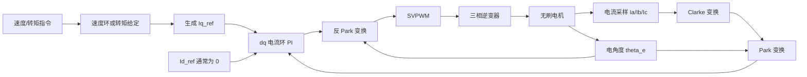
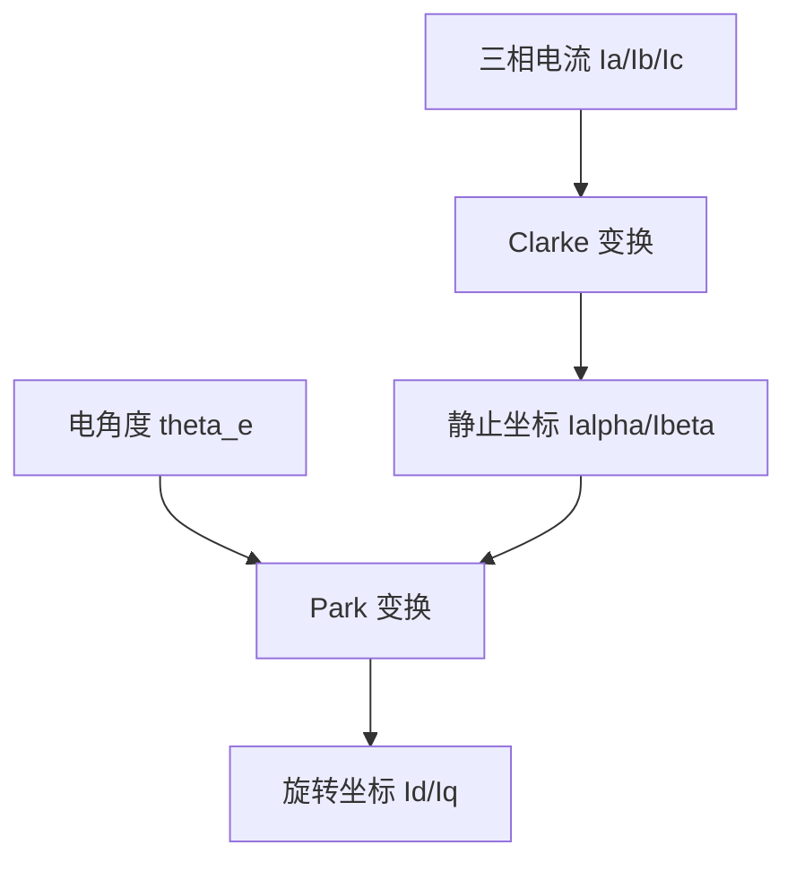
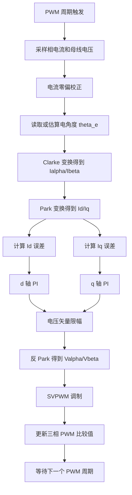
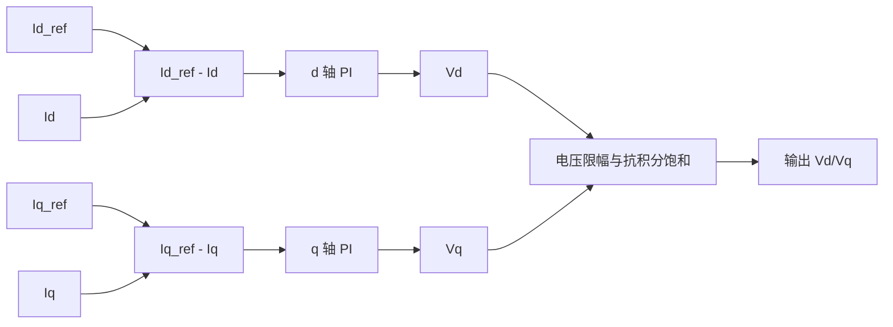
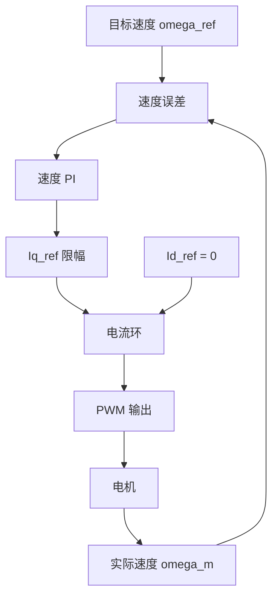
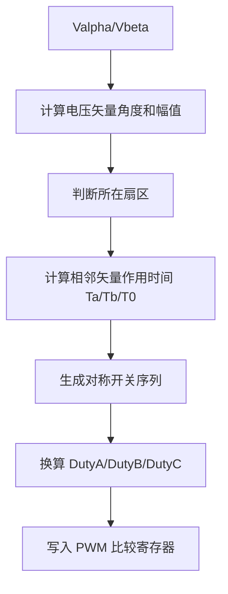
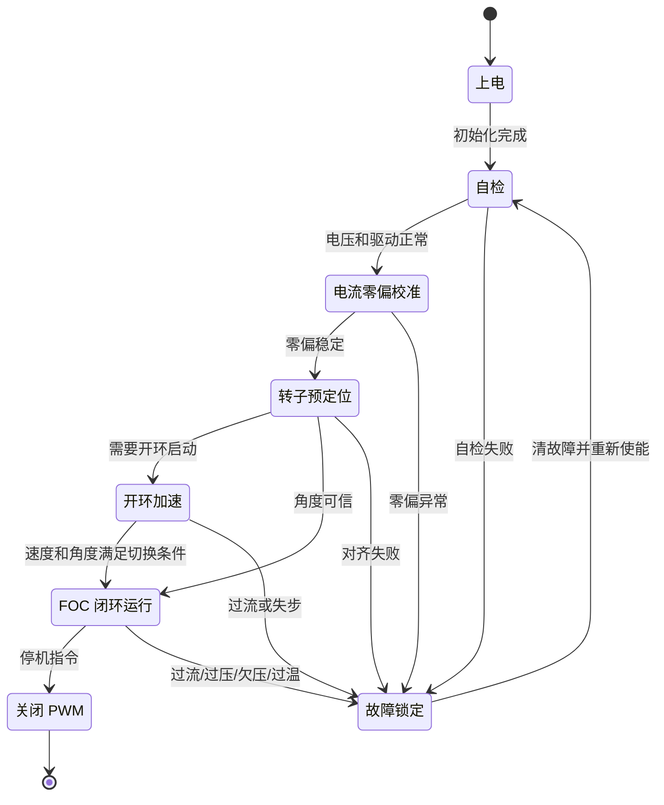
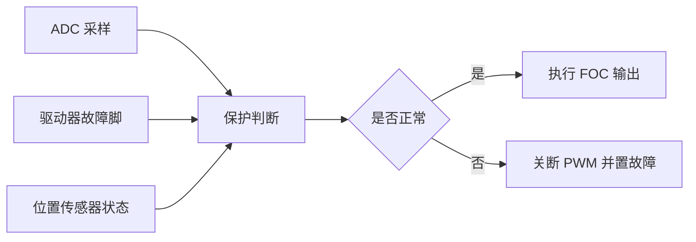

# FOC控制无刷电机

## 1. 概述

FOC（Field Oriented Control，磁场定向控制）用于把三相无刷电机的电流矢量分解到旋转坐标系中控制。对于常见永磁同步电机或正弦反电势无刷电机，FOC 通常把电流分成两部分：

- `Id`：励磁方向电流，沿转子磁链方向。
- `Iq`：转矩方向电流，垂直于转子磁链方向。

在表贴式永磁电机中，常用控制目标是 `Id_ref = 0`，通过调节 `Iq_ref` 控制转矩。这样可以让定子电流主要用于产生转矩，降低转矩脉动和电流谐波。

FOC 的核心链路是：电流采样、坐标变换、电流闭环、反变换、SVPWM 和三相逆变器输出。



## 2. 控制对象与信号

FOC 控制系统通常包含以下输入和输出：

| 信号 | 含义 | 典型来源 |
| --- | --- | --- |
| `Ia`、`Ib`、`Ic` | 三相电流 | 采样电阻、霍尔电流传感器 |
| `theta_m` | 机械角度 | 编码器、霍尔、观测器 |
| `theta_e` | 电角度 | `theta_e = pole_pairs * theta_m + offset` |
| `omega_m` | 机械角速度 | 角度差分、编码器测速、观测器 |
| `Vdc` | 母线电压 | ADC 采样 |
| `Id_ref`、`Iq_ref` | dq 轴电流目标 | 速度环、转矩指令、弱磁控制 |
| `DutyA`、`DutyB`、`DutyC` | 三相 PWM 占空比 | SVPWM 输出 |

电角度必须和电流采样时刻严格对齐，否则 `d/q` 轴解耦会变差，表现为噪声、转矩脉动或电流环振荡。

## 3. 坐标变换

FOC 先把三相静止坐标系的电流变换到两相静止坐标系，再根据转子电角度旋转到 `dq` 坐标系。



常见 Clarke 变换：

```text
Ialpha = Ia
Ibeta  = (Ia + 2 * Ib) / sqrt(3)
```

常见 Park 变换：

```text
Id =  Ialpha * cos(theta_e) + Ibeta * sin(theta_e)
Iq = -Ialpha * sin(theta_e) + Ibeta * cos(theta_e)
```

反 Park 变换用于把电流环输出的 `Vd/Vq` 转回 `Valpha/Vbeta`：

```text
Valpha = Vd * cos(theta_e) - Vq * sin(theta_e)
Vbeta  = Vd * sin(theta_e) + Vq * cos(theta_e)
```

## 4. FOC 中断控制流程

FOC 的电流环通常在 PWM 定时器中断或 ADC 转换完成中断中执行。一次控制周期需要完成采样、变换、PI 调节、限幅和 PWM 更新。



## 5. 电流环

电流环是 FOC 的内环，执行频率最高，直接决定转矩响应和稳定性。



基础 PI 输出：

```text
Vd = Kp_d * (Id_ref - Id) + Ki_d * integral_d
Vq = Kp_q * (Iq_ref - Iq) + Ki_q * integral_q
```

在高速或高动态场景中，可加入解耦补偿：

```text
Vd = PI_d - omega_e * Lq * Iq
Vq = PI_q + omega_e * (Ld * Id + psi_f)
```

其中 `Ld`、`Lq` 是 dq 轴电感，`psi_f` 是永磁体磁链。工程实现中即使不使用完整电机参数，也应至少做好电压限幅和 PI 抗积分饱和。

## 6. 速度环与转矩给定

如果上层输入是速度指令，则速度环输出 `Iq_ref`。如果上层直接给转矩或电流指令，则可以绕过速度环。



速度环频率一般低于电流环。例如电流环 `10 kHz` 到 `40 kHz`，速度环 `500 Hz` 到 `2 kHz`。速度环输出必须限制最大电流，避免过流或母线电压不足。

## 7. SVPWM 输出

电流环得到的 `Valpha/Vbeta` 不能直接驱动逆变器，需要通过 SVPWM 转换成三相桥臂占空比。



SVPWM 的作用是让一个 PWM 周期内的平均电压矢量等效于 `Valpha/Vbeta`。相关推导可参考 [SVPWM 平衡等效原理说明.md](<./SVPWM 平衡等效原理说明.md>)。

## 8. 启动与运行状态机

实际无刷电机控制不能只包含闭环算法，还需要启动、对齐、保护和故障恢复逻辑。



常见启动方式：

- 位置传感器启动：直接读取角度，完成零偏和电角度偏置校准后进入闭环。
- 霍尔启动：根据霍尔区间估算初始电角度，低速阶段角度分辨率较低，需要滤波和补偿。
- 无感启动：先转子对齐，再开环加速，达到可观测速度后切入闭环观测器。

## 9. 保护逻辑

FOC 中保护逻辑必须优先于正常控制输出。典型保护项包括：

| 保护项 | 触发条件 | 动作 |
| --- | --- | --- |
| 过流 | 相电流或母线电流超过阈值 | 立即关 PWM，进入故障 |
| 过压 | `Vdc` 超过母线安全上限 | 限制制动或关 PWM |
| 欠压 | `Vdc` 低于驱动允许值 | 禁止启动或降额运行 |
| 过温 | MOS、驱动器或电机温度过高 | 降额或停机 |
| 角度异常 | 编码器丢失、霍尔非法、观测器失锁 | 关 PWM 或切换安全模式 |
| PI 饱和 | 电压长期达到限幅 | 降低速度目标或限制 `Iq_ref` |

保护链路可以独立于控制环判断，并在每个 PWM 周期内检查关键故障。



## 10. 调试步骤

建议按以下顺序调试，避免同时引入多个不确定因素：

1. 确认三相 PWM 互补输出、死区和刹车输入正常。
2. 校准电流采样零偏，确认 `Ia + Ib + Ic` 接近 `0`。
3. 确认电角度方向、极对数和零位偏置正确。
4. 固定转子或低压输出，验证 Clarke/Park 变换方向。
5. 只闭合电流环，先调 `Id`，再调 `Iq`。
6. 验证 SVPWM 占空比和母线电压利用率。
7. 加入速度环，逐步提高速度和电流限幅。
8. 验证过流、欠压、过压、失速和传感器异常保护。

## 11. 参数整定建议

电流环和速度环参数应由低到高逐步增加。

- 电流环 `Kp` 过小：电流响应慢，转矩跟随差。
- 电流环 `Kp` 过大：电流噪声放大，可能振荡。
- 电流环 `Ki` 过小：稳态误差大。
- 电流环 `Ki` 过大：超调明显，容易积分饱和。
- 速度环带宽应明显低于电流环，避免外环把内环推入饱和。
- `Iq_ref`、`Vd/Vq`、SVPWM 调制度都需要限幅。

FOC 的稳定性依赖采样、电角度、PI 参数和调制输出的一致性。若电机运行时出现反转、抖动或大电流，应优先检查相序、电角度方向、编码器零位和 Park 变换符号。
