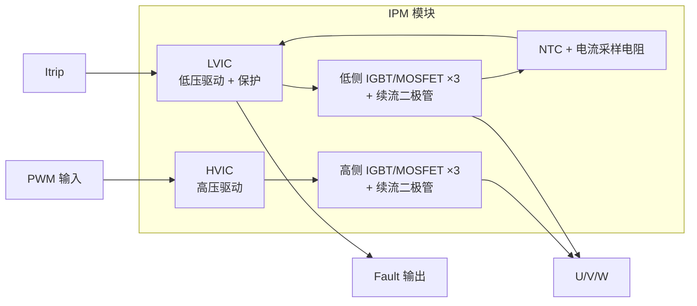
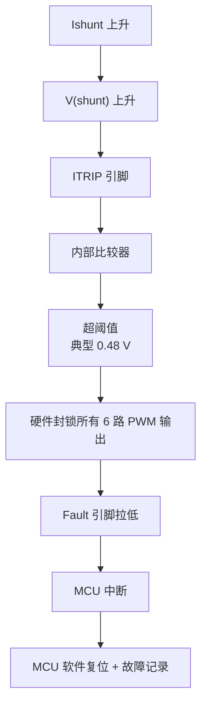
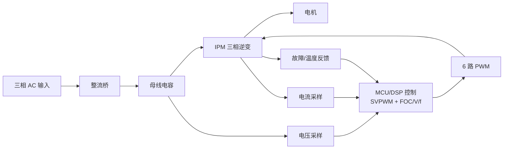

# 英飞凌(Infineon)IPM 全桥模块主要系列

英飞凌的智能功率模块(IPM, Intelligent Power Module)以三相全桥(6-pack)结构为主,广泛应用于变频家电、工业驱动、泵类和风机等场景。以下是主要产品系列:

## 一、CIPOS™ 系列(主流 IPM 产品线)

### 1. CIPOS™ Nano
- **功率等级**:非常小功率(≤100 W)
- **电流范围**:约 2 A @ 500 V
- **特点**:超小封装(DIP 封装),集成三相逆变,适用于小功率 BLDC、风扇电机
- **典型型号**:IRSM515-025MA、IRSM505-065DA4

### 2. CIPOS™ Micro
- **功率等级**:低功率(100–300 W)
- **电流范围**:2–6 A @ 500/600 V
- **特点**:采用 600 V IGBT 或 MOSFET,DIP 36 封装,集成自举二极管、LVIC 驱动
- **典型型号**:IM231 系列、IRSM836 系列

### 3. CIPOS™ Tiny
- **功率等级**:中小功率(约 300 W – 1 kW)
- **电流范围**:4–30 A @ 600 V
- **封装**:DIP 29×12 mm
- **特点**:IGBT + 驱动 IC 集成,带 ITRIP 过流保护、NTC 温度监测
- **典型型号**:IM393、IM513、IRSM808 系列

### 4. CIPOS™ Mini
- **功率等级**:中等功率(约 1–3 kW)
- **电流范围**:10–50 A @ 600/650 V(部分支持 1200 V)
- **封装**:DIP 36×23 mm
- **特点**:采用 TRENCHSTOP™ IGBT 或 RC-IGBT,适用于空调、洗衣机、热泵
- **典型型号**:IM564、IM828、IKCM15L60GD、IKCM30F60GA

### 5. CIPOS™ Maxi
- **功率等级**:大功率(3–5 kW)
- **电流范围**:15–50 A @ 600/1200 V
- **封装**:DIP 采用更大尺寸,带螺钉安装散热片接口
- **特点**:适用于工业变频器、商用空调、热泵压缩机
- **典型型号**:IM818 系列、IFCM20P60GD、IFCM30F60GD

## 二、按开关器件分类

| 系列 | 功率器件 | 典型电压 | 特点 |
|------|---------|---------|------|
| CIPOS™ IGBT 版 | TRENCHSTOP™ IGBT | 600/650/1200 V | 中大功率主流选择 |
| CIPOS™ RC-IGBT | 逆导型 IGBT | 600 V | 小型化,低损耗 |
| CIPOS™ MOSFET 版 | CoolMOS™ / OptiMOS™ | 500/600 V | 高频应用,低功率 |
| CIPOS™ SOI 驱动 | 内置 SOI 栅驱动 IC | — | 更强抗噪、抗负压能力 |

## 三、选型关键参数

选择时主要关注:**额定电压**(500/600/650/1200 V)、**额定电流**(2–50 A)、**器件类型**(IGBT / MOSFET / RC-IGBT)、**封装形式**(DIP Nano/Micro/Tiny/Mini/Maxi)、**是否集成 PFC**、以及**保护功能**(过流、过温、欠压锁定等)。

## 四、典型应用

- **家电**:空调压缩机、洗衣机变频、冰箱压缩机、风扇
- **工业**:小型伺服、水泵、通用变频器
- **新能源**:热泵、光伏辅助驱动

---

# 工业变频器用英飞凌 IPM 全桥模块推荐

工业变频器对 IPM 的要求与家电不同,主要体现在:**更高功率密度、更强过载能力、更好散热、更高可靠性、更宽工作温度范围**。英飞凌针对工业变频器主要推荐以下系列:

## 一、主推系列:CIPOS™ Maxi

这是英飞凌 IPM 家族中**最适合工业变频器**的产品,具备以下优势:

- **功率覆盖**:3–7.5 kW(单模块),适用于小型工业变频器主流功率段
- **电压等级**:600 V / 1200 V 双版本可选
- **电流范围**:15 A、20 A、30 A、35 A、50 A @ 600 V
- **封装**:DIP 压接式或螺钉固定,带 DCB 陶瓷基板,散热性能优于家电级 IPM
- **集成功能**:三相逆变 + 栅极驱动 IC + 过流保护 + NTC 测温 + 自举电路

### 典型型号推荐

| 型号 | 拓扑 | 电压 | 电流 | 适用功率 |
|------|------|------|------|---------|
| **IM818-MCC** | 三相全桥 IGBT | 1200 V | 15 A | 3–5.5 kW(380V) |
| **IM828-XCC** | 三相全桥 IGBT | 1200 V | 25 A | 5.5–7.5 kW(380V) |
| **IFCM15P60GD** | 全桥 + PFC | 600 V | 15 A | 2–3 kW(220V) |
| **IFCM20P60GD** | 全桥 + PFC | 600 V | 20 A | 3–4 kW(220V) |
| **IFCM30F60GD** | 三相全桥 | 600 V | 30 A | 4–5.5 kW(220V) |

## 二、大功率场景推荐:EconoPIM™ / EconoPACK™(非 IPM 但常用)

如果变频器功率超过 **7.5 kW**,CIPOS™ Maxi 已不够用,工业变频器通常会转向英飞凌的**分立式功率模块 + 独立驱动**方案:

- **EconoPIM™ 系列**:集成整流桥 + 逆变桥 + 制动单元,适合 7.5–22 kW
- **Easy 1B / 2B 模块**:灵活搭配,适合 15–75 kW
- **EconoPACK™ 4**:中大功率工业变频器主流选择,22–90 kW
- **PrimePACK™**:90 kW 以上高端工业变频器和新能源

> ⚠️ 注意:这些严格来说是 PIM(功率集成模块)或 IGBT 模块,**不属于 IPM**(不带内置驱动和保护),但在工业变频器领域应用更广泛。

## 三、按变频器功率段选型指南

| 变频器功率 | 母线电压 | 推荐方案 |
|-----------|---------|---------|
| 0.4 – 2.2 kW | 220V / 380V | CIPOS™ Mini(IM564、IKCM30F60GA) |
| 2.2 – 5.5 kW | 380V | **CIPOS™ Maxi IM818** |
| 5.5 – 7.5 kW | 380V | **CIPOS™ Maxi IM828** |
| 7.5 – 22 kW | 380V | EconoPIM™ 2 / Easy 1B |
| 22 – 75 kW | 380V | EconoPACK™ 4 |
| >75 kW | 380V / 690V | PrimePACK™ 2/3 |

## 四、工业变频器选型关键考量

1. **电压裕量**:380V 交流输入对应母线约 540V DC,峰值可达 600V 以上,建议选用 **1200V 器件**以保证可靠性;只有 220V 系统才用 600V 器件。
2. **电流裕量**:工业变频器需要 **150% 过载 60 秒**,选型电流应为额定电流的 1.5–2 倍。
3. **开关频率**:工业变频器常用 4–8 kHz,CIPOS™ Maxi 最高可支持 20 kHz。
4. **温升和散热**:DCB 基板版本的 Maxi 热阻 Rth(j-c) 更低,可长期满载运行。
5. **保护功能**:工业环境要求更严苛,建议选择带 **ITRIP 过流、OTP 过温、UVLO 欠压锁定**的完整保护版本。
6. **认证要求**:工业场景通常需要 UL、CE、EN61800-5-1 合规,英飞凌模块已全部通过。

## 五、最佳性价比推荐

对于**常规 380V 工业变频器(2.2–7.5 kW)**,我最推荐:

- **IM818-MCC**(1200V / 15A,3–5.5 kW)
- **IM828-XCC**(1200V / 25A,5.5–7.5 kW)

这两个型号在中国工业变频器厂商(汇川、英威腾、台达、禾川等)中应用非常广泛,供货稳定、参考设计成熟。

---
# IPM(智能功率模块)的实现逻辑

IPM 是将**功率器件 + 驱动电路 + 保护电路**封装在同一模块内的集成方案。其核心设计逻辑可以从以下几个层面理解:

## 一、IPM 的整体架构

一个典型的三相全桥 IPM 内部由四大模块组成:



## 二、核心实现逻辑分层解析

### 1. 功率级(Power Stage)
**逻辑**:6 个开关器件构成三相全桥,每相上下桥臂交替导通,通过 PWM 调制合成三相正弦电压。

- **器件选择**:600V 系统用 TRENCHSTOP™ IGBT;高频小功率用 CoolMOS™ / SJ-MOSFET
- **拓扑结构**:每个桥臂 = 高侧开关 + 低侧开关 + 反并联续流二极管(FWD)
- **死区设计**:同一桥臂上下管切换时必须插入死区时间(通常 1–3 μs),防止直通短路

### 2. 驱动级(Gate Driver)
**逻辑**:将 MCU 输出的 3.3V/5V 逻辑 PWM 信号转换为能驱动 IGBT 栅极的 15V 驱动信号,并解决高侧浮动电位问题。

#### (1)高侧驱动(HVIC)—— 自举(Bootstrap)原理
由于高侧 IGBT 的发射极电位随开关状态在 0 到母线电压之间跳变,**必须用浮动电源**驱动。典型实现:

\[
V_{BS} = V_{CC} - V_{F(boot)} - V_{CE(sat,low)}
\]

工作过程:
- 低侧 IGBT 导通时,\(V_{CC}\) 通过自举二极管给自举电容 \(C_{BS}\) 充电
- 高侧 IGBT 导通时,\(C_{BS}\) 作为浮动电源为高侧栅极提供 15V 驱动
- **电平移位(Level Shift)电路**负责将低压 PWM 信号"抬升"到高压域

#### (2)低侧驱动(LVIC)
直接由 \(V_{CC}\)(通常 15V)供电,结构简单,包含:
- 施密特触发输入(抗干扰)
- 欠压锁定(UVLO)
- 过流信号处理

### 3. 保护级(Protection)

IPM 的"智能"主要体现在**集成多重保护**上:

| 保护功能 | 实现逻辑 | 响应时间 |
|---------|---------|---------|
| **过流保护(OCP/ITRIP)** | 检测分流电阻压降,超过阈值(通常 0.5V)立即关断所有 IGBT | <1 μs |
| **短路保护(SCP)** | 通过 IGBT 退饱和检测(DESAT)或 ITRIP 快速关断 | <2 μs |
| **过温保护(OTP)** | NTC 热敏电阻反馈给 MCU,由 MCU 决定降频或停机 | 毫秒级 |
| **欠压锁定(UVLO)** | \(V_{CC}\) < 12V 时封锁输出,防止栅极不完全导通导致过热 | μs级 |
| **故障输出(Fault)** | 任何保护触发时,通过 FLT 引脚向 MCU 报警(开漏输出) | 即时 |

保护触发后的关断逻辑通常是**"软关断(Soft Shutdown)"**,通过较大栅极电阻缓慢关断 IGBT,避免关断过电压击穿器件。

## 三、信号流工作时序

以一次 PWM 周期为例,完整的信号流动逻辑:

**(1)MCU 输出阶段**
- MCU 根据 SVPWM 算法计算占空比
- 输出 6 路 PWM 信号(3 对互补信号,含死区)

**(2)IPM 输入处理**
- 输入缓冲 + 施密特触发 → 消除噪声
- 逻辑电平转换(3.3V → 内部逻辑)
- 死区时间再次校验(部分 IPM 内置硬件死区)

**(3)驱动放大**
- 低侧:逻辑信号 → 图腾柱驱动 → 栅极(15V / 0V)
- 高侧:逻辑信号 → 电平移位 → 浮动栅极驱动(\(V_{BS}\) / 0V)

**(4)功率输出**
- IGBT 开通:栅极电压 > \(V_{GE(th)}\),沟道形成,电流流通
- IGBT 关断:栅极放电,电流转移到反并联二极管续流

**(5)反馈与保护**
- 分流电阻电流 → ITRIP 比较器 → 超阈值则硬件关断
- NTC 阻值 → 分压电路 → MCU ADC → 温度计算
- 故障状态 → 锁存器 → FLT 引脚拉低

## 四、关键设计逻辑细节

### 1. 自举电路设计原理
自举电路用于给高侧驱动提供一个随相线节点一起浮动的局部电源。三相全桥中,高侧 IGBT/MOSFET 的发射极/源极并不固定接地,而是连接到 U/V/W 相输出点;当高侧开通时,该节点会被抬升到接近直流母线正端。因此高侧栅极驱动不能直接以控制板地为参考,必须用 `VB-VS` 之间的浮动电压 `VBS` 来驱动。

典型自举回路由以下器件组成:

- **自举二极管 `DBS`**:从 15V 驱动电源 `VCC` 向高侧浮动电源节点 `VB` 单向充电,并在相线节点升高时阻断母线高压回灌。
- **自举电容 `CBS`**:接在 `VB` 与 `VS` 之间,存储高侧驱动所需能量。
- **高侧驱动 IC(HVIC)**:以 `VS` 为局部参考地,用 `VB` 提供栅极充电电流。
- **低侧开关或续流路径**:在 `VS` 被拉到低电位时为 `CBS` 提供充电窗口。

其基本电压关系为:

```text
VBS ~= VCC - VF(boot) - VCE(sat,low)
```

其中 `VF(boot)` 是自举二极管正向压降,`VCE(sat,low)` 是低侧器件导通时的压降。对于常见 15V 栅极驱动,有效 `VBS` 通常需要保持在驱动芯片 UVLO 阈值以上,否则高侧输出会被封锁。

工作过程可分为两个阶段:

1. **充电阶段**:低侧 IGBT/MOSFET 导通,或相线通过续流被拉到接近地电位时,`VCC` 经 `DBS` 给 `CBS` 充电。此时 `VS` 较低,`CBS` 两端电压逐步接近 `VCC-VF`。
2. **浮动供电阶段**:高侧 IGBT/MOSFET 导通后,`VS` 随相线被抬升到母线高压附近,`DBS` 反偏截止,`CBS` 随 `VS` 一起浮动,并向高侧驱动、栅极电荷、驱动 IC 静态电流和泄漏电流供电。

自举电容容值必须满足高侧器件在最长导通时间内的电荷需求,并保证 `VBS` 下跌量不触发欠压锁定:

```text
CBS >= 2 x (QG + ILK x THON + QLS) / (VCC - VF - VLS - Vmin)
```

其中 `QG` 是栅极总电荷,`THON` 是高侧最长导通时间,`Vmin` 是允许的最低自举电压。

工程设计时还需要注意:

- **容值裕量**:计算值通常再乘 2–5 倍裕量,并考虑 MLCC 在直流偏压下的容量衰减。小功率 IPM 常见取值为 0.1–1 μF,具体应按器件手册的 `QG`、HVIC 静态电流和最大占空比校核。
- **耐压选择**:`CBS` 承受的是 `VBS` 电压而不是母线电压,但仍建议选用 25V 或 50V X7R/X5R 陶瓷电容;自举二极管则必须承受母线高压和开关尖峰。
- **二极管速度**:应选快恢复或超快恢复二极管,反向恢复电荷越小越好,否则会增加高 dv/dt 下的损耗和干扰。部分 IPM 已内置自举二极管,外部只需配置自举电容。
- **占空比限制**:自举方案依赖低侧导通或相线回落来补电,不能长期 100% 高侧导通。启动或低速大转矩工况下,软件应保证周期性刷新自举电容。
- **布局要求**:`DBS`、`CBS`、VB/VS 引脚形成的回路必须短且靠近 IPM,避免寄生电感导致 `VBS` 尖峰、误触发 UVLO 或高侧驱动异常。
- **负压与尖峰**:相线 `VS` 在续流和开关瞬间可能出现负压,需要确认 IPM/HVIC 的 VS 负压承受能力,必要时通过栅极电阻、吸收电路和合理 PCB 回路降低尖峰。

### 2. 死区时间逻辑
死区时间 `Tdead` 必须大于 IGBT 的最大关断延迟 + 驱动传输延迟差异:

```text
Tdead > Td(off)max - Td(on)min + Tmargin
```

太短会直通短路,太长会产生输出电压畸变(需死区补偿算法)。

### 3. 电流采样逻辑
主流方式有三种:
- **单电阻采样(Single Shunt)**:DC 母线串联一个分流电阻,成本低,需 SVPWM 相位重构
- **三电阻采样(Triple Shunt)**:每个下桥臂独立采样,精度高,主流工业方案
- **霍尔传感器**:隔离型,用于大功率场景

### 4. 过流保护逻辑链


## 五、IPM 与分立方案的逻辑差异

| 对比项 | 分立方案 | IPM 方案 |
|-------|---------|---------|
| 驱动设计 | 用户自行设计 Gate Driver | 内置 HVIC/LVIC |
| 保护实现 | 外围电路 + MCU 软件 | 硬件级快速保护 |
| PCB 布局 | 需精细考虑寄生电感 | 模块内优化,布线简化 |
| EMI 控制 | 依赖外部滤波 | 栅极回路短,EMI 更低 |
| 热管理 | 各器件独立散热 | DBC/DCB 统一散热 |
| 开发周期 | 长,调试复杂 | 短,参考设计成熟 |

## 六、系统级应用逻辑(以工业变频器为例)



核心控制逻辑:
1. **采样**:ADC 同步采集三相电流、母线电压、NTC 温度
2. **坐标变换**:Clarke(3→2)+ Park(静止→旋转)
3. **PI 控制**:速度环 + 电流环
4. **反变换**:IPark → SVPWM
5. **PWM 输出** → IPM 驱动电机
6. **保护响应**:监测 FLT 引脚,触发安全关机

---

总结来说,IPM 的实现逻辑就是"**把复杂的功率变换与保护逻辑高度集成**",让用户只需关注控制算法和系统设计,而不必重复设计驱动电路和保护电路。这也是为什么 IPM 在家电和中小功率工业驱动中成为主流选择。

如果你希望,我可以进一步展开**某一具体环节**(如自举电路设计、死区补偿算法、过流保护门槛计算、PCB Layout 要点等)。
