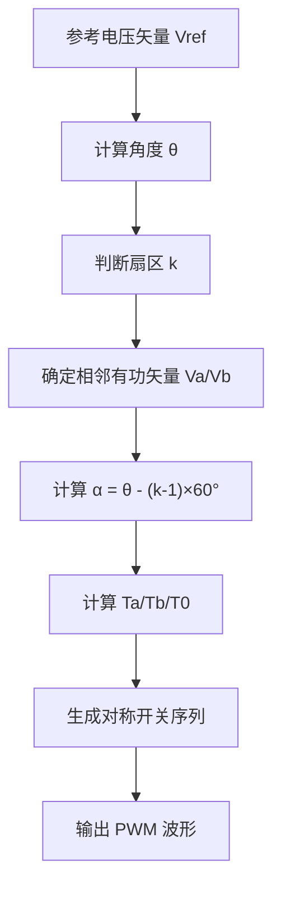
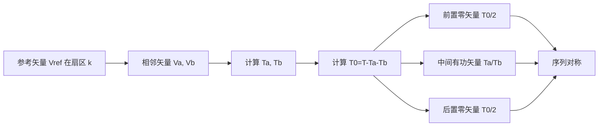

# SVPWM 平衡等效原理说明

## 1. 概述

空间矢量脉宽调制（Space Vector PWM，SVPWM）是一种将三相电机的参考电压矢量转换为六步式逆变器开关状态的调制方法。通过在一个PWM周期内选择相邻的两个有功电压矢量和两个零矢量，使得等效平均电压矢量逼近参考矢量。

平衡等效原理的核心是：在一个周期内，通过对称分布的开关序列，使得参考电压矢量在时间平均意义上等价于这些离散的逆变器矢量组合，从而得到更好的直流母线利用率和较低的谐波。

## 2. 基本矢量及扇区划分

三相两级逆变器的八个开关矢量包括：

- 6 个有功矢量：`V1` ～ `V6`
- 2 个零矢量：`V0` 和 `V7`

参考电压矢量 `Vref` 在固定周期 `T` 中按当前角度落入某一扇区。每个扇区由相邻两个有功矢量构成，参考矢量可以表示为：

`Vref * T = Ta * Va + Tb * Vb + T0 * V0eq`

其中 `Va` 和 `Vb` 为该扇区的相邻两个有功电压矢量，`V0eq` 表示零矢量等效组合。

## 3. 平衡等效原理

在一个PWM周期内，采用对称脉冲序列可减少低频谐波。典型序列为：

`V0 - Va - Vb - V7 - V7 - Vb - Va - V0`

这种对称序列保证了周期中间分界点处电压的对称性，使得电机负载获得稳定的平均矢量。

零矢量的作用时间通常分配为前后各 `T0/2`，这就是平衡等效原理的核心体现：零矢量在周期两端对称分布，补偿了有功矢量的不对称作用。

## 4. 相邻电压矢量的确定

首先判断参考矢量 `Vref` 所在扇区。扇区一般以 60° 为间隔划分：

- 扇区 1：0° ～ 60°
- 扇区 2：60° ～ 120°
- ...
- 扇区 6：300° ～ 360°

例如，`Vref` 在扇区 1 内，则相邻电压矢量为：

- `Va = V1`
- `Vb = V2`

再计算扇区内角度：

- `α = θ - (k-1)*60°`

其中 `θ` 是 `Vref` 的实际角度，`k` 是扇区编号。

## 5. 零矢量时间的计算

对于扇区内的参考矢量，两个有功矢量的作用时间 `Ta` 和 `Tb` 可由以下公式计算：

```text
Ta = T * (Vref / Vdc) * sin(60° - α)
Tb = T * (Vref / Vdc) * sin(α)
T0 = T - Ta - Tb
```

这里 `Vdc` 为逆变器直流母线电压，`T` 为PWM周期。

在对称序列中，零矢量时间 `T0` 一般分成两段：

- 前导零矢量时间：`T0/2`
- 后置零矢量时间：`T0/2`

因此最终序列中的时间分布为：

```text
T0/2, Ta, Tb, T0, Tb, Ta, T0/2
```

若使用两个不同零矢量 `V0` 与 `V7`，则可在前后分别采用 `V0` 和 `V7`，从而确保中点对称；如果只用同一种零矢量，则同样可保证总零矢量时间为 `T0`。

## 6. 等效平均电压表达

根据平衡等效原理，可视为：

```text
Vref * T = Va * Ta + Vb * Tb + V0eq * T0
```

其中 `V0eq` 是两个零矢量在时间平均下的等效值，通常为零向量，因此不引入额外的空间方向分量。

这样，周期平均电压等于参考矢量，保证了电机得到所需的矢量控制量。

## 7. 作用时间分配的意义

- `Ta`、`Tb`：决定参考矢量在扇区内的投影位置，反映有功矢量的空间分量。
- `T0`：用于平衡序列，降低重复开关切换并使序列对称。
- 零矢量前后对称分布：可减少奇次谐波，改善电流波形。

## 8. SVPWM 控制流程框图



## 9. 矢量选择与时间分配框图



## 10. 结论

SVPWM 的平衡等效原理，是通过“相邻有功矢量 + 对称零矢量”组合，在每个PWM周期内实现参考矢量的时间平均等效。用相邻矢量确定方向，用零矢量分配时间平衡开关序列，从而获得更高的直流母线利用率、更小的谐波和更好的电机控制精度。
