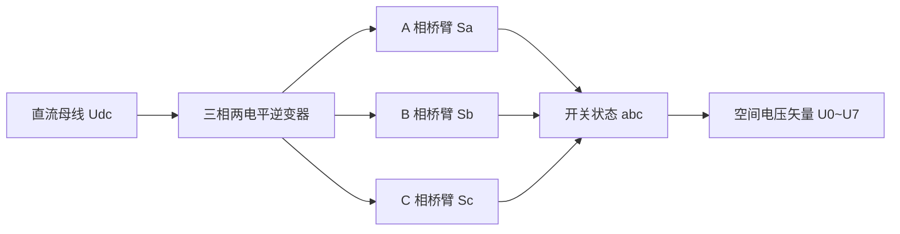
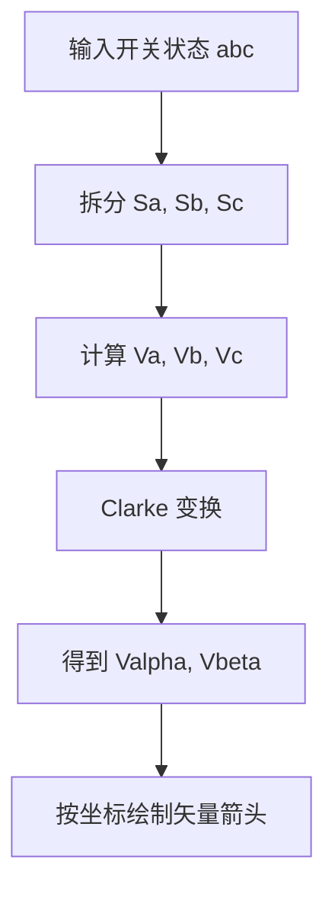
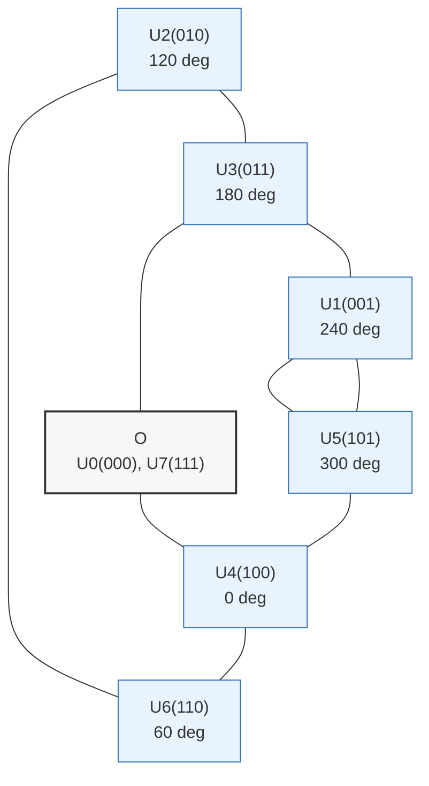
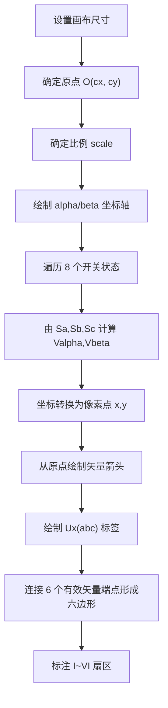
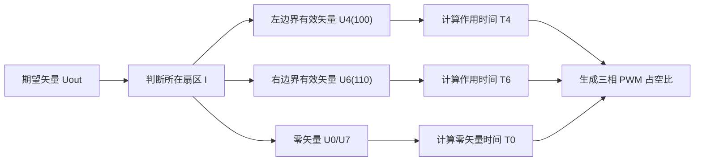

# 八个电压矢量画到电压空间矢量图的实现原理

本文说明三相两电平逆变器的 8 个开关状态如何映射到 `alpha-beta` 静止坐标系，并进一步绘制成电压空间矢量图。文中按常见 SVPWM 图示约定使用 `abc` 三相开关位，`1` 表示上桥臂导通、`0` 表示下桥臂导通。

## 1. 三相逆变器与八个开关状态

三相两电平逆变器每一相只有两个有效输出电平。设三相开关函数为：

- `Sa`：A 相上桥臂状态
- `Sb`：B 相上桥臂状态
- `Sc`：C 相上桥臂状态

因此共有 `2^3 = 8` 个开关组合：



8 个状态中有 6 个有效矢量和 2 个零矢量：

- 有效矢量：`100`、`110`、`010`、`011`、`001`、`101`
- 零矢量：`000`、`111`

零矢量之所以为零，是因为三相输出端同时接到直流母线负端或正端，三相相对电压相同，不会在电机绕组上形成有效线电压。

## 2. 从开关状态到 alpha-beta 坐标

设直流母线电压为 `Udc`，三相桥臂输出相对于直流母线负端的电压为：

```text
Va = Sa * Udc
Vb = Sb * Udc
Vc = Sc * Udc
```

将三相量通过 Clarke 变换投影到 `alpha-beta` 平面：

```text
Valpha = 2/3 * (Va - 1/2 * Vb - 1/2 * Vc)
Vbeta  = 2/3 * (sqrt(3)/2 * Vb - sqrt(3)/2 * Vc)
```

代入 `Va`、`Vb`、`Vc` 后，可直接由开关状态计算坐标：

```text
Valpha = Udc / 3 * (2Sa - Sb - Sc)
Vbeta  = sqrt(3) * Udc / 3 * (Sb - Sc)
```

这两个公式就是把 8 个电压矢量画到空间矢量图上的核心。



## 3. 八个矢量的坐标表

下表采用题图中的编号习惯：`U4(100)` 位于 `alpha` 正方向，随后逆时针每隔 60 度一个有效矢量。

| 矢量 | 开关状态 `abc` | `Valpha` | `Vbeta` | 角度 | 类型 |
| --- | --- | --- | --- | --- | --- |
| `U0` | `000` | `0` | `0` | - | 零矢量 |
| `U4` | `100` | `2/3 Udc` | `0` | `0 deg` | 有效矢量 |
| `U6` | `110` | `1/3 Udc` | `sqrt(3)/3 Udc` | `60 deg` | 有效矢量 |
| `U2` | `010` | `-1/3 Udc` | `sqrt(3)/3 Udc` | `120 deg` | 有效矢量 |
| `U3` | `011` | `-2/3 Udc` | `0` | `180 deg` | 有效矢量 |
| `U1` | `001` | `-1/3 Udc` | `-sqrt(3)/3 Udc` | `240 deg` | 有效矢量 |
| `U5` | `101` | `1/3 Udc` | `-sqrt(3)/3 Udc` | `300 deg` | 有效矢量 |
| `U7` | `111` | `0` | `0` | - | 零矢量 |

可以看到，6 个有效矢量的幅值都相同：

```text
|Uactive| = 2/3 * Udc
```

因此它们的端点落在同一个圆上，连接 6 个端点会形成正六边形。

## 4. 空间矢量图的几何结构

空间矢量图的 `alpha` 轴通常向右，`beta` 轴向上。6 个有效矢量将平面分成 6 个 60 度扇区，两个零矢量位于原点。



扇区划分如下：

| 扇区 | 左边界矢量 | 右边界矢量 | 角度范围 |
| --- | --- | --- | --- |
| I | `U4(100)` | `U6(110)` | `0 deg ~ 60 deg` |
| II | `U6(110)` | `U2(010)` | `60 deg ~ 120 deg` |
| III | `U2(010)` | `U3(011)` | `120 deg ~ 180 deg` |
| IV | `U3(011)` | `U1(001)` | `180 deg ~ 240 deg` |
| V | `U1(001)` | `U5(101)` | `240 deg ~ 300 deg` |
| VI | `U5(101)` | `U4(100)` | `300 deg ~ 360 deg` |

## 5. 绘图实现步骤

在软件中绘制空间矢量图时，通常不直接画电路，而是画 `alpha-beta` 坐标中的几何结果。



坐标转换要注意屏幕坐标系的 `y` 轴通常向下，而数学坐标系的 `beta` 轴向上：

```text
x = cx + scale * Valpha
y = cy - scale * Vbeta
```

如果使用归一化坐标，可令 `Udc = 1`。此时有效矢量半径为 `2/3`，如果希望有效矢量在画布中的显示半径为 `R`，则：

```text
scale = R / (2/3) = 1.5R
```

## 6. 参考矢量与相邻有效矢量合成

SVPWM 的核心思想是：在某个 PWM 周期 `Ts` 内，用当前扇区的两个相邻有效矢量和零矢量的作用时间，合成期望输出电压矢量 `Uout`。

例如 `Uout` 落在扇区 I 时，它由 `U4(100)`、`U6(110)` 和零矢量合成：



设参考矢量在当前扇区内的夹角为 `theta`，`0 <= theta <= 60 deg`，有效矢量幅值为 `Uactive = 2/3 * Udc`，则：

```text
T_left  = Ts * |Uout| / Uactive * sin(60 deg - theta) / sin(60 deg)
T_right = Ts * |Uout| / Uactive * sin(theta) / sin(60 deg)
T0      = Ts - T_left - T_right
```

其中：

- `T_left` 是当前扇区左边界有效矢量的作用时间
- `T_right` 是当前扇区右边界有效矢量的作用时间
- `T0` 通常分配给 `U0` 和 `U7`，以便形成对称 PWM 波形

## 7. 最小绘图伪代码

下面伪代码展示如何把 8 个开关状态转换为可绘制的矢量点：

```c
typedef struct {
    const char *name;
    int sa;
    int sb;
    int sc;
} SwitchVector;

SwitchVector vectors[] = {
    {"U0(000)", 0, 0, 0},
    {"U4(100)", 1, 0, 0},
    {"U6(110)", 1, 1, 0},
    {"U2(010)", 0, 1, 0},
    {"U3(011)", 0, 1, 1},
    {"U1(001)", 0, 0, 1},
    {"U5(101)", 1, 0, 1},
    {"U7(111)", 1, 1, 1},
};

for each vector in vectors {
    float valpha = Udc / 3.0f * (2.0f * sa - sb - sc);
    float vbeta  = SQRT3 * Udc / 3.0f * (sb - sc);

    float x = cx + scale * valpha;
    float y = cy - scale * vbeta;

    draw_arrow(cx, cy, x, y);
    draw_label(x, y, vector.name);
}
```

实际绘制六边形时，只连接 6 个有效矢量端点，顺序为：

```text
U4 -> U6 -> U2 -> U3 -> U1 -> U5 -> U4
```

`U0` 和 `U7` 都画在原点，可以用同一个原点标注或两个相邻标签表示。

## 8. 实现要点总结

1. 八个电压矢量来自三相逆变器的 `2^3` 个开关状态。
2. 通过 Clarke 变换可以把三相桥臂状态映射到 `alpha-beta` 平面。
3. 六个有效矢量幅值相等，角度间隔 60 度，端点构成正六边形。
4. `000` 和 `111` 是零矢量，位于空间矢量图原点。
5. 绘图时先算 `Valpha`、`Vbeta`，再转换成屏幕坐标 `x`、`y`。
6. SVPWM 中的参考矢量由所在扇区的两个相邻有效矢量和零矢量按时间加权合成。
