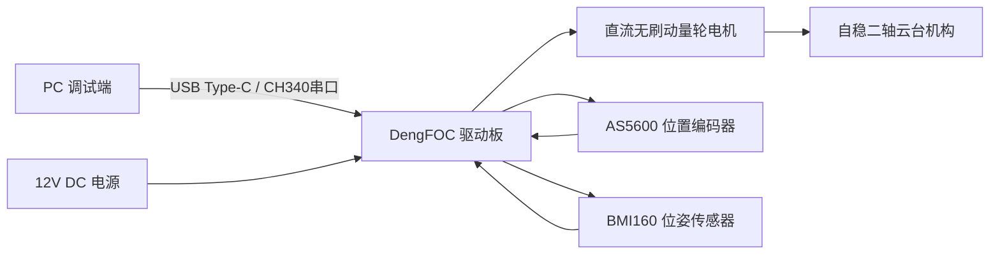
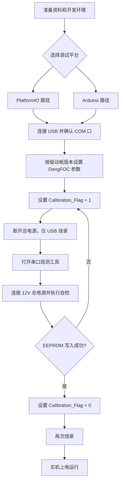
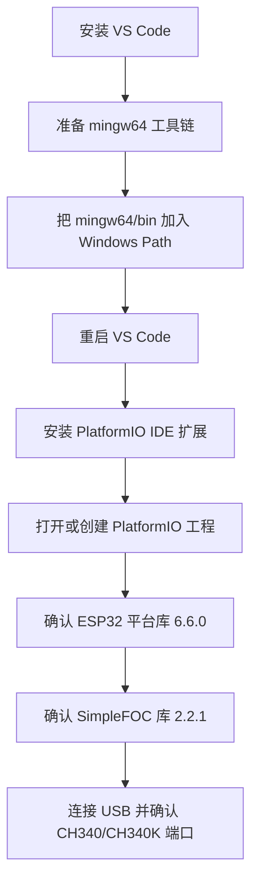
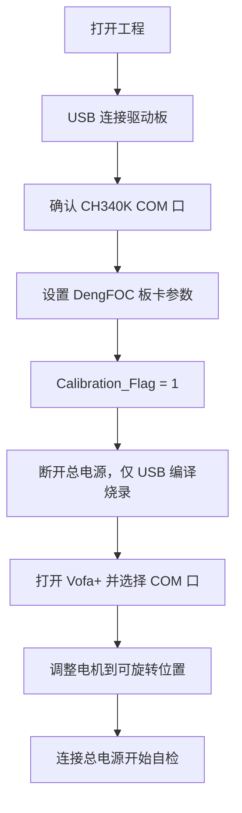
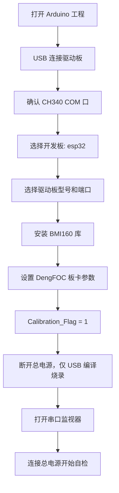
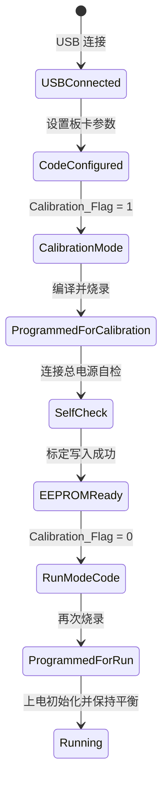

# DengFOC 自稳二轴云台参考文档

> 来源：飞书文档 `https://dcnau3k3qtbv.feishu.cn/docx/ULJAd49t6ovDFwxjBsacmdNpnVf`  
> 原文标题：DengFOC 自稳二轴云台用户手册  
> 原文更新时间：2026-04-28 13:03:11 +08:00  
> 补充资料：`C:\WorkSpace\云台软件\v4\v4\1、V4到手资料`  
> 抓取整理时间：2026-05-11

## 1. 文档用途

本文档基于飞书用户手册抓取内容整理，面向 DengFOC 自稳二轴云台的硬件识别、套餐确认、调试准备、标定自检、快速启动和实机运行。

原始手册包含大量操作截图。本文不搬运截图，改用结构化步骤、参数表和 Mermaid 框图沉淀为可维护的参考文档。

## 2. 系统组成

DengFOC 自稳二轴云台由 DengFOC V3P 或 V4 驱动板、直流无刷动量轮电机、AS5600 位置编码器、BMI160 位姿传感器、12V DC 供电和 PC 调试链路组成。

## 3. 硬件版本参数

| 项目 | V3P 版本 | V4 版本 |
| --- | --- | --- |
| 核心驱动板 | DengFOC-V3P 驱动板 | DengFOC-V4 驱动板 |
| 供电电源 | 12VDC | 12VDC |
| 尺寸 | 117mm * 88mm * 50mm | 117mm * 88mm * 50mm |
| 重量 | 210.5g | 204.0g |
| 动量轮电机类型 | 直流无刷电机 | 直流无刷电机 |
| 位置编码器 | AS5600 编码器 | AS5600 编码器 |
| 位姿传感器 | BMI160 | BMI160 |

驱动板版本会影响代码中的 DengFOC 参数选择：V3P 驱动板配置为 `0`，V4 驱动板配置为 `1`。

## 4. 套餐与安装

用户手册区分两种购买形态：

| 套餐 | 说明 | 用户动作 |
| --- | --- | --- |
| 结构件散件套餐 | 包含散件物料，需要自行安装 | 参考文件夹中的安装文档完成组装 |
| 结构件整机套餐 | 收到的是已安装好的自稳二轴云台 | 可直接进入调试准备 |

注意事项：

- 结构件套餐不等于驱动板套餐。若购买的是散件或整机结构件套餐，仍需自备 DengFOC V3P 驱动板或 DengFOC V4 驱动板。
- 安装过程遇到问题时，应通过工单咨询。

## 5. 调试总流程

调试分为两个平台路径：PlatformIO 或 Arduino。两个路径目标一致，都是先写入标定数据，再关闭标定写入并进入实机运行。

## 6. PlatformIO 调试流程

### 6.1 PlatformIO 平台搭建

本节根据 V4 到手资料中的 `安装platformIO.mp4`、`platformIO使用Dengfoc例程.mp4`、`platformIO使用simplefoc例程.mp4` 和 `到手常见问题以及解决方式.txt` 整理。

搭建目标是在 Windows 上完成 VS Code、PlatformIO IDE、ESP32 平台库、SimpleFOC 库和串口烧录链路准备。

推荐步骤：

1. 安装 VS Code。视频中先从 VS Code 官网下载安装包，再按向导完成安装。
2. 准备 `mingw64` 工具链。视频中将 `mingw64` 解压到本地目录，并进入其 `bin` 目录确认存在 `gcc`、`g++` 等程序。
3. 配置 Windows 环境变量。进入“系统属性 -> 高级 -> 环境变量”，编辑用户变量或系统变量中的 `Path`，新增 `mingw64\bin` 的完整路径。
4. 保存环境变量后，关闭并重新打开 VS Code，让新的 `Path` 生效。
5. 在 VS Code 左侧扩展市场搜索 `PlatformIO IDE`，安装发布者为 PlatformIO 的扩展。
6. 安装完成后，左侧会出现 PlatformIO 图标；进入 PlatformIO 面板后可看到 `PIO Home`、`Projects & Configuration`、`Libraries`、`Boards`、`Platforms`、`Devices` 等菜单。
7. 打开已有 DengFOC PlatformIO 工程，或通过 `PIO Home` 创建新工程。常见问题说明创建工程可能较慢，若长时间无响应，可关闭后重新创建，或在网络可用的环境下重试。
8. 检查 PlatformIO 依赖版本：ESP32 平台库应为 `6.6.0`，SimpleFOC 库应为 `2.2.1`。
9. 连接 USB Type-C，打开设备管理器确认出现 `CH340` 或 `CH340K` 端口。若无端口，需要先安装 CH340 串口驱动。

注意事项：

- 创建 PlatformIO 工程或安装依赖时需要访问网络；若依赖下载长期卡住，优先检查网络环境。
- 编译报错时先核对 ESP32 平台库 `6.6.0` 和 SimpleFOC `2.2.1`，再排查代码改动。
- 烧录失败时先确认 USB Type-C 线连接、设备管理器端口号、PlatformIO 工程选择的串口号三者一致。

### 6.2 标定自检

1. 打开 `DengFOC_2AxisGimbal` 工程文件。
2. 使用 USB Type-C 连接驱动板和电脑。
3. 在设备管理器中确认是否出现 `CH340K COM` 口，并记录当前端口号。
4. 根据驱动板型号修改 DengFOC 参数：V3P 为 `0`，V4 为 `1`。
5. 将 `Calibration_Flag` 修改为 `1`，用于写入 EEPROM。
6. 烧录“调整陀螺仪-自检程序”代码。烧录前确认总电源断开，只保留 USB Type-C 连接。
7. 点击 PlatformIO 的编译按钮，再点击烧录按钮。
8. 打开 Vofa+，选择前面记录的 COM 口。
9. 上电校准电机前，先把电机转到可自由旋转的位置，避免靠近卡位点导致电机不转。
10. 打开 Vofa+ 后再连接驱动板总电源，开始自检。

### 6.3 快速启动

EEPROM 写入成功后：

1. 将 `Calibration_Flag` 修改为 `0`，不再写入 EEPROM。
2. 再次烧录修改后的代码。
3. 烧录前仍需确认总电源断开，只连接 USB Type-C。
4. 烧录后可进入实机运行。

### 6.4 实机运行

1. 调整实物云台电机位置，为上电做准备。
2. 上电后系统会开始校准陀螺仪并完成初始化。
3. 初始化完成后，二轴会固定在一个方向并保持平衡。

## 7. Arduino 调试流程

### 7.1 标定自检

1. 打开 `DengFOC_2AxisGimbal` 工程文件。
2. 使用 USB Type-C 连接驱动板和电脑。
3. 在设备管理器中确认是否出现 `CH340 COM` 口，并记录当前端口号。
4. 使用 Arduino 打开 `DengFOC_2AxisGimbal` 程序。
5. 点击界面上方工具，选择开发板。
6. 选择 `esp32`，并根据驱动板选择对应型号。
7. 选择对应端口。
8. 下载陀螺仪 `BMI160` 库。
9. 根据驱动板型号修改 DengFOC 参数：V3P 为 `0`，V4 为 `1`。
10. 将 `Calibration_Flag` 修改为 `1`，用于写入 EEPROM。
11. 烧录“调整陀螺仪-自检程序”代码。烧录前确认总电源断开，只保留 USB Type-C 连接。
12. 点击编译按钮，再点击烧录按钮。
13. 打开 Arduino 串口监视器，连接总电源上电，开始自检。
14. 上电校准电机前，先把电机转到可自由旋转的位置，避免靠近卡位点导致电机不转。

### 7.2 快速启动

EEPROM 写入成功后：

1. 将 `Calibration_Flag` 修改为 `0`，不再写入 EEPROM。
2. 再次烧录修改后的代码。
3. 烧录前仍需确认总电源断开，只连接 USB Type-C。
4. 烧录后可进入实机运行。

### 7.3 实机运行

1. 调整实物云台电机位置，为上电做准备。
2. 上电后系统会开始校准陀螺仪并完成初始化。
3. 初始化完成后，二轴会固定在一个方向并保持平衡。

## 8. 关键配置项

| 配置项 | 作用 | 推荐检查点 |
| --- | --- | --- |
| DengFOC 板卡参数 | 区分 V3P/V4 驱动板 | V3P = `0`，V4 = `1` |
| `Calibration_Flag = 1` | 执行标定并写入 EEPROM | 只在首次标定或重新标定时使用 |
| `Calibration_Flag = 0` | 使用 EEPROM 中已有标定数据 | EEPROM 写入成功后再切换 |
| COM 口 | PC 与驱动板通信 | PlatformIO 常见为 CH340K，Arduino 手册记录为 CH340 |
| `mingw64\bin` | PlatformIO 编译工具链路径 | 添加到 Windows `Path` 后重启 VS Code |
| ESP32 平台库 | PlatformIO 下的 ESP32 编译平台 | V4 到手资料建议使用 `6.6.0` |
| BMI160 库 | Arduino 环境下的位姿传感器依赖 | Arduino 路径需要确认已安装 |
| SimpleFOC 库 | FOC 控制依赖库 | V4 到手资料建议使用 `2.2.1` |
| 12V 总电源 | 驱动电机和实机运行 | 编译烧录前断开，上电自检或运行时再连接 |

## 9. 运行状态关系

## 10. 调试风险与排查

| 现象 | 可能原因 | 处理建议 |
| --- | --- | --- |
| PlatformIO 创建工程很慢 | 依赖下载慢或网络不可达 | 关闭后重新创建，或在网络可用环境下重试 |
| PlatformIO 编译报错 | ESP32 平台库、SimpleFOC 库或 `mingw64` 路径异常 | 确认 ESP32 平台库 `6.6.0`、SimpleFOC `2.2.1`，并检查 `mingw64\bin` 是否已加入 `Path` |
| 找不到 COM 口 | 驱动未识别、线缆异常、接口异常 | 更换 USB 线，确认 CH340/CH340K 驱动和设备管理器端口 |
| 烧录失败 | 总电源未断开、端口选错、板卡型号不匹配 | 断开 12V 总电源，只保留 USB；重新选择端口和板卡 |
| 电机不转 | 电机靠近卡位点或机械阻滞 | 上电前将电机调整到可自由旋转位置 |
| 自检无法完成 | `Calibration_Flag`、板卡参数或传感器库配置错误 | 复查 V3P/V4 参数、BMI160 库和 `Calibration_Flag = 1` |
| 上电后不保持平衡 | EEPROM 未成功写入或仍在标定模式 | 确认标定成功后改为 `Calibration_Flag = 0` 并再次烧录 |

## 11. 精简操作清单

1. 确认硬件版本：V3P 或 V4。
2. 选择调试平台：PlatformIO 或 Arduino。
3. 安装对应开发环境和依赖库。
4. USB 连接驱动板，记录 COM 口。
5. 按版本设置 DengFOC 参数。
6. 设置 `Calibration_Flag = 1`，断开总电源并烧录。
7. 打开 Vofa+ 或 Arduino 串口监视器。
8. 调整电机到可旋转位置，连接 12V 总电源自检。
9. EEPROM 写入成功后设置 `Calibration_Flag = 0`。
10. 再次断开总电源并烧录。
11. 调整实物姿态，上电运行并观察二轴是否保持平衡。
